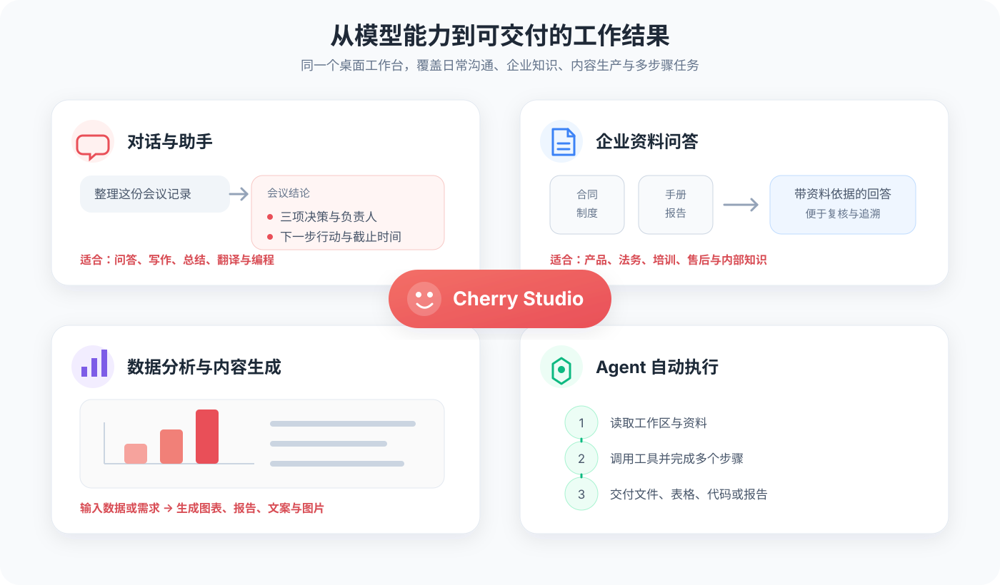

# 项目简介

<figure><figcaption></figcaption></figure>

## 关注我们的社交账号

<table data-view="cards"><thead><tr><th></th><th data-hidden data-card-cover data-type="files"></th><th data-hidden data-card-target data-type="content-ref"></th></tr></thead><tbody><tr><td><a href="https://www.xiaohongshu.com/user/profile/662b6853000000000b031d9a">小红书</a></td><td><a href=".gitbook/assets/1.png">1.png</a></td><td><a href="https://www.xiaohongshu.com/user/profile/662b6853000000000b031d9a">https://www.xiaohongshu.com/user/profile/662b6853000000000b031d9a</a></td></tr><tr><td><a href="https://space.bilibili.com/3546657515898892">哔哩哔哩</a></td><td><a href=".gitbook/assets/3.png">3.png</a></td><td><a href="https://space.bilibili.com/3546657515898892">https://space.bilibili.com/3546657515898892</a></td></tr><tr><td><a href="https://weibo.com/u/7975656228">微博</a></td><td><a href=".gitbook/assets/2.png">2.png</a></td><td><a href="https://weibo.com/u/7975656228">https://weibo.com/u/7975656228</a></td></tr><tr><td><a href="https://www.douyin.com/user/MS4wLjABAAAAmw9A54m5J0hHVMQY5eGrVJ-EHDoOS0hgJ6M1F9MN2Tn2V163A0xrC4_KVzfmQSxC">抖音</a></td><td><a href=".gitbook/assets/4.png">4.png</a></td><td><a href="https://www.douyin.com/user/MS4wLjABAAAAmw9A54m5J0hHVMQY5eGrVJ-EHDoOS0hgJ6M1F9MN2Tn2V163A0xrC4_KVzfmQSxC">https://www.douyin.com/user/MS4wLjABAAAAmw9A54m5J0hHVMQY5eGrVJ-EHDoOS0hgJ6M1F9MN2Tn2V163A0xrC4_KVzfmQSxC</a></td></tr><tr><td><a href="https://x.com/CherryStudioHQ">推特（X）</a></td><td><a href=".gitbook/assets/5.png">5.png</a></td><td><a href="https://x.com/CherryStudioHQ">https://x.com/CherryStudioHQ</a></td></tr></tbody></table>

加入我们的社群：[QQ群](https://qm.qq.com/q/lo0D4qVZKi) · [Telegram](https://t.me/CherryStudioAI) · [Discord](https://discord.gg/wez8HtpxqQ) · [微信群](https://www.cherry-ai.com/#Community)

***

Cherry Studio 是一款集多模型对话、智能体、知识库管理、AI 绘画、翻译等功能于一体的全能 AI 助手平台。Cherry Studio 高度自定义的设计、强大的扩展能力和友好的用户体验，使其成为专业用户和 AI 爱好者的理想选择。无论是零基础用户还是开发者，都能在 Cherry Studio 中找到适合自己的 AI 功能，提升工作效率和创造力。


**CherryIN 是模型服务商（Provider），不是模型。** Cherry Studio 也可以连接 DeepSeek、OpenAI、Claude、Gemini 等服务商，以及 Ollama、LM Studio 等本地模型服务。


## 你可以用它做什么？

* **问答、写作或编程**：使用[对话与助手](cherrystudio/preview/chat.md)总结文章、修改邮件或解释代码。
* **统一管理不同模型**：通过[模型服务](pre-basic/providers/README.md)使用 DeepSeek、Gemini 或本地模型。
* **根据自己的资料回答**：用[知识库](cherrystudio/preview/knowledge-base.md)查询产品手册、课程资料、合同和笔记。
* **完成多步骤任务**：进入[工作（Agent）](advanced-basic/agent.md)，让 AI 读取工作区、整理文件、修改代码或生成报告。
* **连接外部服务**：通过[MCP](advanced-basic/mcp/README.md)查询数据库，或调用 GitHub、Notion 等服务。
* **自动运行或进入群聊**：结合[定时任务](advanced-basic/scheduled-tasks.md)和[频道](advanced-basic/agent-channels.md)生成简报并发送到飞书。
* **处理图片、翻译和笔记**：使用[绘画](cherrystudio/preview/drawing.md)、[翻译](cherrystudio/preview/translation.md)和[笔记](cherrystudio/preview/notes.md)完成内容工作。

<figure><figcaption>
从日常对话、企业资料问答，到数据分析与 Agent 自动执行
</figcaption></figure>

<figure><figcaption>
对话示例：把季度营收数据整理为可视化图表，并继续分析业务趋势
</figcaption></figure>

## 第一次使用，从这里开始


[quick-start.md](getting-started/quick-start.md)


按[快速开始](getting-started/quick-start.md)完成模型配置和第一次对话后，再根据需要查阅知识库、Agent 或其他功能。

## 模型、费用与数据分别由谁负责？

云端模型服务商 / 本地模型 
↓ 
Cherry Studio 
↓ 
对话 · 知识库 · Agent · 翻译 · 绘画

* **模型来源**：可以使用 CherryIN 中当前可用的模型、自己的服务商 API Key，或本机运行的 Ollama / LM Studio。
* **软件费用**：Cherry Studio 客户端开源；模型是否收费、如何计费以及可用额度由模型服务商决定。
* **数据位置**：对话、设置和知识库索引主要保存在本机；使用云端模型时，完成请求所需的内容会发送给对应服务商。
* **完全本地使用**：需要使用本地模型，并避免启用云端模型、联网搜索和其他外部服务。

不要把 API Key 发布到截图、文档、群聊或公开仓库中。怀疑密钥泄露时，请立即到服务商后台撤销并重新生成。

## 对话、工作与知识库

| 能力 | 最适合的任务 | 是否会主动执行操作 |
|---|---|---|
| **助手** | 固定角色和回复风格的日常对话 | 否，以对话为主 |
| **工作（Agent）** | 读取工作区、调用工具并完成多步骤任务 | 是，按权限执行 |
| **知识库** | 从你导入的资料中检索相关内容 | 否，为对话或 Agent 提供资料 |

第一次看到 Skill、MCP、频道等术语时，请阅读[核心概念](advanced-basic/concepts-101.md)。

## 获取帮助

* 遇到错误：先查看[常见问题](question-contact/questions.md)
* 需要提交 Bug 或建议：查看[反馈与建议](question-contact/suggestions.md)
