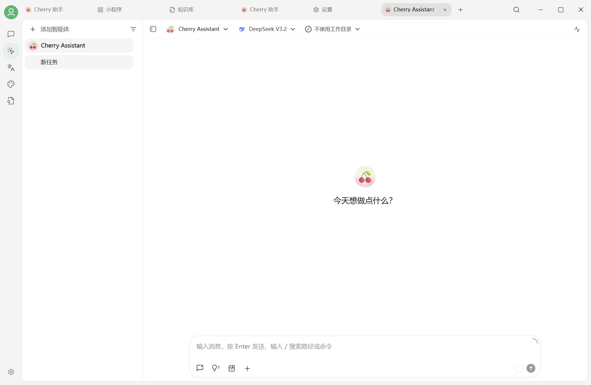

# 用 Agent 完成黄金行情复盘

本案例演示如何在 Cherry Studio V2 中创建一个研究型 Agent：它会搜索公开资料、整理时间线、比较历史数据，并把结果写成可复核的报告。

<figure><figcaption><p>先在智能体工作区选择或创建用于市场复盘的 Agent</p></figcaption></figure>


本案例只用于演示 Agent 工作流，不构成投资建议。金融数据可能延迟或出错；做出任何决策前，请核对原始来源并咨询具备资质的专业人士。


## 最终要得到什么

一份结构清晰的复盘报告，至少包含：

* 研究时间范围和数据截止时间；
* 价格变化摘要和关键区间；
* 可能相关的宏观事件时间线；
* 支持与反驳各项解释的证据；
* 三种情景及其触发条件；
* 来源链接、抓取时间和不确定性说明。

重点不是让 Agent “猜涨跌”，而是让它把分散信息整理成可以核查的证据链。

## 使用前准备

| 项目 | 要求 |
| --- | --- |
| 模型 | 支持工具调用、长文本和较强推理能力 |
| 网络搜索 | 已配置至少一个可用的搜索服务 |
| 工作目录 | 用于保存中间资料和最终报告 |
| 权限 | 仅开启完成任务所需的搜索、读取和写入权限 |

如果模型、搜索服务或网页访问需要 API Key，请先在对应设置中完成配置和检测。

## 第一步：创建 Agent

1. 在助手列表旁点击 **+**。
2. 选择 **创建 Agent**。
3. 名称填写“黄金行情复盘”或其他易识别名称。
4. 选择一个支持工具调用的模型。
5. 选择一个单独的工作目录，避免 Agent 访问无关文件。


不要直接把包含私人资料、密钥或工作文件的上级目录设为工作目录。只授权本次任务真正需要的文件夹。


## 第二步：配置工具

根据当前 Agent 页面提供的工具，启用：

* 网页搜索或联网检索；
* 网页读取；
* 工作目录内的文件读取和写入；
* 如需计算或制图，再启用代码执行能力。

先不要一次开启所有工具。最小权限更容易排查问题，也能降低误操作风险。

## 第三步：写系统提示词

可以使用下面的模板：

```text
你是一名研究助理，负责完成黄金行情复盘。

工作规则：
1. 所有价格、日期、事件和结论都必须给出来源与抓取时间。
2. 找不到可靠数据时明确写“未验证”，不得猜测。
3. 区分事实、来源观点和你的推断。
4. 至少使用两个相互独立的来源核对关键事实。
5. 报告必须说明数据截止时间、限制和可能的反例。
6. 不提供个性化投资建议，不使用“必涨”“必跌”等确定性表述。
7. 先列研究计划，得到确认后再进行大规模检索。
```

这段提示词把“可核查”和“先规划”设为硬约束，比堆叠夸张角色描述更可靠。

## 第四步：发送任务

示例任务：

```text
请复盘最近 30 天黄金价格的主要波动。

先给出研究计划和准备使用的数据源；我确认后再执行。
最终输出 Markdown 报告，包含：
- 数据截止时间与价格变化摘要
- 关键事件时间线
- 至少两个历史相似阶段
- 支持与反驳各项解释的证据
- 乐观、中性、谨慎三种情景及触发条件
- 来源清单和不确定性说明
```

先审查研究计划，再让 Agent 继续。特别注意时间范围、数据口径和来源是否清楚。

## 第五步：审查执行过程

Agent 运行时重点看四件事：

1. **来源是否可靠**：优先选择交易所、央行、统计机构和主流数据服务。
2. **时间是否一致**：现货、期货、不同市场和时区不能混为一谈。
3. **结论是否越界**：相关性不等于因果，情景推演不等于预测。
4. **工具权限是否合理**：出现与任务无关的写入、执行或访问请求时应拒绝。

如果来源冲突，让 Agent 把差异并排列出，不要擅自选择对自己结论更有利的数据。

## 第六步：验收报告

一份合格报告应当满足：

* 标题和开头能说明研究对象、时间范围和数据截止时间；
* 每个关键数字都能追溯到来源；
* 事实、观点和推断分开表达；
* 图表包含单位、时间轴和数据来源；
* 情景分析写明触发条件，不作确定性承诺；
* 阅读顺序清楚，先摘要、后证据、再附录。

## 常见失败与改进

### 搜索了很多网页，但结论仍然空泛

缩小问题，把“为什么黄金下跌”改成可验证的子问题，例如美元指数、实际利率、ETF 持仓和风险事件分别发生了什么变化。

### 报告里有来源，但打不开或对不上

要求 Agent 在正文中为每个关键结论就近添加链接，并在附录列出页面标题、URL 和抓取时间。

### Agent 一开始就执行大量操作

在系统提示词中加入“先提交研究计划并等待确认”。也可以分阶段运行：先搜集数据，再整理时间线，最后写报告。

### 图表漂亮，但数据不可复核

要求同时保存原始数据文件，并在报告中说明字段、单位、缺失值和计算方法。

## 可以迁移到哪些任务

同一工作流也适用于：

* 竞品价格与功能变化跟踪；
* 行业新闻周报；
* 产品事故复盘；
* 公开政策与法规资料整理；
* 多来源技术选型调研。

只需替换研究对象、数据源和验收标准，不要照搬金融场景中的结论。

***

### 💡 获取帮助与提交反馈

如果您在配置或使用过程中遇到任何疑问、Bug 或有功能改进建议，请参考 [反馈与建议](../../question-contact/suggestions.md) 中提供的官方渠道。
