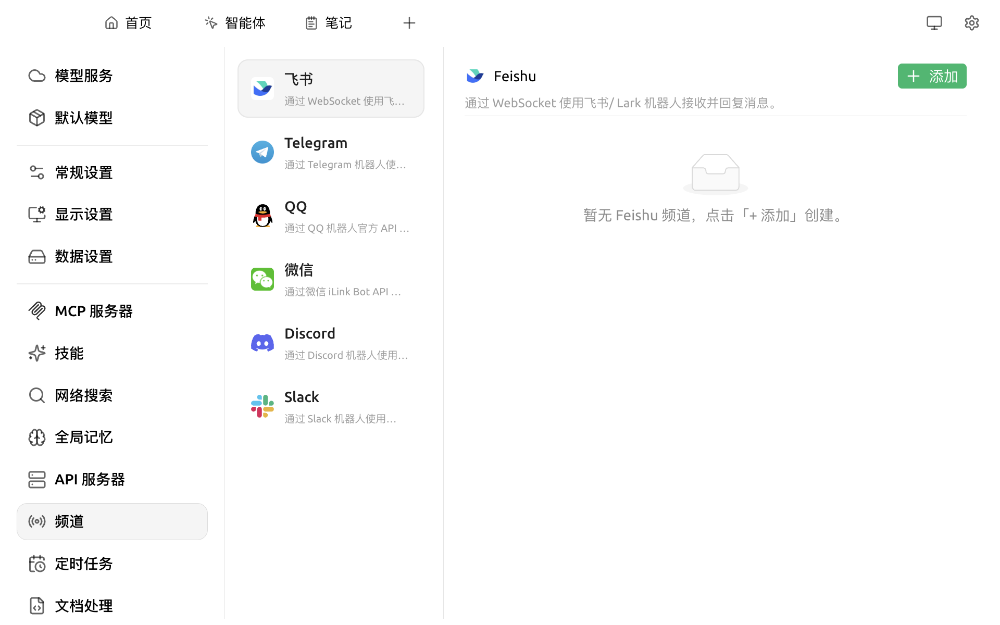
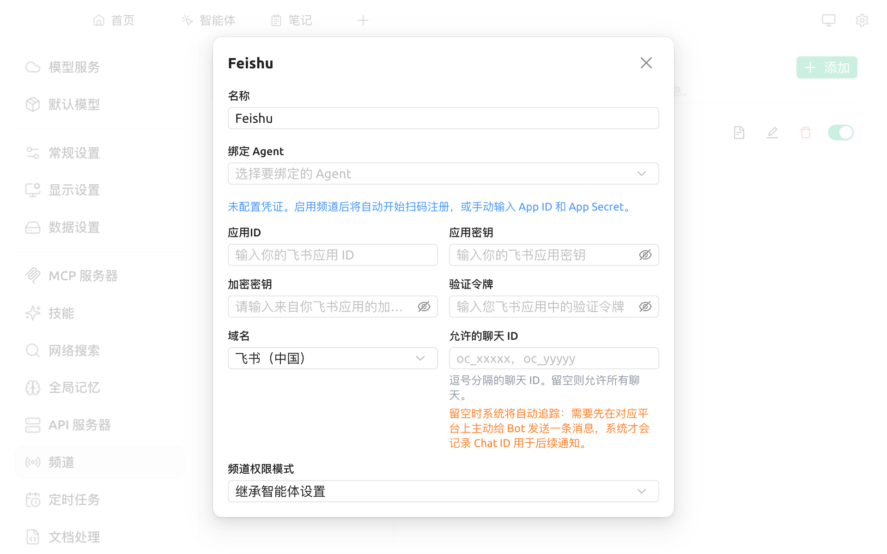

# 频道

当你在 Cherry Studio 中配置好一个智能体（如"研报机器人"、"客服助手"），如果希望它**驻留在 IM 群中**为多人服务，可以使用「频道」功能。

**频道（产品代号 Cherry Claw）** 将 [智能体](agent.md) **接入 IM 平台**作为机器人对外服务。

当前支持的平台：

* 飞书 / Lark（中国版 + 国际版）
* Telegram
* QQ（官方机器人 API）
* 微信（通过 iLink Bot API）
* Discord
* Slack

适用场景示例：

* **公司内部知识机器人**：飞书群成员 @ 机器人提问，它从绑定的 [知识库](../knowledge-base/knowledge-base.md) 检索答案
* **个人助理**：Telegram 私聊机器人协助管理日程、查询信息、提供翻译
* **客服值班**：Discord 机器人按设定话术接待用户

> 推荐先阅读 [概念入门](concepts-101.md) 了解 Agent、频道、定时任务的关系。

## 不会自己配？让 AI 替你配

频道功能涉及 "创建第三方平台机器人 → 拿到凭据 → 填进 Cherry Studio" 几个步骤，对非技术用户来说门槛偏高。**如果不熟悉这些操作，最简单的方式是把任务直接交给具备自主权限的 Agent（如内置的 Cherry Claw）**。

在 Cherry Claw 的对话窗口中描述你的目标即可，例如：

> "请帮我设置一个频道：每天早上 10 点把虎嗅、36 氪、机器之心三家媒体的 AI 相关新闻汇总成 5 条要点，发到我的飞书。"

Cherry Claw 会自动判断需要做哪些事，向你索取必要的凭据（飞书 App ID 等），然后帮你完成频道创建与 [定时任务](scheduled-tasks.md) 配置。


**核心前提说明**：
* 内置的 **Cherry Claw** 以及你自建的智能体，默认状态均为 **「自主模式关闭 + 普通模式」**。
* **在使用频道（或定时任务）前，必须手动进入该智能体的编辑面板开启「自主模式」**。
* 开启「自主模式」后，底层的工具调用授权将全自动接管，原有的「权限模式」配置项将随之隐藏，无需再手动进行设置。详见 [智能体](agent.md)。


如果你希望了解每一步的细节、或者需要自定义配置，可继续按下方手动流程操作。

## 手动配置流程

### 前置要求

1. 已创建一个 [智能体](agent.md)
2. 已启用 [API 服务器](api-server.md)
3. **获取目标 IM 平台的机器人凭据**（详见下方"按平台准备凭据"，各平台命名不同，本质均为平台官方颁发的 token / key，用于验证机器人身份）

### 频道在哪儿

打开 `设置 → 频道`，可以看到所有支持平台的列表：

<figure><figcaption>
频道菜单：每个平台都有一行简介，未绑定时右侧为空态
</figcaption></figure>

### 创建一个频道（以飞书为例）

1. 在左侧列表中点击 **飞书**
2. 在右侧空态点击 **+ 添加**，弹出添加表单：

<figure><figcaption>
飞书频道字段
</figcaption></figure>

各字段含义：

| 字段 | 说明 |
|---|---|
| **名称** | 频道的展示名，便于在多频道时辨识 |
| **绑定 Agent** | 选择一个已创建的 Cherry Agent。若不绑定，则使用通用模型回复 |
| **应用 ID / 应用密钥** | 飞书开放平台 → 自建应用 → 凭证与基础信息 |
| **加密密钥 / 验证令牌** | 飞书开放平台 → 事件订阅，可选 |
| **域名** | `飞书（中国）` / `Lark（国际版）`，二选一 |
| **允许的聊天 ID** | 留空表示不限制；填入则只在指定群/单聊中响应 |
| **频道权限模式** | `继承智能体设置` / 自定义。建议保持继承 |

填写完毕后点击 **保存**。频道启用后会自动开始订阅飞书消息事件。

### 按平台准备凭据



**有两种接入方式，推荐扫码方式**：

* **扫码注册（推荐）**：在飞书频道详情留空 **应用 ID / 应用密钥**，启用频道后会自动弹出二维码。用手机飞书扫描即可自动创建机器人应用，**无需到开放平台手动配置**。
* **手动接入（进阶）**：
  * 在 [开放平台](https://open.feishu.cn) 创建一个 **自建应用**
  * 复制 **App ID** 与 **App Secret** 填入表单
  * 在飞书应用的 **事件订阅** 中启用长连接（WebSocket）
  * 在 **权限管理** 中至少开启：接收单聊消息、接收群聊消息、发送消息



* 与 [@BotFather](https://t.me/BotFather) 对话，`/newbot` 创建机器人
* 复制 **Bot Token**
* 表单中填入 Bot Token 即可
* （可选）想限制只在某些会话响应，先把机器人拉进群或私聊，再用 [@get_id_bot](https://t.me/get_id_bot) 获取 Chat ID 填入 "允许的会话 ID"



* 在 QQ 开放平台申请机器人 → 创建应用 → 复制 **App ID** 与 **Client Secret**
* 填入表单
* （可选）允许的会话 ID 格式：`c2c:openid`（私聊）、`group:groupid`（群）、`channel:channelid`（频道）



* **微信频道的接入方式是扫码登录**，无需任何预先注册：
  * 在频道详情中点击 **添加微信账号**
  * 启用频道后会弹出二维码
  * 用手机微信扫描即可登录
* （可选）允许的用户 ID 格式：`wxid_xxxxx`，多个用逗号分隔



* 在 [Discord Developer Portal](https://discord.com/developers/applications) 新建 Application
* 在 Bot 子页生成 **Bot Token** 并填入表单
* 邀请机器人到你的服务器
* （可选）想限制频道范围：把机器人加入目标频道后，向它发送 `/whoami` 即可获取格式正确的频道 ID



* 在 [Slack API](https://api.slack.com/apps) 新建 App
* 启用 **Socket Mode**，分别生成 **App-Level Token**（`xapp-...`）和 **Bot Token**（`xoxb-...`）
* 两个 Token 都填入表单
* （可选）频道范围限制：向机器人发送 `/whoami` 获取 Slack 频道 ID



### 一个 Agent 可以接多个频道吗？

可以。你可以让同一个 "研报助手" Agent 同时接入飞书内部群（向同事汇报）和你的 Telegram 私聊（向自己推送），互不干扰。每个频道独立维护会话与权限。

### 与定时任务联动

* 频道可以 **接收** 用户消息触发 Agent 回复
* [定时任务](scheduled-tasks.md) 可以 **主动** 调用 Agent 并通过频道把结果发送到 IM 平台
* 二者组合可实现完整的 "日报机器人" 形态

### 常见问题

#### 添加后机器人没反应

* 确认 [API 服务器](api-server.md) 处于 **运行中** 状态
* 确认绑定的 Agent 模型 Provider 余额充足
* 检查 "允许的聊天 ID" 是否填错（留空表示不限）

#### 飞书机器人加入群但收不到 @ 消息

* 在飞书开放平台 → 权限管理，确认开启了 "获取群组中的所有消息"
* 在群中右键机器人 → 设置，开启 "机器人可在本群被 @"

#### 微信频道掉线

* 微信机器人接入相对脆弱，建议优先使用飞书 / Telegram
* 长期未用会被微信主动下线，重新登录 iLink 即可


不同平台对自建机器人有不同的合规要求。在企业内部群启用前请确认已获取所在组织 / 平台的许可。


***

### 💡 获取帮助与提交反馈

如果您在配置或使用过程中遇到任何疑问、Bug 或有功能改进建议，请参考 [反馈与建议](../question-contact/suggestions.md) 中提供的官方渠道。
