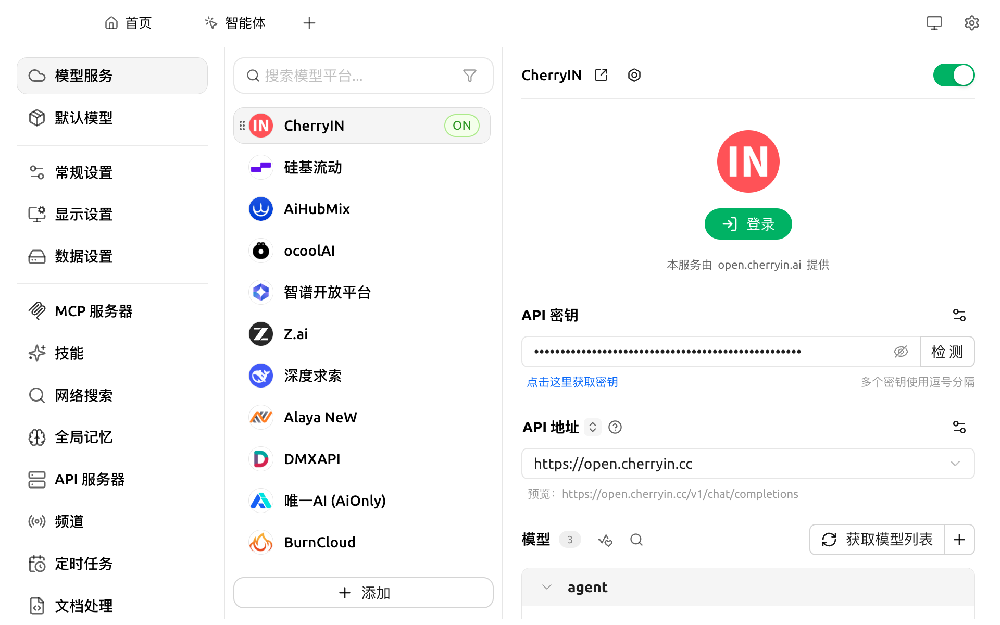
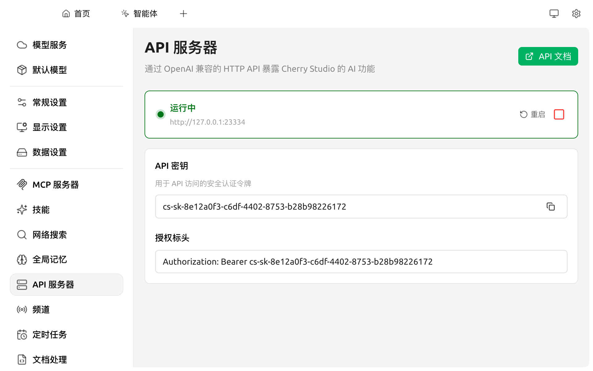
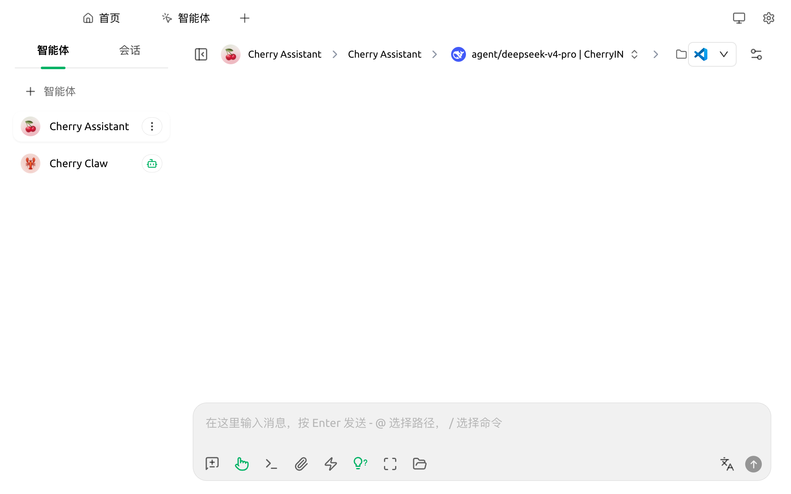
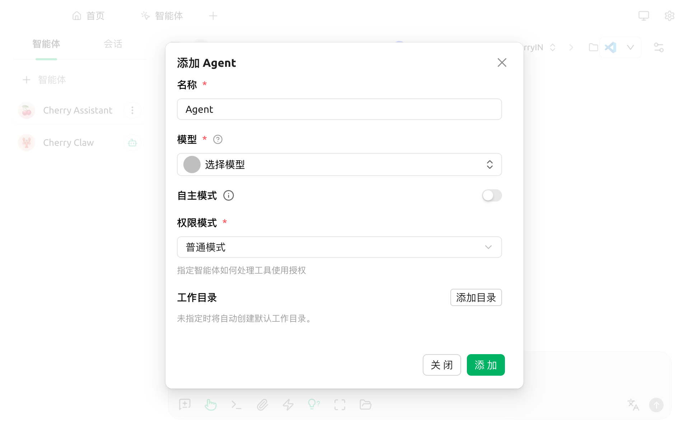
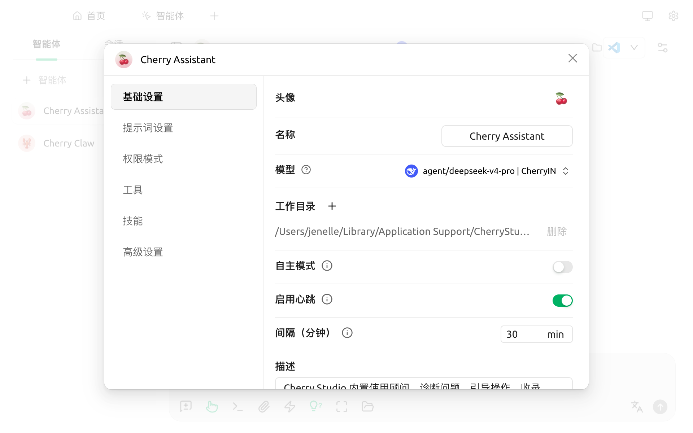

# 智能体

智能体让 AI 不仅能对话，更能**自主完成任务**。

类比：

* 普通对话中的 AI 类似 **仅能给建议的同事** —— 你询问方法，它告诉你步骤
* 智能体类似 **具备执行能力的同事** —— 你给定目标，它自主读取文件、查询资料、调用工具，逐步完成

适用场景示例：

* "将 `~/Downloads` 中所有 PDF 整理为 Excel 清单"
* "查询今日主流科技媒体头条，生成一份 5 条要点的简报"
* "审阅指定的 Python 文件，给出改进建议并直接修改"
* "每日早上 9 点自动执行以上任务"（结合 [定时任务](scheduled-tasks.md)）

> 推荐先阅读 [概念入门](concepts-101.md) 理清助手 / 智能体 / 技能 / MCP / 频道之间的关系。

### 开始前的两项准备

#### 1. 一家支持 Anthropic 协议的 Provider

智能体依赖"工具调用"格式的对话方式，目前最成熟的实现是 Anthropic Claude 系列模型。因此需要一家提供该协议的模型服务商，推荐选项：

* **[CherryIN](../pre-basic/providers/cherryin-1.md)**（最便捷）：单一账号即可同时支持普通对话与智能体
* **[Anthropic 官方](../pre-basic/providers/anthropic.md)**：直接使用 Claude 账号
* 其他主流 AI 网关（如 [OpenRouter](../pre-basic/providers/openrouter.md)）

#### 2. 启用 API 服务器

Cherry Studio 需要在本地运行一个内部服务以承载 Agent。操作上仅需在 `设置 → API 服务器` 中点击启动按钮即可，详见 [API 服务器](api-server.md)。


**Token 消耗提示**：Agent 模式涉及多轮对话与工具调用，单次任务的 token 消耗显著高于普通对话。建议在 Provider 后台设置月度上限以避免超支。


### 第 1 步：配置 Anthropic 类型的 Provider

打开 `设置 → 模型服务`，找到（或新建）一个支持 Anthropic 端点的 Provider：

* 填写 **API 密钥**
* 确认 **API 地址** 指向正确的 Anthropic 端点（CherryIN 默认 `https://open.cherryin.cc`）
* 点击 **获取模型列表**，添加至少一个对话模型（如 `claude-sonnet-4` / `agent/deepseek-v4-pro` 等）

<figure><figcaption>
已配置 CherryIN 并添加 agent 模型
</figcaption></figure>


订阅了 Claude Code 的用户可直接将 Anthropic key 与 endpoint 填入对应字段获取模型。


### 第 2 步：启用 API 服务器

打开 `设置 → API 服务器`，确认端口与密钥后点击 ▶ 启动。详细说明见 [API 服务器](api-server.md)。

<figure><figcaption>
API 服务器运行中，Agent 方可工作
</figcaption></figure>

### 第 3 步：进入智能体页面

顶部 Tab 点击 **智能体**。Cherry Studio 默认内置 **Cherry Assistant** 和 **Cherry Claw** 两个智能体，可直接使用，也可基于自己的需求新建一个。

<figure><figcaption>
智能体页面：左侧列表 + 右侧对话区
</figcaption></figure>

### 第 4 步：新建一个智能体

点击左侧栏顶部 **+ 智能体** 按钮，弹出 **添加 Agent** 表单：

<figure><figcaption>
添加 Agent 表单
</figcaption></figure>

各字段说明：

| 字段 | 说明 |
|---|---|
| **名称** | Agent 在列表中的显示名 |
| **模型** | 选择上一步在 Anthropic 类型 Provider 下添加的对话模型 |
| **自主模式** | 一个独立的开关。开启后会启用工作区 `soul.md` 自定义身份、自动注入任务管理工具，并禁用不适合无人值守的交互式工具。**[频道](agent-channels.md) 与 [定时任务](scheduled-tasks.md) 要求开启此项，并将权限模式设为全自动模式** |
| **权限模式** | 控制 Agent 调用工具时是否需要人工授权，详见下表。默认 `普通模式` |
| **工作目录** | Agent 可读写的本地目录。留空则自动创建默认目录 |

填写完点击 **添加** 即完成创建。

### 第 5 步：调整智能体的提示词、工具与技能

点击智能体卡片右侧的 ⋮ 菜单 → **编辑**，进入完整编辑面板：

<figure><figcaption>
智能体编辑面板（基础设置 Tab）
</figcaption></figure>

左侧 Tab 分类对应不同设置：

* **基础设置**：头像、名称、模型、工作目录、自主模式、启用心跳、心跳间隔、描述
* **提示词设置**：编辑系统提示词，决定 Agent 的角色与回话风格
* **权限模式**：在 4 种权限策略之间切换（见下方表格）
* **工具**：勾选 Agent 可使用的内置工具，及挂载来自 [MCP 服务器](mcp/) 的外部工具
* **技能**：挂载预先安装的 [技能](../pre-basic/settings/skills.md)
* **高级设置**：上下文长度、温度、最大轮数等参数

#### 权限模式的 4 种选择

| 模式 | 行为 | 适用场景 |
|---|---|---|
| **普通模式**（默认）| 可自由读取文件；编辑文件或执行命令前会请求人工授权 | 日常对话型 Agent |
| **计划模式** | 只能读取文件并制定计划，不能编辑或执行命令 | 让 Agent 给你"出方案"但你来执行 |
| **自动编辑模式** | 可自由读写文件；执行命令前仍会请求授权 | 让 Agent 接管代码 / 文档编辑，但保留对命令的控制 |
| **全自动模式** | 所有工具均无需人工授权 | **频道与定时任务必须使用此模式，并同时开启自主模式**；自主决策的全自动场景 |


**全自动模式**会让 Agent 跳过所有人工确认，包括写文件、执行命令、调用外部 API 等。**请仅在受控环境下启用**，并将 `工作目录` 限制在你愿意被 Agent 修改的范围内。



**自主模式 vs 权限模式**：

* **自主模式** 决定 Agent **能不能**进入"无人值守、长任务"形态（加载 soul.md、注入任务管理工具）
* **权限模式** 决定 Agent **怎么**处理工具调用授权

两者独立。要让 Agent 自动运行定时任务并发到飞书群，需要：**开启自主模式 + 选择全自动模式**。


### 第 6 步：与智能体对话

返回智能体页面，点击智能体卡片进入会话：

* 在底部输入框输入任务，例如"请帮我把 `~/Downloads/report.md` 转成 PPT 大纲"
* Agent 会自动判断调用哪些工具、是否需要多轮推理
* 工具调用与决策过程以可折叠卡片形式逐步展示

#### 结果展示

<figure><figcaption>
智能体调用工具并返回结果示例
</figcaption></figure>

### 常见问题

#### 智能体页面提示"请启用 API 服务器以使用智能体功能"

回 `设置 → API 服务器`，点击绿色 ▶ 启动按钮。详情见 [API 服务器](api-server.md)。

#### 创建 Agent 时下拉里没有模型

* 确认所选 Provider 至少添加了一个对话模型
* 确认该 Provider 类型为 **Anthropic** 或 **CherryIN**（OpenAI-only 的 Provider 不会出现在 Agent 模型选择里）

#### Agent 输出突然停止

可能命中工具调用上限或单次会话长度上限。提高 Agent 设置中的最大轮数与单次输出 token 上限即可。

### 下一步

* 把 Agent 接到 IM 平台（飞书 / Telegram / QQ / 微信 / Discord / Slack）→ [频道](agent-channels.md)
* 让 Agent 定时自动执行任务 → [定时任务](scheduled-tasks.md)
* 拓展工具能力 → [MCP 使用教程](mcp/)
