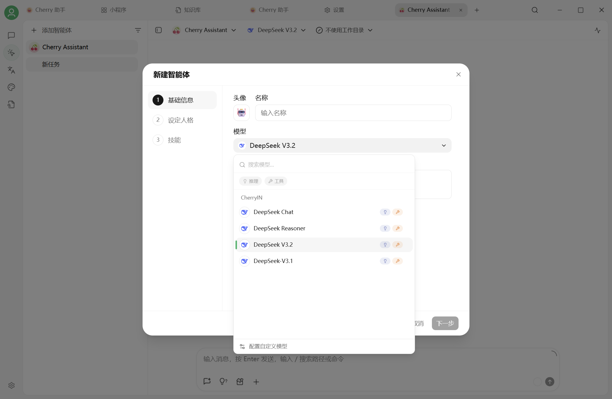
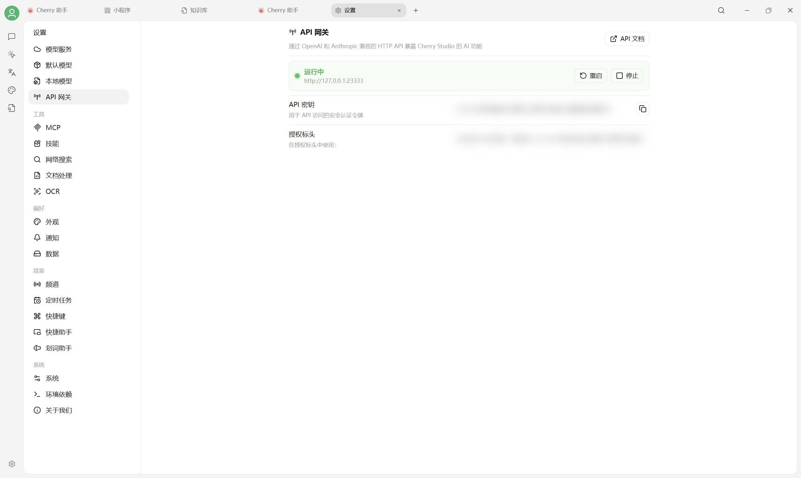
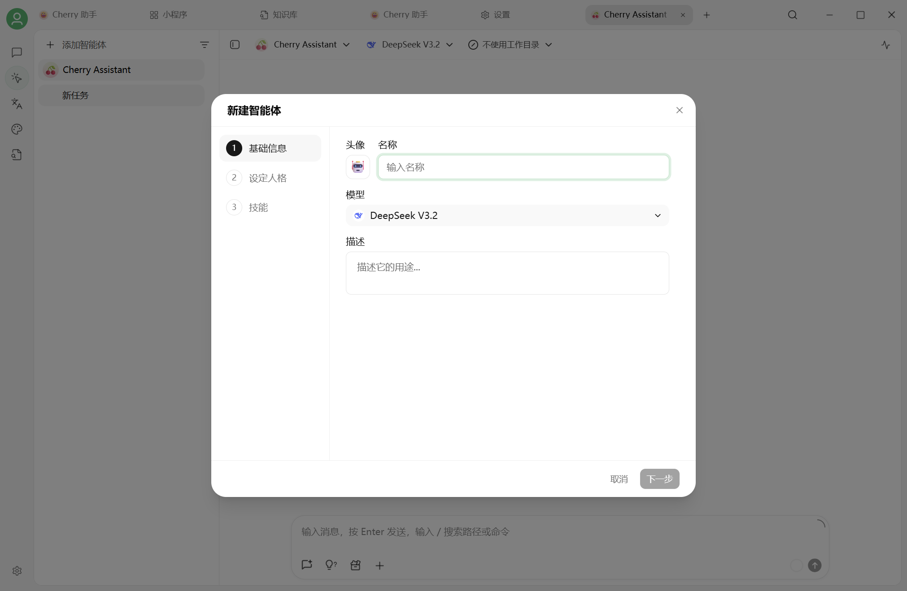
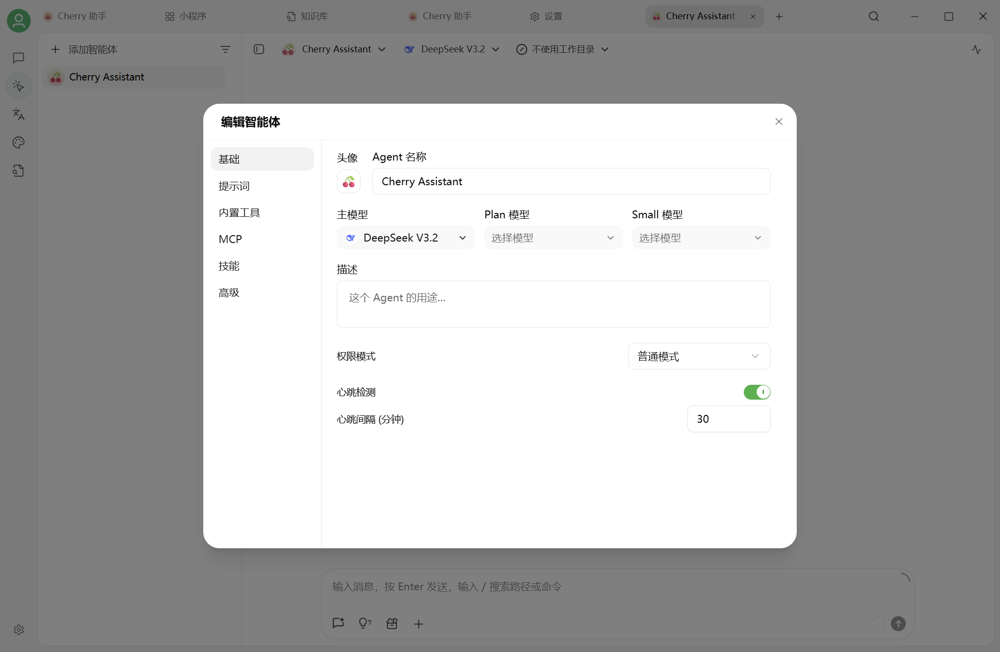

# Agent

Agent 让 AI 不仅能对话，更能**自主完成任务**。

类比：

* 普通对话中的 AI 类似 **仅能给建议的同事** —— 你询问方法，它告诉你步骤
* Agent 类似 **具备执行能力的同事** —— 你给定目标，它自主读取文件、查询资料、调用工具，逐步完成

适用场景示例：

* "将 `~/Downloads` 中所有 PDF 整理为 Excel 清单"
* "查询今日主流科技媒体头条，生成一份 5 条要点的简报"
* "审阅指定的 Python 文件，给出改进建议并直接修改"
* "每日早上 9 点自动执行以上任务"（结合 [定时任务](scheduled-tasks.md)）

> 推荐先阅读 [概念入门](concepts-101.md) 理清助手 / Agent / 技能 / MCP / 频道之间的关系。

### 开始前的两项准备

#### 1. 一个可用于 Agent 的对话模型

V2 的 Agent 模型选择器会显示可用于对话的模型，并过滤嵌入、重排、图像生成等非对话模型。可选来源包括：

* **[CherryIN](../pre-basic/providers/cherryin-1.md)**、[Anthropic](../pre-basic/providers/anthropic.md) 等支持 Anthropic 或兼容端点的 Provider
* **Google / Gemini** 官方或自定义 Google 网关中的对话模型
* 其他能由 Cherry Studio 本地 API 网关转换为 Agent 运行协议的对话模型

不同模型的工具调用稳定性和费用差异较大。首次使用建议选择明确支持工具调用的模型，再用一个小任务测试。

#### 2. 启用 API 网关

Cherry Studio 需要本地 API 网关为 Agent 路由模型请求。打开 `设置 → API 网关`，确认服务已启动；相关配置见 [API 网关](api-server.md)。


**Token 消耗提示**：Agent 模式涉及多轮对话与工具调用，单次任务的 token 消耗显著高于普通对话。建议在 Provider 后台设置月度上限以避免超支。


### 第 1 步：配置 Provider 与模型

打开 `设置 → 模型服务`，找到或新建一个 Provider：

* 填写 **API 密钥**
* 确认 API 地址和端点类型与服务商要求一致
* 点击 **获取模型列表**，添加至少一个支持对话和工具调用的模型

<figure><figcaption>
已配置 CherryIN 并添加 agent 模型
</figcaption></figure>


V2 已支持把已启用的 Google / Gemini 对话模型用于 Agent。若模型未出现在选择器中，请先确认 Provider 和模型均已启用，且模型类型不是嵌入、重排或生图。


### 第 2 步：启用 API 网关

打开 `设置 → API 网关`，确认端口与密钥后点击 ▶ 启动。详细说明见 [API 网关](api-server.md)。

<figure><figcaption>
API 网关运行中，Agent 方可工作
</figcaption></figure>

### 第 3 步：进入 Agent 页面

顶部点击 **工作** 进入 Agent 工作区。V2 内置 **Cherry Assistant** 使用顾问，也可以基于自己的需求新建 Agent。旧版的 Cherry Claw 品牌与「自主模式」名称已移除，其任务管理、记忆和工作区身份能力已成为所有 Agent 的默认能力。

<figure><figcaption>
Agent 页面：左侧列表 + 右侧对话区
</figcaption></figure>

### 第 4 步：新建一个 Agent

点击 Agent 列表中的添加入口，打开分步创建向导：

<figure><figcaption>
添加 Agent 表单
</figcaption></figure>

创建向导包含三步：

| 步骤 | 说明 |
|---|---|
| **基础信息** | 头像、名称、模型与描述；名称和模型为必填 |
| **角色设定** | 编写系统提示词，定义 Agent 的身份和行为 |
| **能力** | 选择创建后启用的技能；内置技能默认可用 |

完成向导后点击 **创建**。工作区在开始任务时从输入框下方的工作区选择器中设置，可选择已有工作区、添加本地文件夹，或选择不使用工作目录。

### 第 5 步：调整 Agent 的提示词、工具与技能

点击 Agent 卡片本身，进入完整编辑面板：

<figure><figcaption>
Agent 编辑面板（基础设置 Tab）
</figcaption></figure>

编辑对话框的分类如下：

* **基础设置**：头像、名称、主模型、规划模型、小模型、描述、权限模式与心跳
* **提示词**：编辑系统提示词，决定 Agent 的角色与回应方式
* **工具 → 内置工具**：查看并禁用不希望 Agent 使用的内置工具
* **工具 → MCP**：挂载来自 [MCP 服务器](mcp/) 的外部工具
* **工具 → 技能**：为 Agent 启用预先安装的 [技能](../pre-basic/settings/skills.md)
* **高级设置**：环境变量等高级配置


V2 的编辑对话框会自动保存修改，关闭对话框时也会提交尚未完成的自动保存。已打开的 Agent 会话会接收模型、权限与工具策略等配置更新，无需先关闭全部会话。


#### 权限模式的 4 种选择

| 模式 | 行为 | 适用场景 |
|---|---|---|
| **普通模式**（默认）| 可自由读取文件；编辑文件或执行命令前会请求人工授权 | 日常对话型 Agent |
| **计划模式** | 只能读取文件并制定计划，不能编辑或执行命令 | 让 Agent 给你"出方案"但你来执行 |
| **自动编辑模式** | 可自由读写文件；执行命令前仍会请求授权 | 让 Agent 接管代码 / 文档编辑，但保留对命令的控制 |
| **全自动模式** | 所有工具均无需人工授权 | 仅用于范围受控、明确需要无人确认的场景 |


**全自动模式**会让 Agent 跳过所有人工确认，包括写文件、执行命令、调用外部 API 等。**请仅在受控环境下启用**，并将 `工作目录` 限制在你愿意被 Agent 修改的范围内。



V2 已移除 **自主模式 / Soul Mode** 开关。所有 Agent 都会加载工作区身份文件并具备任务管理与记忆能力；**权限模式**只决定工具调用是否需要确认。[频道](agent-channels.md) 和 [定时任务](scheduled-tasks.md) 可以使用任意 Agent，不再以自主模式或全自动模式作为前置条件。



从 V1 升级后，旧的 `allowed_tools` 自动批准偏好不会迁移为 V2 的禁用工具列表。请逐个检查 Agent 的工具设置，主动禁用不应使用的工具。


### 第 6 步：与 Agent 对话

返回 Agent 页面，点击 Agent 卡片进入会话：

* 在底部输入框输入任务，例如"请帮我把 `~/Downloads/report.md` 转成 PPT 大纲"
* 在输入框下方选择本次任务使用的 **工作区**；工作区决定 Agent 主要读写的目录
* Agent 会自动判断调用哪些工具、是否需要多轮推理
* 工具调用与决策过程以可折叠卡片形式逐步展示

#### 在右侧面板预览和编辑文件

Agent 生成或修改工作区文件后，可在右侧文件面板中搜索并打开文件。对于不超过 2 MiB、使用 UTF-8 编码且换行符统一为 LF 或 CRLF 的文本文件，可以从 **预览** 切换到编辑模式直接修改。

编辑内容会自动保存，没有单独的保存按钮。若在尚未保存完成时离开当前文件，Cherry Studio 会询问是否 **放弃并继续**；选择取消可留在当前文件继续编辑。


如果文件同时被外部程序修改，界面会提示“磁盘上的文件已发生变化”。选择 **重新加载文件** 会放弃当前草稿并读取磁盘上的最新内容；选择 **保留草稿** 会暂时停止自动保存，直到你处理冲突。二进制文件、超过 2 MiB 的文件、非 UTF-8 文本或混合换行符文件仍只能预览。


#### 成功标志

Agent 会在会话中展示任务进度、工具调用和最终结果。涉及写文件或执行命令时，普通模式会先显示权限确认；完成后可在右侧文件面板检查生成或修改的文件。

### 常见问题

#### Agent 页面提示 API 网关不可用

回 `设置 → API 网关`，点击绿色 ▶ 启动按钮。详情见 [API 网关](api-server.md)。

#### 创建 Agent 时下拉里没有模型

* 确认 Provider 与模型均已启用
* 确认至少添加了一个对话模型；嵌入、重排和生图模型不会出现在 Agent 模型选择器中
* Google / Gemini 模型可用于 V2 Agent；若未出现，请检查 Google Provider 是否启用

#### Agent 输出突然停止

V2 会把 Agent 运行失败直接显示在对话中，不再以空白回复掩盖错误。请先展开错误信息，检查模型额度、API 网关、权限请求、工作区访问或工具执行失败。V2 编辑界面已不再提供每个 Agent 的「最大会话轮数」字段。

### 下一步

* 把 Agent 接到 IM 平台（飞书 / Telegram / QQ / 微信 / Discord / Slack）→ [频道](agent-channels.md)
* 让 Agent 定时自动执行任务 → [定时任务](scheduled-tasks.md)
* 拓展工具能力 → [MCP 使用教程](mcp/)

***

### 💡 获取帮助与提交反馈

如果您在配置或使用过程中遇到任何疑问、Bug 或有功能改进建议，请参考 [反馈与建议](../question-contact/suggestions.md) 中提供的官方渠道。
