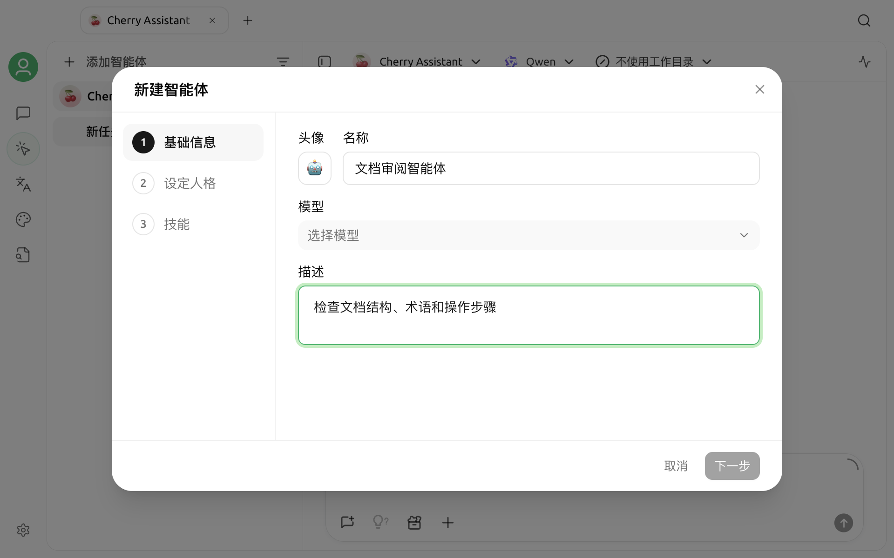

# 智能体



智能体可以在受控权限下读取工作区、调用工具并连续完成多步骤任务。它适合“需要真正执行”的工作，例如整理一批文件、修改项目代码、调用 MCP 服务或按计划生成报告。

如果你只需要固定人设、知识库问答或日常聊天，先使用助手会更简单。两者的区别见[概念入门](concepts-101.md)。

## 开始前

### 配置可用模型

智能体的模型必须支持 Anthropic Messages 端点。模型选择器会自动隐藏 Embedding、Rerank 和图像生成模型，只显示适合智能体对话执行的模型。

如果列表为空，请先在 **设置 → 模型服务** 中：

1. 配置 API 地址和 API Key。
2. 获取或手动添加模型。
3. 确认该模型支持 Anthropic Messages 端点。

模型服务的通用配置方法见[模型服务](../pre-basic/providers/)。

### 确认本地 API 服务器可用

智能体页面底层依赖 Cherry Studio 的本地 API 服务器。V2 在新建智能体时会自动尝试启动服务，通常不需要预先进入设置页操作。

如果智能体页面显示服务已停用或未运行，直接点击页面中的启动按钮；仍无法启动时，再前往 **设置 → API 服务器** 检查端口和运行状态。详见[API 服务器](api-server.md)。

## 创建智能体

通过启动台或侧栏打开 **智能体**，然后点击左侧智能体列表上方的 **+ 智能体**。

也可以打开[资源库](../cherrystudio/preview/library.md)，切换到 **智能体** 后点击新建。资源库会直接打开完整配置页面。

### 最少需要填写什么

| 字段 | 是否必填 | 说明 |
| :--- | :--- | :--- |
| 名称 | 是 | 智能体在列表和会话中的显示名称 |
| 模型 | 是 | 主要执行模型，只显示支持 Anthropic Messages 的模型 |
| 可访问目录 | 否 | 限定智能体可以访问的本地目录；未指定时会创建默认工作目录 |
| 描述 | 否 | 说明用途，方便在资源库中识别 |


可访问目录也是安全边界。不要直接授予整个用户目录、系统目录或保存密钥的目录；优先为任务创建独立工作区，只添加确实需要访问的位置。


保存后，智能体会出现在左侧列表和资源库中。技能按智能体绑定，因此要先完成首次保存，才能为它启用技能。

## 配置页面

从资源库点击智能体卡片，或从智能体会话顶部打开设置，可以继续编辑以下部分：

| 设置区 | 可以配置的内容 |
| :--- | :--- |
| 基础设置 | 头像、名称、主模型、规划模型、小模型、可访问目录、自主模式、心跳和描述 |
| 提示词设置 | 智能体的系统指令 |
| 权限模式 | 工具调用的默认审批方式 |
| 能力扩展 | 内置工具、MCP Server 和技能 |
| 高级设置 | 最大执行轮次和环境变量 |

### 主模型、规划模型和小模型

* **主模型**是必填项，负责大多数对话和工具执行。
* **规划模型**是可选项，可用于需要独立规划的流程。
* **小模型**是可选项，可用于适合轻量模型的辅助步骤。

三个位置都只显示智能体兼容模型。没有明确需求时，只配置主模型即可。

### 提示词

提示词用于定义角色、目标、工作规范和输出要求。比起罗列大量背景，更建议写清：

* 智能体负责什么，不负责什么。
* 哪些目录、数据源和工具可以使用。
* 执行前需要确认哪些操作。
* 结果保存在哪里、采用什么格式。

安全限制不能只依赖提示词。目录范围、权限模式和工具开关仍应单独配置。

## 选择权限模式

权限模式决定哪些工具会自动获得批准。切换模式时，Cherry Studio 会同步更新由该模式自动加入的工具。

| 模式 | 默认行为 | 适合场景 |
| :--- | :--- | :--- |
| 普通模式 | 可自由读取文件；编辑文件或执行命令前询问 | 初次使用、交互式任务 |
| 计划模式 | 只读文件并制定计划；不能编辑文件或执行命令 | 代码审阅、方案设计、风险评估 |
| 自动编辑模式 | 可自由读取和编辑文件；执行命令前询问 | 文档整理、受控代码修改 |
| 全自动模式 | 当前可用工具无需逐次审批 | 无人值守且范围严格受控的任务 |

除了模式自动加入的工具，你还可以在 **能力扩展 → 内置工具** 中手动添加其他工具。


全自动模式会跳过工具审批。智能体可能写入文件、运行命令或调用外部服务。只在隔离工作区中使用，并先用普通模式完整测试同一任务。


## 自主模式与心跳

### 自主模式

开启自主模式后，智能体会使用工作区中的灵魂文件构建自定义系统提示词，获得自主任务管理能力，并禁用不适合无人值守运行的交互式工具。

开启自主模式会同时把权限模式切换为 **全自动模式**；从全自动模式切换到其他模式时，自主模式会关闭。

自主模式适合长期运行、频道和其他无人值守场景。它不是提升回答质量的通用开关：如果任务需要频繁向用户确认，普通智能体更合适。

### 心跳

心跳用于让支持自主运行的智能体按配置的间隔检查并继续处理工作。可以在基础设置中启用或关闭，并设置间隔分钟数。

只有在智能体已经具备明确目标、受限目录和安全工具集时再开启心跳，避免无意义的重复运行。

## 添加工具、MCP 和技能

打开 **能力扩展**，可以在三个标签之间切换：

### 内置工具

内置工具提供文件读取、编辑、命令执行和任务管理等能力。权限模式会自动加入一部分工具；带有模式标记的工具不能单独移除。

只启用任务真正需要的工具。即使使用普通模式，过大的工具集合也会增加模型误选工具的可能。

### MCP

这里会列出 Cherry Studio 中已有的 MCP Server。未启用的 Server 可以显示在已绑定列表中，但不能从新增列表选择；需要先在 **设置 → MCP 服务器** 中启用。

MCP Server 可能访问本地程序或远程服务。绑定前检查其命令、环境变量、目录和远程地址。完整说明见[MCP 使用教程](mcp/)。

### 技能

技能提供任务说明、流程、脚本或模板。只有已经保存并取得 ID 的智能体才能启用技能。

如果列表为空，请先在资源库或 **设置 → 技能** 中安装。详见[技能](../pre-basic/settings/skills.md)。

## 设置高级选项

### 最大执行轮次

最大执行轮次用于限制一次任务可以持续的回合数。留空或设为 `0` 时使用默认值；当前默认上限为 100。

轮次不是“回答长度”。智能体每次规划、工具调用和继续执行都可能占用回合。任务异常循环时，应先检查提示词和工具结果，而不是一味提高上限。

### 环境变量

环境变量按每行一个 `KEY=VALUE` 填写，例如：

```text
PROJECT_ENV=staging
OUTPUT_FORMAT=markdown
```

环境变量会进入智能体运行配置。不要把密码、API Key 或访问令牌写进文档、提示词或截图；敏感值只应保存在受控配置中，并按最小权限管理。

## 开始会话

1. 打开 **智能体** 页面。
2. 从左侧选择智能体。
3. 新建会话，输入一个边界清晰的任务。
4. 查看工具调用卡片；在普通、计划或自动编辑模式下，根据提示批准或拒绝操作。
5. 检查生成或修改的文件，再继续下一步。

一个好的首个测试任务应当范围小、结果容易验证，例如：

> 阅读当前工作区中的 `README.md`，列出需要更新的三处内容。先不要修改文件。

确认读取范围正确后，再逐步允许编辑、命令或外部工具。

## 工作区与记忆

智能体的第一个可访问目录会作为主要工作区。部分能力会在工作区中保存持久文件，例如自主模式的灵魂文件和智能体工作区记忆。

如果两个智能体使用同一个首个可访问目录，它们可能会读写同一组工作区文件。需要隔离项目或身份时，为每个智能体使用不同目录。

工作区记忆的文件结构和使用方式见[智能体工作区记忆](memory.md)。

## 常见问题

### 智能体页面提示 API 服务器未运行

先点击页面中的启动按钮。若启动失败：

1. 打开 **设置 → API 服务器**。
2. 检查端口是否被其他程序占用。
3. 重新启动服务，再返回智能体页面。

### 创建时没有可选模型

智能体只显示支持 Anthropic Messages 端点的对话模型。检查模型是否已添加到模型服务，以及端点能力是否正确；Embedding、Rerank 和图像生成模型不会显示。

### 无法启用技能

先保存智能体。技能启用状态按智能体 ID 保存，新建但尚未保存的智能体没有可绑定的 ID。

### 找不到某个 MCP Server

前往 **设置 → MCP 服务器**，确认 Server 已添加并启用。智能体的新增列表只允许选择处于启用状态的 Server。

### 每次编辑或执行命令都会询问

这是普通模式的预期行为。根据风险选择自动编辑模式，或在能力扩展中调整具体工具。不要仅为了减少提示而直接切换到全自动模式。

### 任务提前停止或反复执行

依次检查：

1. 模型是否稳定支持工具调用。
2. 工具返回是否包含错误或缺少必要数据。
3. 提示词是否给出了明确终止条件。
4. 最大执行轮次是否过低。
5. 自主模式或心跳是否让任务在不合适的场景持续运行。

## 下一步

* 用[技能](../pre-basic/settings/skills.md)固化工作方法。
* 用 [MCP](mcp/) 连接外部工具和数据。
* 了解[智能体工作区记忆](memory.md)。
* 智能体稳定运行后，再配置[频道](agent-channels.md)或[定时任务](scheduled-tasks.md)。
