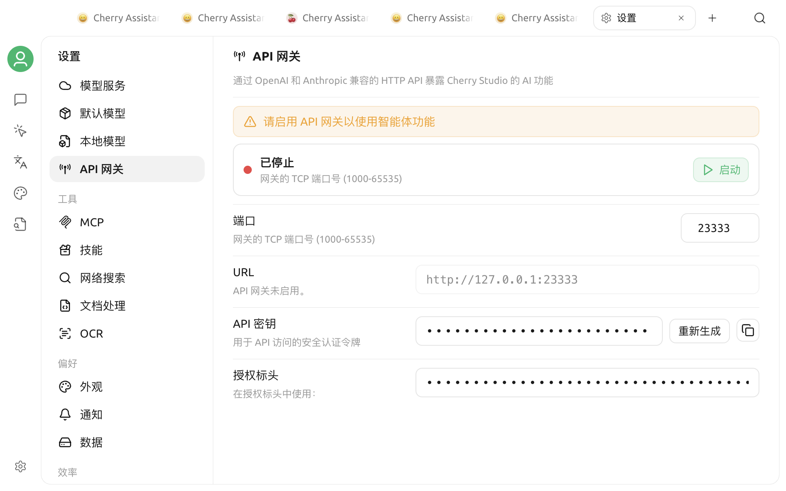

# API 网关

API 网关把 Cherry Studio 中已配置的模型、MCP 和知识库能力开放为本地 HTTP 接口。其他应用可以通过兼容 OpenAI 或 Anthropic 的请求格式调用这些能力，无需在每个工具中重复配置服务商密钥。



常见用途包括：

* 让脚本或第三方工具复用 Cherry Studio 中的模型服务商。
* 通过 OpenAI Chat Completions 或 Anthropic Messages 格式发起对话。
* 从外部程序查询 MCP Server 或搜索 Cherry Studio 知识库。
* 支持 Cherry Studio 的 Agent 页面和部分内部操作。


当前 Agent 页面需要 API 服务器。Cherry Studio 检测到已有 Agent 时会尝试自动启动服务；如果服务被停止，Agent 页面会提示重新启用。频道和定时任务使用独立的本地主进程服务，不要求你另外启用 API 服务器。


## 启动服务器

1. 打开 `设置 → API 服务器`。
2. 确认端口可用。默认端口是 `23333`，可设置为 `1000`–`65535`。
3. 点击 **启动**。

启动后，页面会显示 **运行中**、服务地址和 **API 文档** 按钮。标准配置下的地址为：

```
http://127.0.0.1:23333
```

服务器运行时不能编辑端口。如需修改，先点击 **停止**，更换端口后重新启动。

重新打开 Cherry Studio 时，以下任一条件成立会自动尝试启动：

* API 服务器上次保持启用；
* Cherry Studio 中已经存在 Agent。


API 服务器随 Cherry Studio 运行。退出应用后，本地接口也会停止。


## API 密钥

首次启动时，Cherry Studio 会生成一个以 `cs-sk-` 开头的 API 密钥并保存在本地。重启服务器或应用不会自动更换它。

受保护的接口支持两种认证头：

```
Authorization: Bearer YOUR_API_KEY
```

或：

```
x-api-key: YOUR_API_KEY
```

设置页默认展示 Bearer 格式，并提供复制按钮。需要更换密钥时，先停止服务器，再点击 **重新生成**；新密钥生成后，旧密钥会立即无法通过认证。


API 密钥可以调用 Cherry Studio 中已启用的模型和数据能力。不要把真实密钥写进代码仓库、截图、文档或公开聊天；建议通过环境变量传给调用程序。


## 可用接口

启动服务器后，打开页面右上角的 **API 文档**，或直接访问：

* `/api-docs`：Swagger 形式的交互文档
* `/api-docs.json`：OpenAPI JSON

主要公开接口包括：

| 能力 | 接口 |
|---|---|
| 服务状态 | `GET /health` |
| OpenAI 兼容对话 | `POST /v1/chat/completions` |
| Anthropic 兼容对话 | `POST /v1/messages` |
| 指定服务商的 Anthropic 兼容对话 | `POST /{provider_id}/v1/messages` |
| MCP Server 列表与详情 | `GET /v1/mcps`、`GET /v1/mcps/:server_id` |
| 知识库列表与详情 | `GET /v1/knowledge-bases`、`GET /v1/knowledge-bases/:id` |
| 知识库搜索 | `POST /v1/knowledge-bases/search` |

`GET /`、`GET /health`、`/api-docs` 和 `/api-docs.json` 不要求认证；模型、MCP、知识库和其他 `/v1` 接口需要 API 密钥。


当前 API 没有提供 `GET /v1/models`。如果第三方客户端必须自动拉取模型列表，请改为手动填写模型 ID，或确认客户端允许跳过模型发现。


## 发起第一次请求

下面的示例调用 OpenAI 兼容接口。请把 `YOUR_API_KEY`、`provider-id` 和 `model-id` 替换为自己的值：

```bash
curl http://127.0.0.1:23333/v1/chat/completions \
  -H "Authorization: Bearer YOUR_API_KEY" \
  -H "Content-Type: application/json" \
  -d '{
    "model": "provider-id:model-id",
    "messages": [
      {
        "role": "user",
        "content": "用一句话介绍 Cherry Studio"
      }
    ]
  }'
```

如果需要流式输出，在请求体中加入：

```json
{
  "stream": true
}
```

流式响应使用 Server-Sent Events，并以 `data: [DONE]` 结束。

## 填写模型 ID

API 使用以下格式定位模型：

```
服务商 ID:模型 ID
```

例如，服务商 ID 为 `my-openai`、模型 ID 为 `gpt-4o-mini` 时，应填写：

```
my-openai:gpt-4o-mini
```

这里需要的是 Cherry Studio 内部的服务商 ID，不一定等于设置页显示名称。模型必须已经添加到该服务商并可用；缺少冒号、服务商未启用或模型不存在都会返回请求错误。

API 服务器会从已启用的 OpenAI、Anthropic、Ollama 和 New API 类型服务商中解析可用模型。具体模型能力仍由上游服务商决定。

不同兼容端点的限制并不相同：

* `/v1/chat/completions` 当前只接受类型为 OpenAI 的服务商。
* `/v1/messages` 和 `/{provider_id}/v1/messages` 用于 Anthropic Messages 兼容请求。
* 某个服务商出现在 Cherry Studio 设置中，不代表它能通过所有 API 端点调用。

如果返回“服务商不支持”，先确认服务商类型与所用端点匹配，而不是只检查模型名称。

## 在第三方客户端中使用

对于允许自定义 OpenAI Base URL 的客户端，通常填写：

| 配置项 | 值 |
|---|---|
| Base URL | `http://127.0.0.1:23333/v1` |
| API Key | 设置页显示的 Cherry Studio API 密钥 |
| Model | `服务商 ID:模型 ID` |

不同客户端可能会自动拼接 `/v1`，填写前先查看它的 Base URL 说明。如果最终请求出现 `/v1/v1/chat/completions`，请去掉其中一处 `/v1`。

部分客户端只接受公网 HTTPS 地址、强制调用 `/v1/models`，或不允许模型 ID 中出现冒号。这类客户端无法直接使用当前本地接口。

## 安全边界

标准设置默认监听 `127.0.0.1`，因此只有本机程序可以直接访问。设置页只提供端口修改，不提供局域网开放开关。

从旧版本升级的用户可能保留历史监听地址。请以设置页运行状态显示的实际 URL 为准；如果显示 `0.0.0.0` 或局域网地址，应立即确认这是否是你的预期配置。

如果你通过反向代理、端口转发、SSH 隧道或其他方式把接口转发到另一台设备，需要自行承担额外的访问控制：

* 强制使用 HTTPS。
* 在代理层增加来源限制和速率限制。
* 不在 URL 查询参数中传递 API 密钥。
* 定期更换密钥，并在不使用时停止转发。
* 注意 `/health` 和 API 文档本身不要求认证。

不要把监听地址直接暴露到公网。API 允许跨来源请求，单靠浏览器同源策略不能构成安全保护。

## 排查问题

### 启动失败或端口被占用

如果错误中包含 `EADDRINUSE`：

1. 停止可能正在使用同一端口的其他 Cherry Studio 实例或本地服务。
2. 在设置页改用另一个空闲端口。
3. macOS 或 Linux 可执行 `lsof -i :23333` 查看占用进程；Windows 可执行 `netstat -ano | findstr :23333`。

### 返回 401 或 403

* `401` 通常表示没有认证头、Bearer 格式错误或密钥为空。
* `403` 通常表示密钥与设置页当前值不一致。
* 如果刚重新生成密钥，更新调用程序中的环境变量或配置后再试。

先用下面的无认证请求确认服务是否在线：

```bash
curl http://127.0.0.1:23333/health
```

### 返回模型格式或服务商错误

确认模型使用 `服务商 ID:模型 ID` 格式，并检查：

* 服务商已启用；
* 服务商类型受 API 服务器支持；
* 模型已存在于该服务商的模型列表；
* 请求使用的是内部服务商 ID，而不是仅用于展示的名称。

同时确认端点与服务商类型匹配：OpenAI Chat Completions 当前要求 OpenAI 类型服务商，Anthropic Messages 应使用 Messages 端点。

### 知识库接口返回 503

知识库接口需要读取 Cherry Studio 主窗口中的当前知识库状态。主窗口尚未准备好、正在关闭或内部状态不可用时，接口会返回 `503`。保持主窗口打开并等待应用完成加载后再重试。

### 第三方客户端无法连接

* 确认 Cherry Studio 和 API 服务器都仍在运行。
* 检查客户端是否运行在另一台设备、容器或虚拟机中；其中的 `127.0.0.1` 不一定指向 Cherry Studio 所在主机。
* 检查 Base URL 是否重复或遗漏 `/v1`。
* 使用 `curl` 分别测试 `/health` 和目标接口，以区分网络、认证和请求体问题。

如需进一步排查，可在 `设置 → 数据设置` 打开日志目录。分享日志前必须搜索并遮盖 API 密钥、Token、个人路径和业务数据。

***

### 💡 获取帮助与提交反馈

如果您在配置或使用过程中遇到疑问、Bug 或改进建议，请参考 [反馈与建议](../question-contact/suggestions.md) 中的官方渠道。
