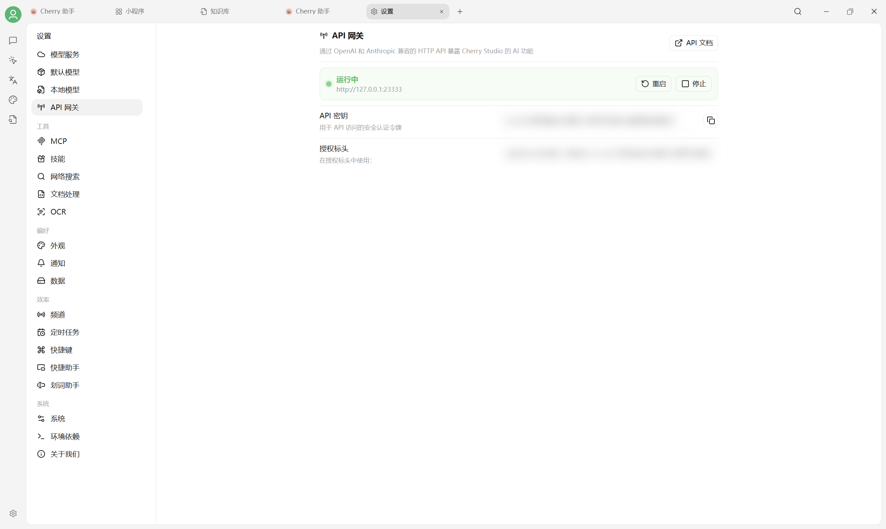

# API 网关

API 网关把 Cherry Studio 中已配置并启用的模型能力，通过本机 HTTP API 提供给脚本、编程工具或其他兼容客户端。V2 同时提供 **OpenAI 兼容**与 **Anthropic 兼容**接口。


日常使用 Cherry Studio 的对话、绘画、翻译和 Agent 不需要开启 API 网关。只有外部程序需要调用 Cherry Studio 时才开启。


## 打开与启动

1. 打开 `设置 → API 网关`。
2. 确认端口可用；默认地址通常为 `http://127.0.0.1:23333`。
3. 点击 **启动**。
4. 状态变为绿色 **运行中** 后，即可复制地址并按 API 文档接入。

<figure><figcaption><p>V2 API 网关运行状态。截图中的密钥字段已遮罩。</p></figcaption></figure>

页面右上角的 **API 文档** 会打开当前版本的接口说明。端点、请求字段和示例应以这里展示的内容为准。

## API 密钥

API 网关使用本地访问密钥保护接口。外部客户端通常需要在请求头中传入：

```http
Authorization: Bearer <你的 API 网关密钥>
```


API 网关密钥可以调用你在 Cherry Studio 中配置的模型。不要把真实密钥放进截图、仓库、聊天记录或公开问题中；如果已经泄露，请立即重新生成。


## 接入外部客户端

外部工具通常需要填写三项：

| 字段 | 填写内容 |
|---|---|
| Base URL | API 网关页面显示的本地地址 |
| API Key | 页面生成的 API 网关密钥 |
| API 类型 | 根据客户端选择 OpenAI 兼容或 Anthropic 兼容 |

不同客户端对 Base URL 是否需要追加路径的要求不同，请先查看 API 文档和目标客户端说明，不要盲目添加 `/v1/chat/completions`。

## 常见问题

### 启动失败或端口被占用

先停止网关，换一个未被占用的端口后重新启动。如果同时运行多个 Cherry Studio 实例，每个实例应使用不同端口。

### 外部程序无法连接

* 确认页面状态为 **运行中**；
* 确认地址、端口和 API 类型填写正确；
* 确认系统防火墙或安全软件没有拦截本地连接；
* 使用页面中的 **API 文档** 示例做最小请求测试。

### 是否能直接从其他电脑访问

V2 页面默认显示本机回环地址 `127.0.0.1`，仅供当前电脑访问。不要为了方便直接暴露到公网；确有跨机需求时，应使用受控隧道、访问控制和独立密钥。

***

### 💡 获取帮助与提交反馈

如果您在配置或使用过程中遇到疑问，请参考 [反馈与建议](../question-contact/suggestions.md)。
