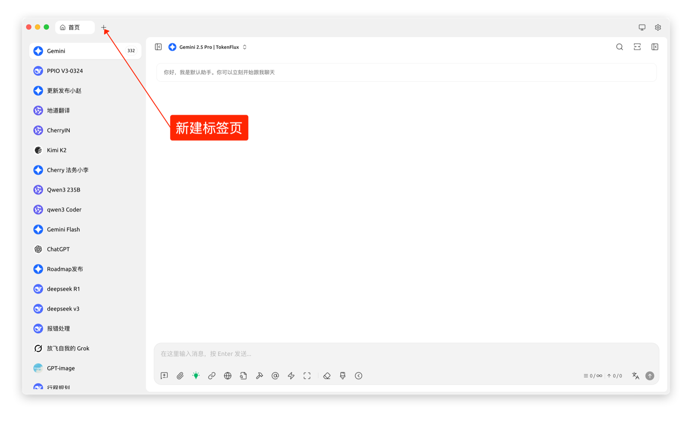
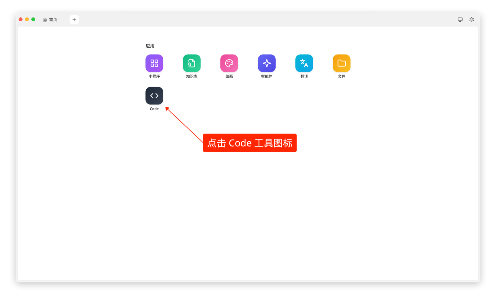
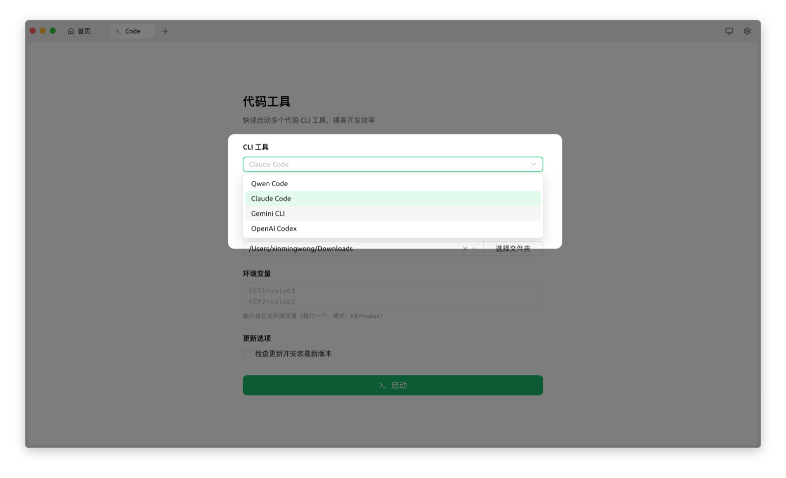
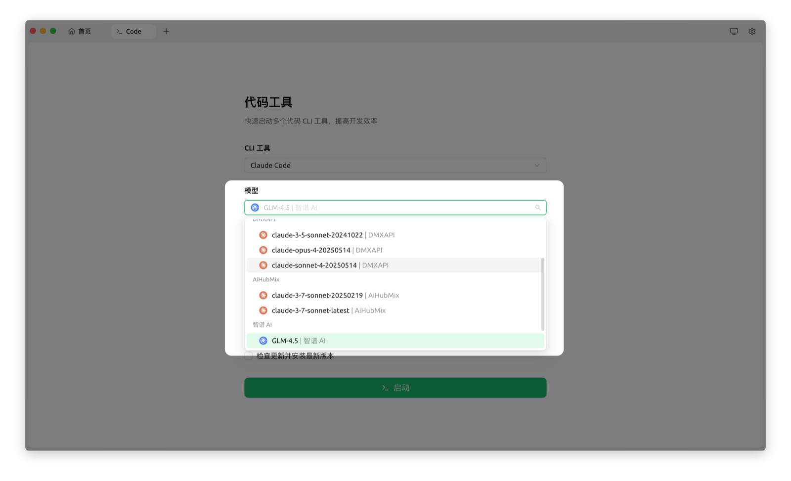
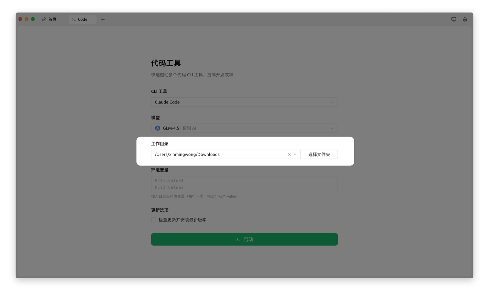
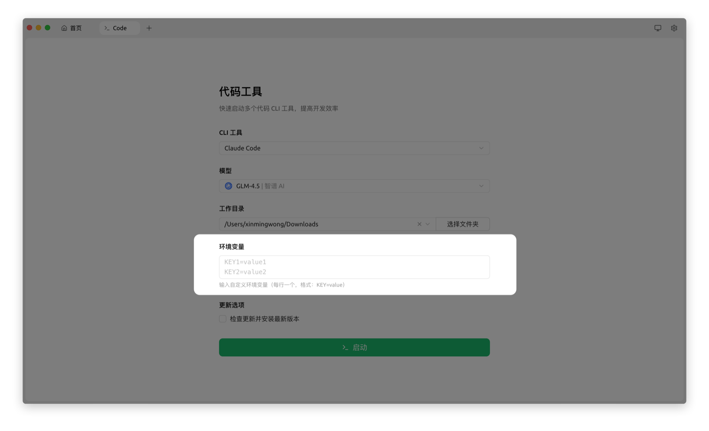
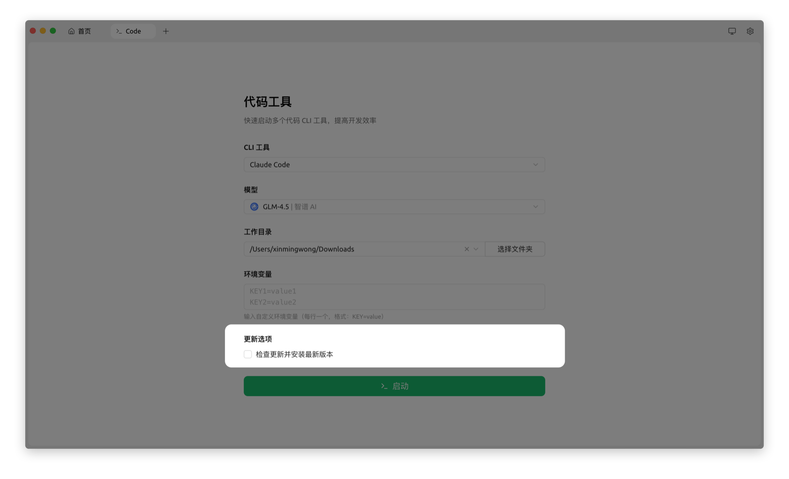
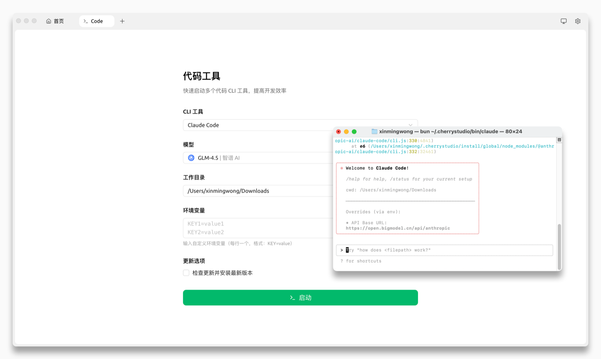

# Code Tools 使用教程

Code Tools 可以在 Cherry Studio 内直接启动和管理多种 AI 编程 CLI，例如 Claude Code、Gemini CLI、Qwen Code 和 OpenAI Codex。本教程以 Cherry Studio v1.9.9 为例，引导你完成一次完整配置。

***

### 操作步骤

#### 1. 确认 Cherry Studio 版本

请先确认 Cherry Studio 已升级到当前正式版。你可以前往 [客户端下载](../cherrystudio/download.md)、[GitHub Releases](https://github.com/CherryHQ/cherry-studio/releases) 或官方网站下载安装包。

#### 2. 进入 Code Tools 界面

顶部导航模式：点击界面顶部的 `+` 号打开启动台，然后点击 **Code**。

<figure><figcaption>
点击顶部 + 打开启动台
</figcaption></figure>

<figure><figcaption>
在启动台中点击 Code
</figcaption></figure>


左侧导航模式下，可直接点击左侧导航栏里的 **Code** 按钮进入该页面。


#### 3. 选择 CLI 工具

根据你的需求和所持有的 API Key，选择一个要使用的 Code Agent 工具。目前支持以下几种：

* **Claude Code**
* **Gemini CLI**
* **Qwen Code**
* **OpenAI Codex**

<figure><figcaption>
选择 Code Agent 工具
</figcaption></figure>

#### 4. 选择 Agent 调用的模型

在模型下拉列表中，选择与所选 CLI 工具兼容的模型。 _（详细的模型兼容性说明，请参考下方的“重要注意事项”）_

<figure><figcaption>
选择模型
</figcaption></figure>

#### 5. 指定工作目录

点击 **选择目录** 按钮，为 Agent 指定一个工作目录。Agent 将拥有访问此目录下所有文件和子目录的权限，以便理解项目上下文、读取文件和执行代码。

<figure><figcaption>
指定工作目录
</figcaption></figure>

#### 6. 设置环境变量

* **自动配置**：你在第 4 步（模型）和第 5 步（工作目录）中的选择，会自动生成相应的环境变量。
* **自定义添加**：如果你的 Agent 或项目需要其他特定的环境变量（例如 `PROXY_URL` 等），可以在此区域自定义添加。

<figure><figcaption>
环境变量配置
</figcaption></figure>

#### 7. 更新选项

* **内置可执行文件**：Cherry Studio 已集成上述 Code Agent 的可执行文件，通常无需手动安装 CLI。
* **自动更新**：如果希望 Agent 始终保持最新版本，可以勾选 **检查更新并安装最新版本**。勾选后，每次启动时程序都会联网检查并更新 Agent 工具。

<figure><figcaption>
更新选项
</figcaption></figure>

#### 8. 启动 Agent

所有配置完成后，点击 **启动** 按钮。Cherry Studio 会自动调用系统自带的 Terminal（终端）工具，并在其中加载好所有环境变量，然后运行你选择的 Code Agent。现在你可以在弹出的终端窗口中与 AI Agent 交互。

<figure><figcaption>
在终端中运行 Code Agent
</figcaption></figure>

***

### 重要注意事项

1. **模型兼容性说明**：
   * **Claude Code**：需要选择支持 Anthropic API Endpoint 格式的模型。优先使用 Claude 系列模型；部分官方平台也会提供 Claude Code 兼容模型，具体以模型下拉列表和服务商说明为准。
   * **Gemini CLI**：需要选择 Google Gemini 系列模型。
   * **Qwen Code**：支持 OpenAI Chat Completions API 格式的模型，推荐使用 Qwen Coder 系列模型以获得更好的代码生成效果。
   * **OpenAI Codex**：需要选择 OpenAI / Codex 兼容的 GPT 系列模型，具体以当前账号和模型服务商支持为准。
   * **注意**：第三方网关（如 One API、New API 等）即使能转发同名模型，也不一定兼容对应 CLI 的认证方式、Endpoint 格式或工具调用协议。若启动失败，请优先使用该 CLI 官方支持的模型服务。
2. **依赖与环境冲突**：
   * Cherry Studio 内部集成了独立的 Node.js 运行环境、Code Agent 可执行文件及环境变量配置，旨在提供一个开箱即用的纯净环境。
   * 如果你在启动 Agent 时遇到依赖冲突或奇怪的错误，可以考虑暂时**卸载或禁用系统内已安装的相关依赖**（如全局安装的 Node.js 或特定工具链），以排除冲突。
3. **API Token 消耗警告**：
   * **Code Agent 对 API Token 的消耗量非常大**。在处理复杂任务时，Agent 为了思考、规划和生成代码，可能会产生大量请求，导致 Token 快速消耗。
   * 请务必根据自己的 API 额度和预算，**量力而为**，密切关注 Token 使用情况，以防止预算超支。

希望本教程能帮助你快速上手 Cherry Studio 强大的 Code Agent 功能！
