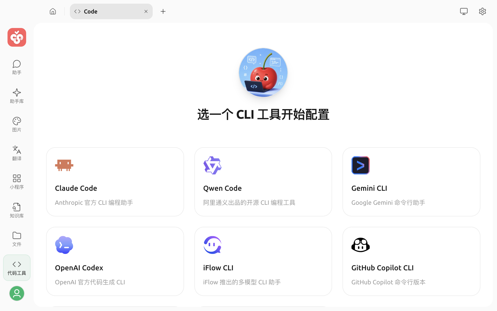
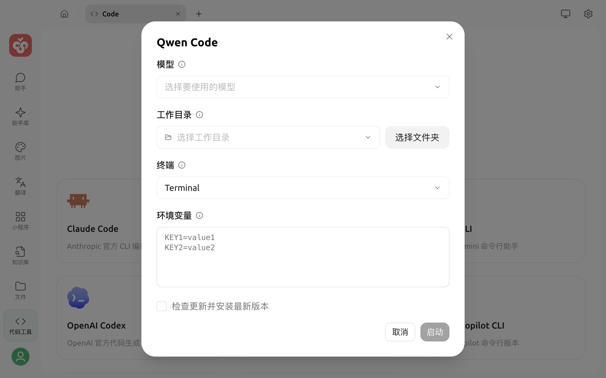

# 代码工具

代码工具用于在 Cherry Studio 中配置并启动 AI 编程 CLI。你可以复用已经配置的模型服务，指定项目目录和终端，再在独立终端窗口中使用 CLI。

## 开始前

* 代码工具需要 **Bun**。如果页面提示尚未安装，点击提示中的 **安装 Bun**。
* 使用 Kimi CLI 时还需要 **uv**；可以在 **设置 → MCP 设置 → 环境依赖** 中安装。
* 除 GitHub Copilot CLI 外，请先在 Cherry Studio 中配置可用的模型服务和 API Key。


AI 编程 CLI 可以在所选工作目录中读取、修改文件并执行命令。建议先使用 Git 或其他方式保存当前版本，不要选择包含无关敏感文件的目录。


## 打开代码工具

1. 点击顶部标签栏右侧的 `+`，打开启动台。
2. 点击 **Code**。
3. 在代码工具页面选择要使用的 CLI。

当前支持：

| CLI | 模型来源 |
| :--- | :--- |
| Claude Code | Anthropic 兼容模型 |
| Qwen Code | OpenAI 兼容模型 |
| Gemini CLI | Gemini 兼容模型 |
| OpenAI Codex | OpenAI 或 OpenAI Responses 兼容模型 |
| iFlow CLI | OpenAI 兼容模型 |
| GitHub Copilot CLI | 不显示模型选择；使用 GitHub Copilot 自身的认证与模型能力 |
| Kimi CLI | OpenAI 兼容模型 |
| OpenCode | OpenAI、OpenAI Responses 或 Anthropic 兼容模型 |

模型列表会根据所选 CLI 的接口类型自动筛选。某个模型没有出现时，先检查服务商是否已启用、模型是否已添加，以及接口类型是否兼容。

## 配置并启动

选择 CLI 卡片后，在配置窗口中完成以下项目：

1. **模型**：选择要交给 CLI 使用的模型。GitHub Copilot CLI 没有这一项。
2. **工作目录**：选择 CLI 启动时进入的项目目录。最近使用的目录会保留在列表中。
3. **终端**：在 macOS 或 Windows 上选择一个已检测到的终端。Windows 使用 WSL、Alacritty 或 WezTerm 时，如果未能自动定位程序，需要设置自定义可执行文件路径。
4. **环境变量**：按 `KEY=value` 格式填写，每行一个。Cherry Studio 会根据模型生成所需变量；这里填写的同名变量会覆盖自动生成值。
5. **检查更新并安装最新版本**：按需开启。开启后，启动前会查询并更新所选 CLI。
6. 点击 **启动**。

如果 CLI 尚未安装，Cherry Studio 会在首次启动时下载安装，然后在所选终端和工作目录中运行。Kimi CLI 由 uv 负责下载和启动，因此首次运行同样需要网络连接。


GitHub Copilot CLI 不使用 Cherry Studio 的模型选择器。需要额外认证信息时，请按照该 CLI 的要求在环境变量区域配置，例如使用 `GITHUB_TOKEN`。


## 环境变量与密钥

除自定义环境变量外，Cherry Studio 会从所选模型服务中读取 API 地址、模型标识和 API Key，并转换为对应 CLI 需要的变量或启动参数。

自定义变量适合代理地址或 CLI 专用开关。填写前请确认变量名；同名自定义值优先于自动生成值，错误覆盖可能导致认证或连接失败。


不要在截图、日志或公开问题中暴露 API Key、GitHub Token 或其他凭据。代码工具会把自定义环境变量保存在当前配置中，只应在可信设备上使用。


## 常见问题

### 启动按钮不可用

确认已经安装 Bun、选择工作目录，并为除 GitHub Copilot CLI 之外的工具选择模型。

### 模型列表为空

所选 CLI 只显示接口类型兼容的模型。返回模型服务设置，检查服务商是否启用、API Key 是否可用、模型是否已添加，以及模型的 Endpoint 类型。

### Kimi CLI 提示找不到 uv

前往 **设置 → MCP 设置 → 环境依赖** 安装 uv。刚安装后仍未识别时，重启 Cherry Studio。

### 终端没有打开

改选系统默认终端。Windows 使用其他终端时，确认对应程序已安装；WSL、Alacritty 或 WezTerm 还可以通过 **设置自定义终端路径** 指定可执行文件。

首次启动、安装 CLI 或检查更新都依赖网络，可能需要等待。若失败，请先检查网络、代理和 API 服务配置，再重新启动。
