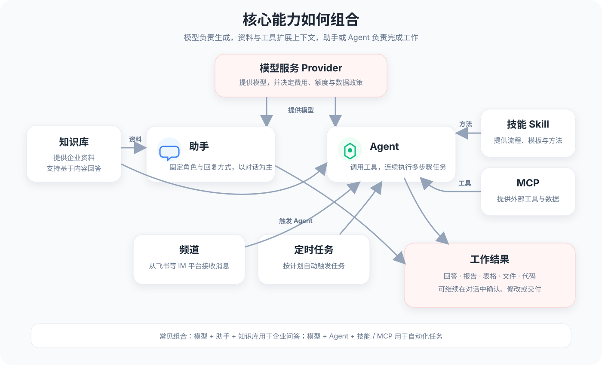

# 核心概念

本页按 Cherry Studio 界面中看到的名称介绍各项能力。需要操作步骤时，直接点击对应名称进入教程。

<figure><figcaption>
模型、资料、工具、触发方式与最终工作结果之间的关系
</figcaption></figure>

## 能力对照

| 界面名称 | 主要用途 | 进入教程 |
|---|---|---|
| **启动台** | 查找并打开应用，把常用应用固定到顶部 | [启动台](../cherrystudio/preview/launchpad.md) |
| **对话** | 与模型交流；管理助手、助手库和话题 | [对话](../cherrystudio/preview/chat.md) |
| **工作** | 让 Agent 读取工作区、调用工具并执行多步骤任务 | [工作（Agent）](agent.md) |
| **绘画** | 使用图像模型生成或编辑图片 | [绘画](../cherrystudio/preview/drawing.md) |
| **翻译** | 翻译文本、图片和文档 | [翻译](../cherrystudio/preview/translation.md) |
| **小程序** | 在客户端内打开常用网页应用 | [小程序](../cherrystudio/preview/app.md) |
| **知识库** | 导入资料并建立可检索的内容库 | [知识库](../knowledge-base/knowledge-base.md) |
| **文件** | 集中管理应用内使用的文件 | [文件](../cherrystudio/preview/files.md) |
| **Code Switch** | 管理和调用外部编码工具 | [Code Switch](code-tools.md) |
| **笔记** | 使用内置 Markdown 编辑器整理内容 | [笔记](../cherrystudio/preview/notes.md) |
| **快捷助手** | 用全局快捷键呼出迷你对话窗口 | [快捷助手](../cherrystudio/preview/quick-assistant.md) |
| **划词助手** | 对其他应用中选中的文字执行 AI 操作 | [划词助手](../cherrystudio/preview/selection-assistant.md) |

## 对话中的助手与工作中的 Agent

* **助手（Assistant）**属于**对话**页面，用于保存角色、提示词和回复风格。
* **Agent**运行在**工作**页面，可以读取工作区、调用工具并连续执行多个步骤。

简单判断：只需要“回答我”时使用对话；需要“替我做”时使用工作。

## 助手与 Agent

助手以对话为主。它保存角色设定和回复方式，也可以结合知识库或 MCP。

Agent 面向需要连续执行的任务。它可以读取工作区、调用已授权的工具，并根据目标完成多个步骤。

相关文档：[对话与助手库](../cherrystudio/preview/chat.md#zhu-shou-ku) · [工作（Agent）](agent.md)

## 知识库

知识库从导入的资料中检索相关内容，再交给模型生成回答。它既可以用于普通对话，也可以作为 Agent 的资料来源。

知识库适合处理相对稳定且需要反复查询的资料；临时文件可以直接作为对话附件使用。

相关文档：[知识库](../knowledge-base/knowledge-base.md)

## 技能与 MCP

技能定义任务的处理方法，通常包含操作说明、模板和配套资源。MCP 提供可调用的外部工具或数据。

例如，制作周报的技能可以规定分析和排版流程；连接项目管理系统的 MCP 工具可以读取实际任务数据。两者可以配合使用。

Cherry Studio 已内置文件上传和知识库能力。读取本地资料不要求配置 MCP。

相关文档：[技能](../pre-basic/settings/skills.md) · [MCP](mcp/)

## 频道与定时任务

频道让 Agent 在支持的 IM 平台中接收消息并返回结果。定时任务按设定的时间自动触发 Agent。

这两项能力负责触发和传递任务，不改变 Agent 本身的模型、工具或权限设置。

相关文档：[频道](agent-channels.md) · [定时任务](scheduled-tasks.md)

## 组合关系

* Provider 提供模型。
* 知识库提供资料。
* 技能提供处理方法。
* MCP 提供外部工具与数据。
* 助手和 Agent 负责对话或任务执行。
* 频道和定时任务提供消息入口或自动触发。

## 按需求查阅

* 配置模型并开始对话：[快速开始](../getting-started/quick-start.md)
* 固定对话角色：[对话页面中的助手库](../cherrystudio/preview/chat.md#zhu-shou-ku)
* 使用自己的资料：[知识库](../knowledge-base/knowledge-base.md)
* 执行多步骤任务：[工作（Agent）](agent.md)
* 连接外部服务：[MCP](mcp/)
* 接入群聊或周期运行：[频道](agent-channels.md) · [定时任务](scheduled-tasks.md)
