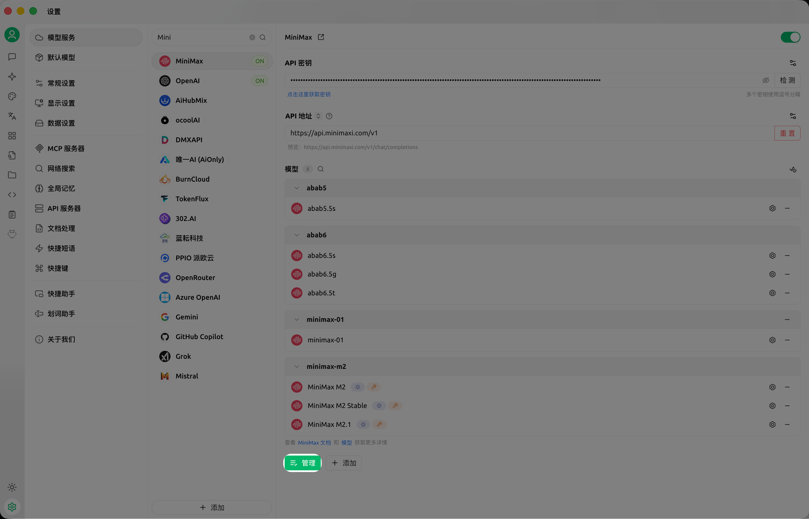

# 调用链使用说明

## 功能介绍

调用链（又称“trace”）为用户提供对话的洞察能力，帮助用户觉察模型、知识库、MCP、网络搜索等在对话过程中的具体表现。它是一个基于 [OpenTelemetry](https://opentelemetry.io/docs/languages/js/) 实现的可观测工具，通过端侧采集、存储、处理数据实现可视化，为定位问题、优化效果提供量化评估依据。

每次对话对应一条 trace 数据，一条 trace 由多个 span 组成，每个 span 对应 Cherry Studio 的一个程序处理逻辑如调用模型会话、调用 MCP 、调用知识库、调用网络搜索等。trace 以树结构展示，span 为树节点，主要数据包括耗时、token 使用量，当然在 span 详情还可以查看其具体的输入输出。

<figure><figcaption></figcaption></figure>

## 开启 Trace

默认情况下，Cherry Studio 安装之后，Trace 是隐藏的状态。需要在 "设置"-"常规设置" - "开发者模式" 中开启，如下图：

<figure><figcaption></figcaption></figure>

且对于之前的会话不会产生 Trace 记录，只会在新的问答产生之后才会产生 Trace 记录。所产生的记录存储在本地，如需要彻底清除 Trace ，可以通过 "设置" - "数据设置" - "数据目录" - "清除缓存" 进行清除，也可通过手动 删除 \~/.cherrystudio/trace 下的文件进行清除，如下图：

<figure><figcaption></figcaption></figure>

## 场景介绍

### 全链路查看

在 Cherry Studio 对话框中点击调用链查看调用链的全链路数据。无论在对话过程中调用了模型，还是网络搜索、知识库、MCP，都可以在调用链窗口中查看到全链路调用数据。

<figure><figcaption></figcaption></figure>

<figure><figcaption></figcaption></figure>

### 查看链路中模型

若想要查看调用链中模型的详情，可以点击模型调用节点，查看其输入、输出详情。

<figure><figcaption></figcaption></figure>

<figure><figcaption></figcaption></figure>

<figure><figcaption></figcaption></figure>

### 查看链路中网络搜索

若想要查看调用链中网络搜索的详情，可以点击网络搜索调用节点，查看其输入、输出详情。在详情中，可以查看到调用网络搜索查询的问题和其返回的结果。

<figure><figcaption></figcaption></figure>

<figure><figcaption></figcaption></figure>

<figure><figcaption></figcaption></figure>

### 查看链路中知识库

若想要查看调用链中知识库的详情，可以点击知识库调用节点，查看其输入、输出详情。在详情中，可以查看到调用知识库查询的问题和其返回的答案。

<figure><figcaption></figcaption></figure>

### 查看链路中 MCP 调用情况

若想要查看调用链中 MCP 的详情，可以点击 MCP 调用节点，查看其输入、输出详情。在详情中，可以查看到调用此 MCP Server tool 的入参和 tool 的返回。

<figure><figcaption></figcaption></figure>

<figure><figcaption></figcaption></figure>

## 问题和建议

当前功能由阿里云 [EDAS](https://www.aliyun.com/product/edas) 团队提供，如有问题或建议，请进入钉钉群 （ 群号： 21958624 ） 与开发者进行深度沟通。

\
