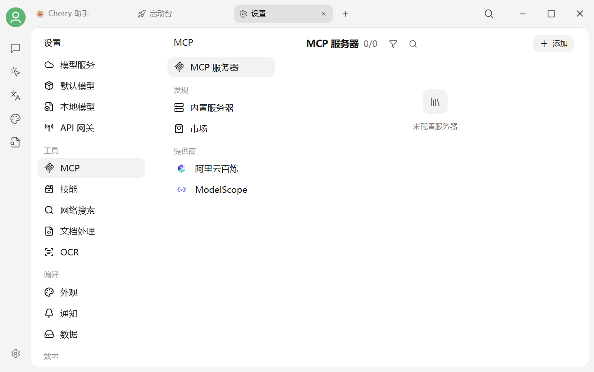

# MCP 使用教程

<figure><figcaption>
设置 → MCP：管理服务器、内置服务器和市场
</figcaption></figure>

## 一句话理解 MCP

**MCP 是让 AI 能调用你电脑或在线账号里资源的"统一接口"。**

类比：

* AI 默认像一台**未安装任何 App 的手机** —— 只能聊天，无法访问你电脑里的文件，无法登录你的 Notion，也无法操作浏览器
* **MCP** 类似手机的**应用商店 + 通用接口**：安装一个 MCP，AI 就获得一项新能力，例如"读取本地文件"、"查询 Notion 内容"、"代为发送邮件"

MCP 由 Anthropic 公司发起并制定统一规范，全球开发者按此规范开发各类工具组件（称为 **MCP Server**）。任何支持 MCP 的 AI 客户端（包括 Cherry Studio）都可使用同一批工具。

## 用 MCP 能做什么？

以下是适合普通用户的常见场景：

* **读取本地文件**：让 AI 访问 `~/Documents` 中的笔记、账单、合同
* **接入笔记类工具**：让 AI 查询并修改 Notion / Obsidian / Apple Notes 中的内容
* **自动收发消息**：让 AI 起草并直接发送邮件、飞书消息
* **查询数据库**：让 AI 自动编写 SQL 查询 MySQL / PostgreSQL
* **浏览网页 + 截屏**：让 AI 操作浏览器获取信息
* **代码协作**：让 AI 直接读取/修改本地代码仓库、查询 GitHub Issue

## MCP 与「技能」的区别

二者容易混淆，对比如下：

| | **技能（Skill）** | **MCP** |
|---|---|---|
| **本质** | "怎么做"的能力包 | "用什么"的接口 |
| **类比** | AI 的学历背景（思考方式） | AI 的工具箱（操作能力） |
| **典型例子** | "会做小红书图文"、"会画流程图" | "可读取文件"、"可查询 Notion"、"可发送邮件" |
| **是否需要外部账号/工具** | 不需要（纯模型层） | 通常需要（接入外部 App / API） |

**实操区别**：安装一个"小红书技能"后，AI 输出会符合小红书风格；安装一个 Notion MCP 后，AI 才能真正访问你的 Notion 数据。

> 推荐先阅读 [概念入门](../concepts-101.md)。

## 1. 检查运行环境

打开 `设置 → 环境依赖`。目标 MCP 的命令包含 `uvx` / `uv run` 时需要 uv，包含 `bunx` / `bun run` 时需要 Bun。显示版本号或“内置”即表示可用；不必预先安装页面中的全部工具。

## 2. 添加 MCP



1. 打开 `设置 → MCP → 内置服务器`。
2. 找到需要的服务器，例如 `@cherry/fetch`。
3. 按页面提示启用或添加。
4. 返回 MCP 服务器列表，确认状态正常。

<figure><figcaption>
优先选择客户端已经集成的 MCP
</figcaption></figure>



1. 打开 `设置 → MCP → MCP 服务器`。
2. 点击 **添加 → 快速创建**。
3. 按 MCP 官方说明填写名称、传输类型、命令、参数和环境变量。
4. 保存并等待首次下载和启动完成。

<figure><figcaption>
命令、参数与环境变量需要分别填写
</figcaption></figure>



常见传输类型：

| 类型 | 使用场景 |
|---|---|
| stdio | 在本机通过命令启动 |
| SSE | 连接使用服务器发送事件的远端 MCP |
| Streamable HTTP | 连接使用当前 HTTP 传输协议的远端 MCP |

## 3. 在对话或工作中启用

* **对话**：在输入框工具区打开 **MCP**，勾选需要的服务器。
* **工作**：打开 Agent 编辑面板，进入 `工具 → MCP`，只启用当前任务需要的服务器。

成功时，服务器状态正常，工具列表中能看到对应工具，执行任务时会出现工具调用记录。

## 哪里能找到 MCP？

* **官方仓库**：[github.com/modelcontextprotocol/servers](https://github.com/modelcontextprotocol/servers)（最全）
* **Cherry Studio 内置市场**：在 `设置 → MCP → 发现 → 内置服务器` 中浏览与一键安装社区和官方插件。
* **Cherry Studio 内置服务提供商**：`设置 → MCP → 服务商` 中集成了部分服务商，可以在配置后获取其 MCP。
* **第三方分享**：Reddit / Discord / 个人博客都有很多。

## 常见疑问

**Q：安装 MCP 需要编程能力吗？**
不需要。通常只需复制一段配置粘贴到 Cherry Studio，或使用 [自动安装](auto-install.md) 让 AI 代为完成。

**Q：安装错误会损坏我的电脑吗？**
存在实际风险。MCP Server 是在本机或远端运行的程序，它能做什么取决于自身代码、系统权限和你提供的凭据，不能只看名称判断。优先使用应用内置或可审查的官方实现，只授予完成任务所需的最小目录和账号权限。

**Q：MCP 是否会获取我的数据？**
取决于具体的 MCP 实现。官方仓库中的开源 MCP 代码可审查，相对可信；第三方闭源 MCP 安装前请确认开发者身份。

### 服务器无法启动

依次检查命令是否存在、参数是否分开填写、首次下载依赖所需的网络，以及 API Key 等环境变量是否完整。修改后保存并重新启动服务器。

### 对话里看不到 MCP 工具

确认 MCP 总开关和目标服务器均已启用，当前助手或 Agent 已关联该服务器，并且服务器成功加载出工具列表。配置完成后建议新建话题再测试。


命令、参数和环境变量必须以目标 MCP 的当前官方说明为准。只安装可信服务器，并仅授予完成任务所需的最小账号和目录权限。


***

### 💡 获取帮助与提交反馈

如果您在配置或使用过程中遇到任何疑问、Bug 或有功能改进建议，请参考 [反馈与建议](../../question-contact/suggestions.md) 中提供的官方渠道。
