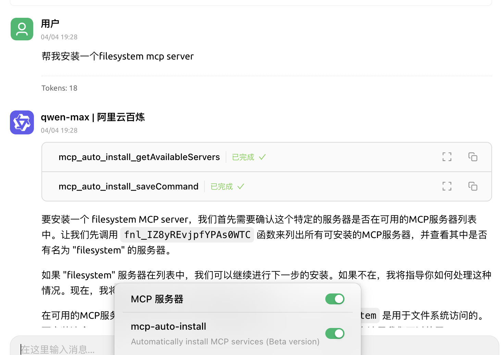
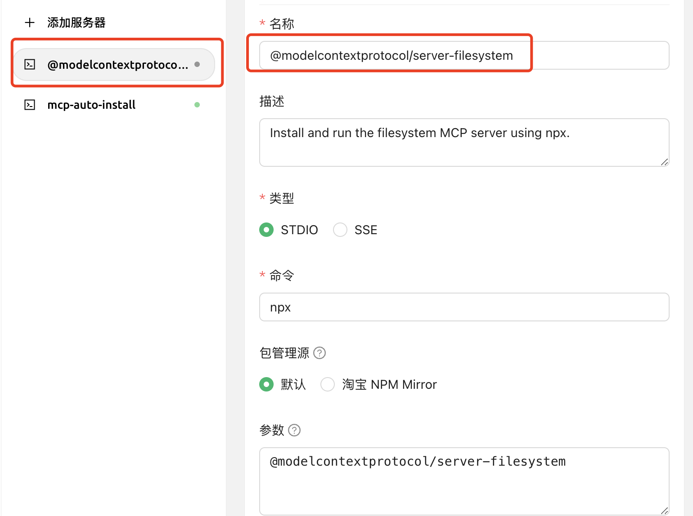

# 自动安装 MCP

Cherry Studio V2 内置了实验性的 `@cherry/mcp-auto-install` 服务。它可以根据你的自然语言需求搜索并生成 MCP 服务器配置，适合快速试用；涉及生产环境或敏感数据时，仍建议手动核对配置。

## 使用前准备

开始前请确认：

* 已配置一个支持工具调用的对话模型；
* 当前网络可以访问 MCP 包的下载源；
* 你理解目标 MCP 服务器需要的权限和环境变量。


自动安装结果由模型生成，可能出现包名、启动参数或环境变量不完整的情况。保存前请核对项目主页，不要直接运行来源不明的 MCP 包。


## 操作步骤

1. 打开 **设置 → MCP**。
2. 找到内置的 `@cherry/mcp-auto-install`，启用并保存。
3. 回到对话页，在当前助手中启用该 MCP 服务器。
4. 用一句话说明要安装的能力。例如：

```
帮我安装一个只允许访问 D:\Documents 的 filesystem MCP server。
```

<figure><figcaption><p>描述需要安装的 MCP 能力</p></figcaption></figure>

5. 查看模型给出的安装结果，进入 MCP 配置页核对命令、参数、环境变量和可访问目录。
6. 启用新服务器，确认状态正常并成功加载工具后，再回到对话中测试。

<figure><figcaption><p>保存前核对服务器配置</p></figcaption></figure>

## 成功标志

* 新服务器出现在 MCP 列表中；
* 服务器状态正常，并显示可用工具；
* 新建话题后，模型能够按要求调用对应工具。

## 常见问题

### 安装后服务器无法启动

优先检查运行器是否存在、包下载是否被网络阻止，以及必填环境变量是否为空。不要反复让模型生成新配置；先对照目标 MCP 项目的官方安装说明逐项核对。

### 模型没有执行安装

换用支持工具调用的模型，并在当前助手中确认自动安装服务器已经启用。也可以把需求拆小，只说明一种能力、一个目标目录和一个权限范围。

***

### 💡 获取帮助与提交反馈

如果您在配置或使用过程中遇到任何疑问、Bug 或有功能改进建议，请参考 [反馈与建议](../../question-contact/suggestions.md) 中提供的官方渠道。
