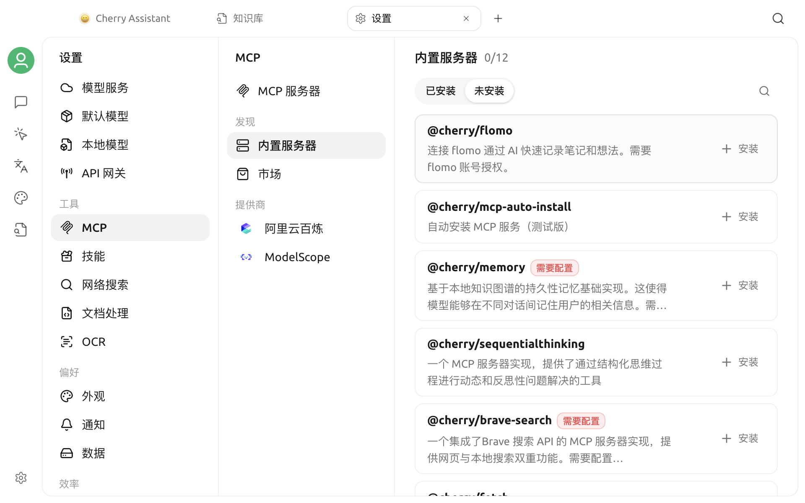

# 内置 MCP 服务器

Cherry Studio 提供一组可以直接安装的内置 MCP 服务器。它们由应用内置运行或使用预设连接，无需手动编写 JSON 配置，适合快速为助手和智能体增加网页读取、文件操作、代码执行、记忆和第三方服务等能力。




“内置”不代表全部自动启用。需要先从内置列表安装服务器；带有 **需要配置** 标记的服务器，还必须填写参数或环境变量。


## 安装与使用

1. 打开 **设置 → MCP 服务器**。
2. 在 **内置服务器** 区域查找需要的服务器，也可以切换到 **可安装** 筛选。
3. 点击 **安装**。
4. 如果服务器显示 **需要配置**，回到已安装服务器列表并点击该服务器，填写本页说明的参数。
5. 保存并启用服务器。
6. 在目标助手或智能体的工具设置中添加该 MCP 服务器。

对话时还需要使用支持工具调用的模型。只安装服务器但未添加到当前助手或智能体，模型无法使用其中的工具。

## 当前内置服务器

| 服务器 | 主要用途 | 是否需要额外准备 |
| --- | --- | --- |
| `@cherry/fetch` | 以 HTML、Markdown、纯文本或 JSON 读取 URL | 否 |
| `@cherry/browser` | 打开和操作动态网页、管理标签页、截图 | 否 |
| `@cherry/filesystem` | 在限定目录内查找、读取、编辑和删除文件 | 配置允许访问的目录 |
| `@cherry/python` | 在 Pyodide 环境中执行 Python 代码 | 否 |
| `@cherry/brave-search` | Brave 网页搜索与本地地点搜索 | `BRAVE_API_KEY` |
| `@cherry/memory` | 使用本地知识图谱保存跨对话记忆 | `MEMORY_FILE_PATH` |
| `@cherry/sequentialthinking` | 为复杂任务提供分步、修订和分支思考工具 | 否 |
| `@cherry/dify-knowledge` | 查询 Dify 知识库 | API 地址和 `DIFY_KEY` |
| `@cherry/flomo` | 将笔记和想法写入 flomo | flomo 账号授权 |
| `@cherry/didi-mcp` | 地点搜索、价格预估和网约车订单操作 | `DIDI_API_KEY`，仅支持中国大陆 |
| `@cherry/nowledge-mem` | 连接本机运行的 Nowledge Mem | 安装并运行 Nowledge Mem |
| `@cherry/mcp-auto-install` | 让模型搜索并安装其他 MCP 服务器 | 测试功能，需可用的 NPX 或内置 Bun |

## 网页与代码工具

### `@cherry/fetch`

适合读取不需要复杂交互的网页或接口。它提供 HTML、Markdown、纯文本和 JSON 四种读取方式，并支持在请求中传入自定义 Header。

如果页面依赖登录状态、JavaScript 渲染或点击操作，请改用 `@cherry/browser`。

### `@cherry/browser`

通过 Cherry Studio 管理的 Electron 浏览器窗口操作网页，支持：

- 打开 URL 和执行页面脚本；
- 获取页面快照或截图；
- 列出、切换和关闭标签页；
- 重置浏览会话。

浏览器会接触页面内容和可能存在的登录状态。使用前检查模型准备访问的站点，不要让不受信任的提示词执行敏感账号操作。

### `@cherry/python`

提供 `python_execute` 工具，在 Pyodide 环境中运行 Python 3.12 代码。适合数据计算、文本处理和格式转换，也可以通过 PEP 723 元数据声明依赖。

每次调用默认超时为 60 秒。它不是本机完整 Python 环境，依赖原生二进制、系统命令或特定硬件的代码可能无法运行。

### `@cherry/sequentialthinking`

为模型提供可修订、可分支的分步思考工具。它适合复杂规划和分析任务，但不会自动提高所有回答的质量；简单问题通常无需启用。

## 本地文件与记忆

### `@cherry/filesystem`

提供 `glob`、`ls`、`grep`、`read`、`edit`、`write` 和 `delete` 工具。服务器只应访问你明确授权的工作目录。

安装后，在服务器详情中使用以下任一方式配置目录：

- **参数**：第一行填写工作目录的绝对路径；
- **环境变量**：填写 `WORKSPACE_ROOT=绝对路径`。

如果两者同时存在，`WORKSPACE_ROOT` 优先。`~` 可以展开为用户目录，但为了减少歧义，建议填写完整绝对路径。


默认情况下，`write`、`edit` 和 `delete` 不会自动批准。不要扩大授权目录，也不要为了省略确认而一次性批准不熟悉的写入或删除操作。


### `@cherry/memory`

把实体、关系和观察记录保存在本地 JSON 文件中，供模型跨对话读取和更新。安装后配置：

```text
MEMORY_FILE_PATH=/绝对路径/memory.json
```

这是 MCP 服务器自己的知识图谱记忆，与 Cherry Studio 的 [全局记忆](../memory.md) 是两套独立功能。一般用户可以先使用全局记忆；只有需要直接控制实体和关系时再启用此服务器。

### `@cherry/nowledge-mem`

连接本机 `http://127.0.0.1:14242/mcp`。使用前需要安装并运行 [Nowledge Mem](https://mem.nowledge.co/)；Cherry Studio 中无需填写远程 URL。

## 搜索、知识库与第三方服务

### `@cherry/brave-search`

提供网页搜索和本地地点搜索。先从 [Brave Search API](https://brave.com/search/api/) 获取密钥，然后在服务器详情中填写：

```text
BRAVE_API_KEY=你的 API Key
```

### `@cherry/dify-knowledge`

列出并检索 Dify 知识库。需要在 **参数** 中填写知识库 API 根地址，并在 **环境变量** 中填写 `DIFY_KEY`。完整步骤请参阅 [连接 Dify 知识库](dify.md)。

### `@cherry/flomo`

通过 flomo 的远程 MCP 地址连接账号。安装并启用后，如果出现授权页面，请按提示完成 flomo 账号授权。不要在 Cherry Studio 的参数或环境变量中粘贴 flomo 登录密码。

### `@cherry/didi-mcp`

提供地点搜索、价格预估、创建或取消网约车订单、查询订单和司机位置等工具。安装后填写：

```text
DIDI_API_KEY=你的 API Key
```

该服务仅支持中国大陆。创建订单和取消订单会产生真实外部操作，建议在 **工具**页关闭这些工具的自动批准。

### `@cherry/mcp-auto-install`

允许模型在对话中搜索并安装其他 MCP 服务器，目前属于测试功能。该预设通过 NPX 启动；如果启动失败，请先在 MCP 设置中检查并安装运行依赖。详细说明请参阅 [自动安装 MCP](auto-install.md)。

## 权限建议

内置服务器使用统一的 MCP 权限设置。安装后建议逐项检查：

- 只启用当前任务需要的服务器和工具；
- 文件、浏览器、记忆和第三方账号工具只授权必要范围；
- 写文件、删除文件、创建订单、取消订单等操作保留人工确认；
- 不再使用的服务器及时停用或卸载；
- API Key 只保存在服务器配置中，不要放入提示词、截图或共享记录。

## 常见问题

### 已安装，但对话中找不到工具

确认服务器已经启用，并已添加到当前助手或智能体。然后检查所选模型是否支持工具调用。

### 显示“需要配置”

安装后点击已安装服务器列表中的对应条目，在 **设置**页填写参数或环境变量并保存。参数和环境变量均为一行一项。

### 服务器启用失败

打开服务器详情中的日志，先检查缺少参数、无效 API Key、目录权限或本地依赖。更多排查方法请参阅 [MCP 服务器常见问题](faq.md)。

## 相关文档

- [配置和使用 MCP](config.md)
- [自动安装 MCP](auto-install.md)
- [MCP 服务器常见问题](faq.md)
- [反馈与建议](../../question-contact/suggestions.md)
