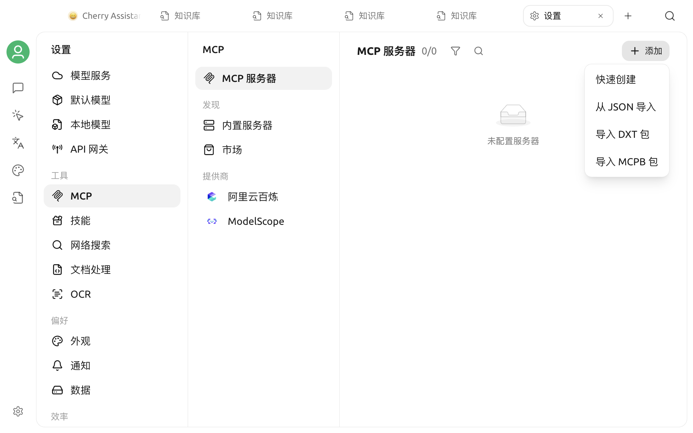

# 配置和使用 MCP

在 Cherry Studio 中使用 MCP 分为两件事：

1. 把 MCP 服务器添加到 **设置 → MCP 服务器**，完成连接和权限配置；
2. 把已启用的服务器添加到需要使用它的助手或 Agent。

如果还不了解 MCP 的作用，请先阅读 [MCP 使用教程](README.md)。如果系统缺少 NPX、Bun 或 UV，请先完成 [MCP 环境安装](install.md)。



## 选择添加方式

打开 **设置 → MCP 服务器**，点击 **添加**，可以选择：

| 方式 | 适用场景 |
| --- | --- |
| 新建 | 手动填写 STDIO、SSE 或 Streamable HTTP 配置 |
| 从 JSON 导入 | 开发者已经提供 `mcpServers` JSON |
| 从 DXT 导入 | 已获得 `.dxt` 扩展包 |
| 内置服务器 | 使用 Cherry Studio 已适配的常用工具 |

常见需求优先检查[内置 MCP 服务器](builtin.md)。内置版本无需手动查找命令，也更容易控制权限。

## 连接类型

### STDIO

STDIO 服务器由 Cherry Studio 在本机启动，通常需要填写：

| 字段 | 说明 |
| --- | --- |
| 名称 | 用于识别服务器，可以自定义 |
| 类型 | `STDIO` |
| 命令 | 可执行程序，例如 `npx`、`uvx`、`node` |
| 参数 | 每行一个参数，顺序必须与开发者文档一致 |
| 环境变量 | 每行一个 `KEY=value` |

当命令包含 NPX、Bun、UV 或 UVX 时，页面会显示可选的软件包镜像设置。除非默认源不可用，否则不需要修改。

下面使用官方 Time Server 演示最小配置：

| 字段 | 值 |
| --- | --- |
| 名称 | `time` |
| 类型 | `STDIO` |
| 命令 | `uvx` |
| 参数 | 第一行 `mcp-server-time`，第二行 `--local-timezone=Asia/Shanghai` |

也可以省略时区参数，让模型在调用工具时显式传入时区。

### SSE

用于连接使用 Server-Sent Events 的远程 MCP 服务器。选择 `SSE` 后填写服务器 URL，例如：

```text
https://example.com/sse
```

如果服务需要认证，在 **Headers** 中每行填写一个 `KEY=value`：

```text
Authorization=Bearer your-token
```

### Streamable HTTP

用于连接较新的 Streamable HTTP MCP 服务器。配置方式和 SSE 相似，但 URL 通常以 `/mcp` 结尾：

```text
https://example.com/mcp
```

协议类型必须与服务端一致。不能因为某个 URL 可以在浏览器打开，就假设它同时支持 SSE 和 Streamable HTTP。


远程服务器的 Header 可能包含账号令牌。只把密钥填写在服务器设置中，不要放进提示词、截图或共享配置。


## 从 JSON 导入

Cherry Studio 每次只导入一个服务器。常见格式如下：

```json
{
  "mcpServers": {
    "example-server": {
      "command": "npx",
      "args": ["-y", "@example/mcp-server"],
      "env": {
        "EXAMPLE_API_KEY": "在导入后替换"
      }
    }
  }
}
```

远程服务器可以使用 `type`、`url` 和 `headers`：

```json
{
  "mcpServers": {
    "remote-example": {
      "type": "streamableHttp",
      "url": "https://example.com/mcp",
      "headers": {
        "Authorization": "Bearer your-token"
      }
    }
  }
}
```

导入后服务器默认不启用。请先打开详情页检查命令、参数、URL、Header 和环境变量，再尝试连接。

## 从 DXT 导入

DXT 是包含服务器清单与资源的扩展包。选择 `.dxt` 文件后，Cherry Studio 会读取其中的启动配置并创建服务器。

DXT 仍然属于可执行扩展。只安装可信来源的文件，并在导入后检查提供者、命令、参数和需要的权限。

## 检查服务器详情

点击已安装服务器进入详情页。保存配置并启用后，可以查看：

- **设置**：连接类型、命令、参数、环境变量、Header、超时和高级信息；
- **工具**：服务器提供的工具、参数结构、启用状态和自动批准；
- **提示词**：服务器提供的 MCP Prompts；
- **资源**：服务器提供的 MCP Resources；
- **日志**：连接过程和 STDIO 错误输出。

并非所有服务器都会提供提示词或资源；这些页签只在服务器启用后出现。

### 超时与长任务

普通工具调用默认超时为 60 秒。只有服务器确实需要长时间运行时，才开启 **Long Running** 或提高超时时间。超时设置不能修复错误的命令、无效密钥或无法访问的 URL。

### 工具权限

在 **工具**页可以单独停用某个工具，也可以控制是否自动批准。建议：

- 查询和只读工具按需启用；
- 写文件、删除数据、发送消息、创建订单等操作保留人工确认；
- 不使用的工具直接关闭，减少模型误调用的范围。

## 在普通助手中使用

打开助手设置的 **MCP** 页面，或使用输入框中的 MCP 快捷面板，可以选择三种模式：

| 模式 | 行为 |
| --- | --- |
| 禁用 | 当前助手不使用 MCP |
| 自动 | 通过内置 Hub 发现并调用所有已启用 MCP 服务器中的工具 |
| 手动 | 只使用你为当前助手选中的已启用服务器 |

对权限敏感的工作建议使用 **手动** 模式。自动模式适合工具较多、需要模型自行发现能力的场景，但仍应在每个服务器的 **工具**页限制高风险操作。

选择模式后，使用支持工具调用的模型并提出明确任务。例如：

```text
请使用 time 工具查询东京当前时间，并同时给出与上海的时差。
```

模型是否调用工具取决于模型能力、问题和提示词。需要强制检索时，可以明确写出服务器或工具的用途。

## 在 Agent 中使用

1. 打开目标 Agent 的编辑或设置页面。
2. 进入 **工具 → MCP**。
3. 添加需要的服务器。
4. 保存 Agent。

只有已启用的 MCP 服务器可以被选择。服务器被停用后，即使仍保留在 Agent 配置中，也不会提供工具。

## 验证是否连接成功

建议按以下顺序检查：

1. 服务器列表中状态为启用；
2. 详情页的 **工具**页能列出工具；
3. 目标助手或 Agent 已添加该服务器；
4. 所选模型支持工具调用；
5. 发送一个范围明确、结果容易验证的测试问题；
6. 在回答中展开工具调用记录，确认参数和结果正确。

如果服务器无法启动、连接后没有工具或调用超时，请查看 [MCP 服务器常见问题](faq.md)。

## 相关文档

- [MCP 使用教程](README.md)
- [MCP 环境安装](install.md)
- [内置 MCP 服务器](builtin.md)
- [自动安装 MCP](auto-install.md)
- [反馈与建议](../../question-contact/suggestions.md)
