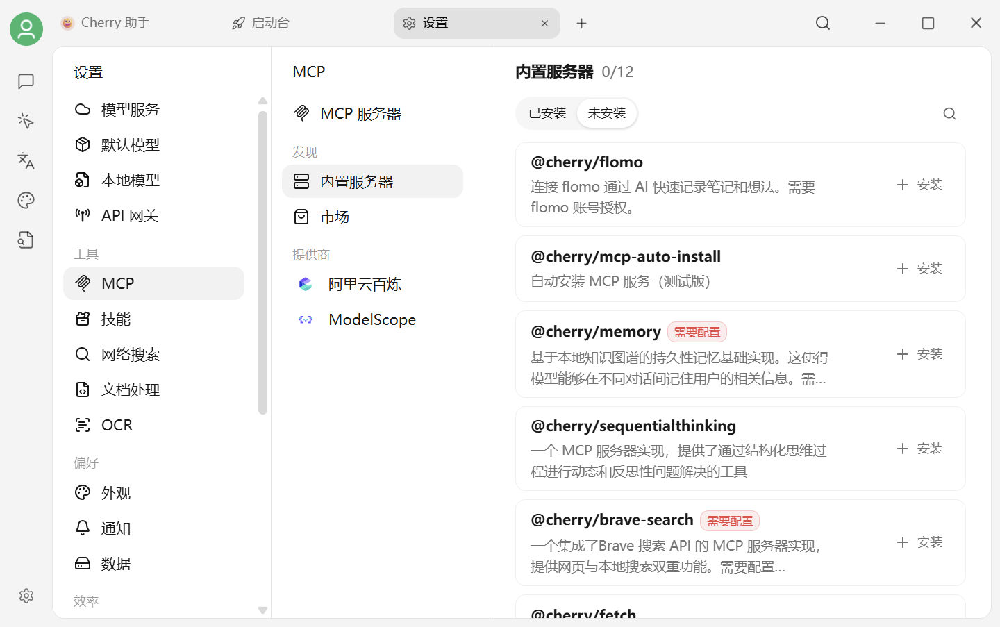
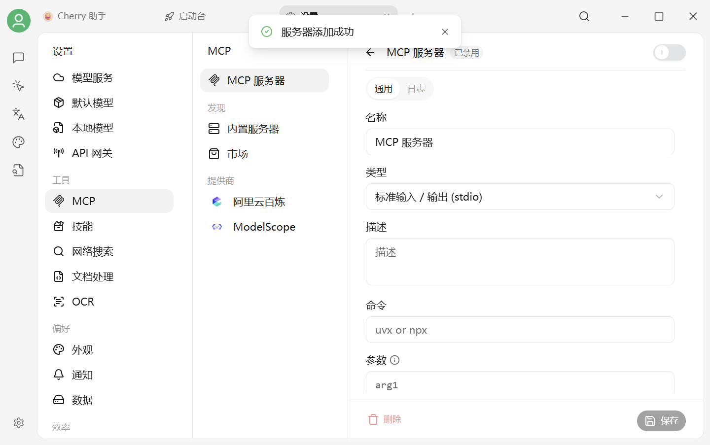

# 配置和使用 MCP

本页用“让 AI 读取网页”说明完整流程。第一次使用建议先启用内置的 `@cherry/fetch`，不需要手写命令。

## 方法一：启用内置服务器（推荐）

1. 打开 `设置 → MCP → 内置服务器`。
2. 找到 `@cherry/fetch`。
3. 按页面提示启用或添加。
4. 回到 `MCP 服务器`，确认它已经出现且状态正常。

<figure><figcaption>
优先从内置服务器选择经过集成的 MCP
</figcaption></figure>

## 方法二：快速创建自定义服务器

只有目标 MCP 不在内置列表中时，才需要手动配置：

1. 打开 `设置 → MCP → MCP 服务器`。
2. 点击右上角 **添加 → 快速创建**。
3. 按 MCP 自己的说明填写名称、类型、命令、参数和环境变量。
4. 保存后等待首次下载和启动完成。

<figure><figcaption>
MCP 快速创建表单
</figcaption></figure>

常见类型：

| 类型 | 什么时候用 |
| --- | --- |
| 标准输入 / 输出（stdio） | 在本机通过命令启动的 MCP |
| SSE | 使用旧式服务器发送事件连接的远端 MCP |
| Streamable HTTP | 使用当前 HTTP 传输协议的远端 MCP |


命令、参数和环境变量必须以目标 MCP 的当前官方说明为准。不要把 API Key 写进名称、描述、截图或公开 Issue。


## 在对话或 Agent 中使用

### 普通对话

1. 回到 [对话界面](../../cherrystudio/preview/chat.md)。
2. 在输入框工具区打开 **MCP**。
3. 勾选刚刚添加的服务器。
4. 提出需要工具的任务，例如：
   `请读取 https://docs.cherryai.com.cn/ 的标题，并用三点概括首页内容。`

### Agent

1. 打开 Agent 编辑面板。
2. 进入 `工具 → MCP`。
3. 只启用当前任务需要的服务器。
4. 为文件、账号和外部 API 设置最小权限。

## 成功标志

* 服务器状态正常，没有持续显示启动失败；
* 对话或 Agent 的工具列表能看到它；
* 执行任务时会出现工具调用记录；
* 返回结果与目标资源一致。

如果启动失败，先检查 [MCP 环境安装](install.md)，再查看 [常见问题](faq.md)。

***

### 💡 获取帮助与提交反馈

如果您在配置或使用过程中遇到疑问，请参考 [反馈与建议](../../question-contact/suggestions.md)。
