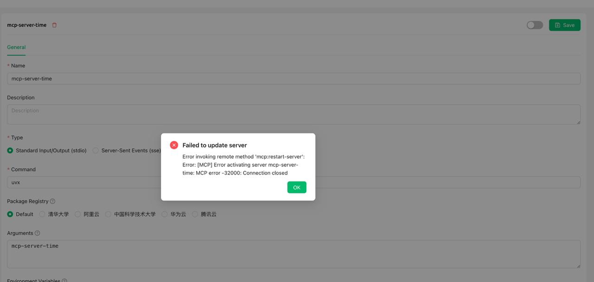

# 常见问题

### 1. mcp-server-time

<figure><figcaption><p>报错截图</p></figcaption></figure>

**解决方案**

在“参数”一栏填写：

```
mcp-server-time
--local-timezone
<你的标准时区，例如：Asia/Shanghai>
```

***

### 💡 获取帮助与提交反馈

如果您在配置或使用过程中遇到任何疑问、Bug 或有功能改进建议，请参考 [反馈与建议](../../question-contact/suggestions.md) 中提供的官方渠道。
