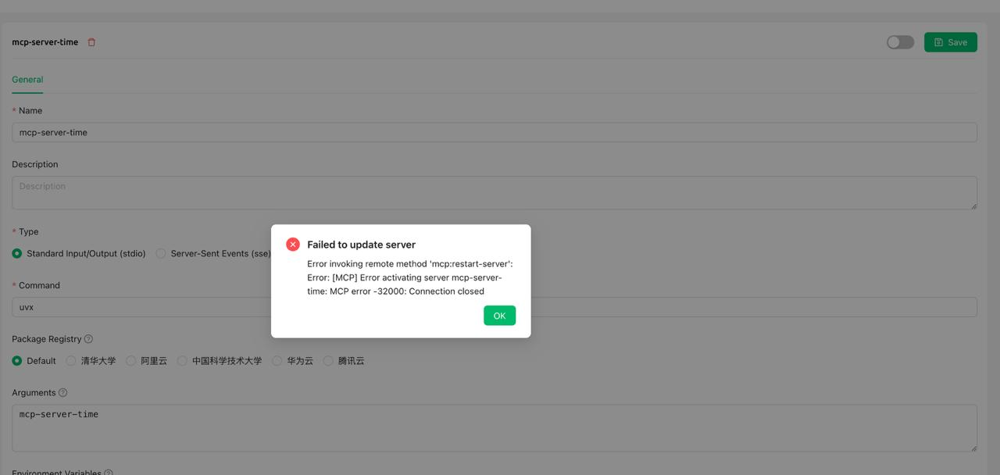

# 常见问题

本页汇总 MCP 服务器安装和运行时最常见的问题。建议先到 **设置 → MCP** 查看服务器状态，再根据错误信息排查。

## 服务器无法启动

依次检查：

1. **命令是否存在**：使用 `npx`、`uvx` 或其他运行器时，确认它已经安装并能在系统终端中执行。
2. **参数是否分行填写**：命令、参数和环境变量要放在对应输入框中，不要把整条终端命令粘贴到“命令”一栏。
3. **网络是否可用**：首次启动通常需要下载依赖。代理、企业网络或防火墙可能会阻止 npm、PyPI 等源。
4. **环境变量是否完整**：需要 API Key 的 MCP 服务器必须填写对应变量，变量名要与项目说明一致。

修改后保存配置并重新启动服务器；若仍失败，请复制错误日志中的第一段报错进行检索。

## `mcp-server-time` 时区错误

<figure><figcaption><p>报错截图</p></figcaption></figure>

在服务器的“参数”一栏逐行填写：

```
mcp-server-time
--local-timezone
Asia/Shanghai
```

如果不在中国大陆，请把 `Asia/Shanghai` 替换为你所在地区的 [IANA 时区名称](https://en.wikipedia.org/wiki/List_of_tz_database_time_zones)。

## 对话里看不到 MCP 工具

确认以下三点：

* MCP 总开关和目标服务器均已启用；
* 当前助手或 Agent 已关联该 MCP 服务器；
* 服务器状态正常，并且成功加载出工具列表。

配置完成后建议新建一个话题再测试，避免旧会话继续使用之前的工具状态。

## 工具调用一直等待或失败

先使用更明确的指令，只调用一个工具完成一个小任务。如果工具涉及文件写入、执行命令或外部服务，还要检查权限确认、目标路径和第三方服务额度。


只安装你信任的 MCP 服务器。启用文件、终端或浏览器类工具前，先确认它能访问哪些数据和目录。


***

### 💡 获取帮助与提交反馈

如果您在配置或使用过程中遇到任何疑问、Bug 或有功能改进建议，请参考 [反馈与建议](../../question-contact/suggestions.md) 中提供的官方渠道。
