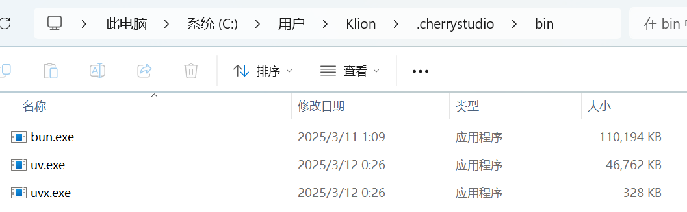

# MCP 环境安装

首次使用 MCP 前，需要安装两个底层工具：**uv** 与 **bun**。绝大多数 MCP Server 依赖其中之一启动。

> 推荐先阅读 [MCP 使用教程总览](README.md)。

无需了解 uv / bun 的技术细节，Cherry Studio 会**自动完成下载与安装**，仅需在界面中点击对应按钮。

## 自动安装（推荐）


Cherry Studio 用的是**自己内置的** uv 和 bun，不会复用你电脑里可能已经装过的版本。所以即使你系统里已经有 uv，也仍然需要按下面步骤再装一次给 Cherry Studio 用。


在 `设置 - MCP 服务器` 中，点击 `安装` 按钮，即可自动下载并安装。因为是直接从 GitHub 上下载，速度可能会比较慢，且有较大可能失败。安装成功与否，以下文提到的文件夹内是否有文件为准。

<figure><figcaption></figcaption></figure>

**可执行程序安装目录：**

Windows: `C:\Users\用户名\.cherrystudio\bin`

macOS、Linux: `~/.cherrystudio/bin`

<figure><figcaption>
bin 目录
</figcaption></figure>

**无法正常安装的情况下：**

可以将系统中的相对应命令使用软链接的方式链接到这里，如果没有对应目录，需要手动建立。也可以手动下载可执行文件放到这个目录下面：

Bun: [https://github.com/oven-sh/bun/releases](https://github.com/oven-sh/bun/releases)\
UV: [https://github.com/astral-sh/uv/releases](https://github.com/astral-sh/uv/releases)
