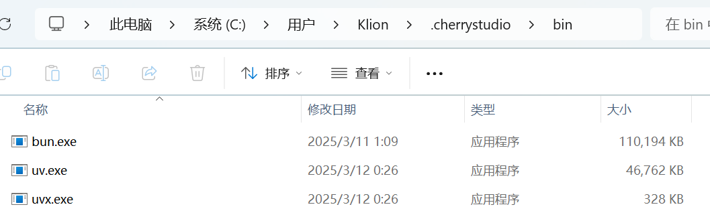

# MCP 环境安装

首次使用 MCP 前，需要安装两个底层工具：**uv** 与 **bun**。绝大多数 MCP Server 依赖其中之一启动。

> 推荐先阅读 [MCP 使用教程总览](README.md)。

无需了解 uv / bun 的技术细节，Cherry Studio 会**自动完成下载与安装**，仅需在界面中点击对应按钮。

## 自动安装（推荐）


Cherry Studio 用的是 **自己内置的** [uv](https://github.com/astral-sh/uv) 和 [bun](https://github.com/oven-sh/bun)，不会复用你电脑里可能已经装过的版本。所以即使你系统里已经有 uv / bun，也仍然需要按下面步骤再装一次给 Cherry Studio 用。


在 `设置 → MCP` 中点击 `安装` 按钮，即可自动下载并安装。安装过程需要访问 GitHub；若下载失败，请先检查网络连接，再按页面提示重试。最终状态以 MCP 页面显示为准。

<figure><figcaption></figcaption></figure>

**可执行程序安装目录：**



`C:\Users\用户名\.cherrystudio\bin`



`~/.cherrystudio/bin`



<figure><figcaption>
bin 目录
</figcaption></figure>

**无法正常安装的情况下：**

可以将系统中的相对应命令使用软链接的方式链接到这里，如果没有对应目录，需要手动建立。也可以手动下载可执行文件放到这个目录下面：

Bun: [https://github.com/oven-sh/bun/releases](https://github.com/oven-sh/bun/releases)\
UV: [https://github.com/astral-sh/uv/releases](https://github.com/astral-sh/uv/releases)

***

### 💡 获取帮助与提交反馈

如果您在配置或使用过程中遇到任何疑问、Bug 或有功能改进建议，请参考 [反馈与建议](../../question-contact/suggestions.md) 中提供的官方渠道。
