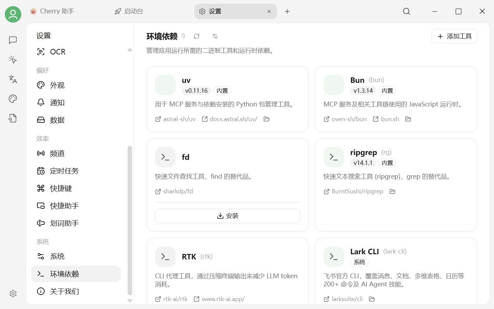

# MCP 环境安装

MCP Server 常用 Python 或 JavaScript 运行，因此 Cherry Studio V2 把 `uv`、`bun` 等工具统一放在 **环境依赖** 页面管理。

<figure><figcaption>
设置 → 环境依赖
</figcaption></figure>

## 第一次使用

1. 打开 `设置 → 环境依赖`。
2. 找到 `uv` 与 `bun`。
3. 显示 **内置** 或版本号时，说明已经可用。
4. 如果显示 **安装**，点击后等待完成。
5. 返回 `设置 → MCP` 添加或启用服务器。

不同 MCP 使用的运行环境不同：

| 配置中的命令 | 需要的环境 |
| --- | --- |
| `uvx`、`uv run` | uv |
| `bunx`、`bun run` | Bun |
| 独立二进制程序 | 以该 MCP 的说明为准 |


不必为了“准备充分”安装页面中的全部工具。先添加目标 MCP，只有它提示缺少依赖时再安装对应项目。


## 安装失败

* 检查代理或网络能否访问工具的官方下载地址；
* 点击页面顶部刷新按钮重新检测；
* 查看应用日志中的具体错误；
* 不要从来源不明的网站下载同名可执行文件。

最终状态以 `设置 → 环境依赖` 中显示的版本号或“内置”标记为准。

***

### 💡 获取帮助与提交反馈

如果您在配置或使用过程中遇到疑问，请参考 [反馈与建议](../../question-contact/suggestions.md)。
