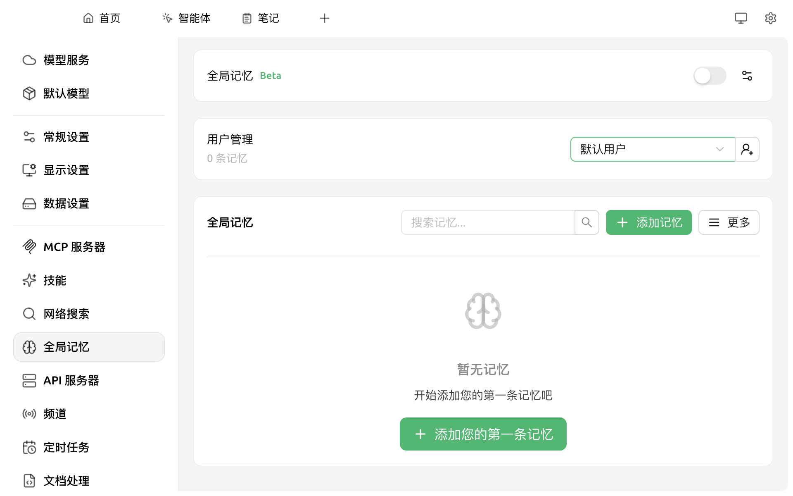
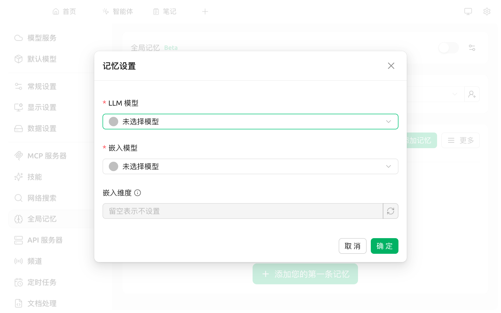
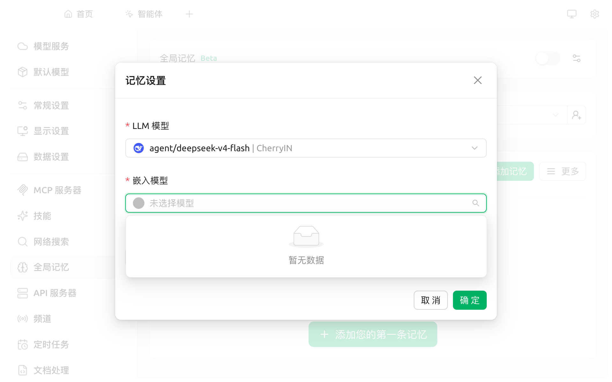

# 全局记忆

普通对话中的 AI 没有长期记忆 —— 每开启一个新话题，都需要重新自我介绍。

**全局记忆**为 AI 提供**长期记忆能力**：启用后，AI 会**跨对话**记住关于你的关键信息（职业、偏好、常用语气、长期事实等），新对话可直接调用。本功能当前为 **Beta** 阶段。

> 推荐先阅读 [概念入门](concepts-101.md) 理清记忆与其他功能的关系。

### 启用前的两项准备

全局记忆涉及两类工作：

* **理解与整理记忆**：需要一个对话模型（与日常聊天使用的同类）
* **存储与检索记忆**：需要一个"嵌入模型"

**嵌入模型**的作用是**将每条记忆转换为数字向量**，AI 通过比较向量相似度快速找出相关记忆。这类专用小模型体积小、速度快、调用成本低。

请先在 `设置 → 模型服务` 中配置好至少一个 Provider，并 **同时添加一个对话模型和一个嵌入模型**。以 CherryIN 为例：在 Provider 详情页点击 **获取模型列表**，在弹窗顶部切到"嵌入"分类，至少加 1 个（推荐 `bge-m3` 或 `text-embedding-3-small`）。


仅添加对话模型而未添加嵌入模型，将无法完成记忆设置（嵌入模型下拉会显示"暂无数据"）。


### 开启全局记忆

1. 打开 `设置 → 全局记忆`
2. 点击右上角 **全局记忆** 开关

<figure><figcaption>
未启用状态：右上角灰色开关 + 空态"暂无记忆"
</figcaption></figure>

开关首次打开时，会自动弹出 **记忆设置** 对话框，要求选择模型：

<figure><figcaption>
必填项：LLM 模型 + 嵌入模型
</figcaption></figure>

* **LLM 模型**：选择任一你已配置的对话模型
* **嵌入模型**：选择任一你已添加的 Embedding 模型
* **嵌入维度**：可留空，由 Embedding 模型默认维度自动决定

填完点击 **确定**。系统级别的全局记忆即开启完成。

### 还要在每个助手里"也"开一次


**很多用户在这里卡住**：完成上面所有步骤后，新对话里 AI 似乎仍然记不住事情 —— 因为全局记忆是**两层开关**：
1. 系统级别（你刚才完成的）
2. 助手级别（**默认是关闭的**）

每个助手都需要单独开启才能使用记忆。


步骤：

1. 进入对话页，点击助手列表中的目标助手 → 编辑（或在助手广场创建新助手时）
2. 在助手设置中找到 **全局记忆** 开关，打开它
3. 之后该助手在新对话中会自动读取并更新记忆库

为常用的"默认助手"先开一次，后续就一劳永逸了。

### 嵌入模型下拉显示"暂无数据"怎么办

最常见的卡点：你选完 LLM 模型后，嵌入模型下拉是"暂无数据"。

<figure><figcaption>
典型卡点：LLM 已选 (CherryIN)，嵌入下拉显示"暂无数据"
</figcaption></figure>

原因：你的 Provider 里没有任何 Embedding 模型可供选择。解决方法：

1. 关闭当前对话框（点 **取消**）
2. 前往 `设置 → 模型服务 → 你的 Provider`
3. 点击 **获取模型列表**，在弹窗顶部 Tab 切到 **嵌入**
4. 添加 1–2 个嵌入模型（如 `bge-m3`、`text-embedding-3-small` 等）
5. 回到 `设置 → 全局记忆`，重新打开开关

### 用户管理

全局记忆按"用户"分组。默认提供一个 `默认用户`，你也可以为家人或团队成员分别建立独立的记忆库：

* 点击 **用户管理** 右侧 +👤 图标 → 输入新用户 ID 创建
* 切换不同用户后，下方 **记忆列表** 与统计独立显示

### 添加、查看与删除记忆

启用后：

* 点击 **添加您的第一条记忆** 或 **+ 添加记忆**，在弹窗中输入内容并保存
* 通过 **搜索记忆…** 框可按关键字过滤
* 每条记忆可单独编辑或删除
* 在更多操作菜单中可选 **重置记忆** / **重置用户记忆**，清空当前用户的全部记忆（不可恢复，谨慎使用）

### Token 消耗

启用全局记忆后，每次对话会额外消耗一定 token：
* 提取问题向量、检索候选记忆
* 让 LLM 评估是否要写入新记忆 + 写入操作

如对成本敏感，可只在最常用的 1-2 个助手中开启全局记忆，其他助手保持关闭。


v1 的全局记忆将在 Cherry Studio v2 中重构，配置入口与字段名可能变化。本页内容仅适用于 **v1.9.x 系列**。


### 提示与技巧

* 第一次启用后，可在 `添加您的第一条记忆` 里写一条 **关于你自己的概况**（职业、关注方向、偏好语气等），后续对话会自动参考
* 如不希望某些助手使用记忆，请到该助手设置中单独关闭"全局记忆"
* 长期使用建议定期清理过时记忆，避免污染上下文

如遇问题，请在 [反馈与建议](../question-contact/suggestions.md) 中提交反馈。
