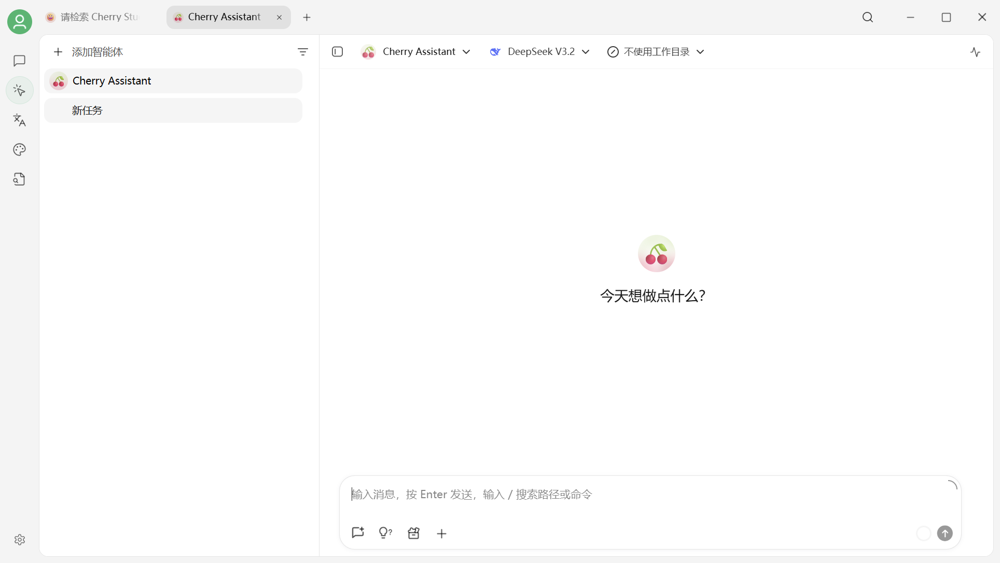
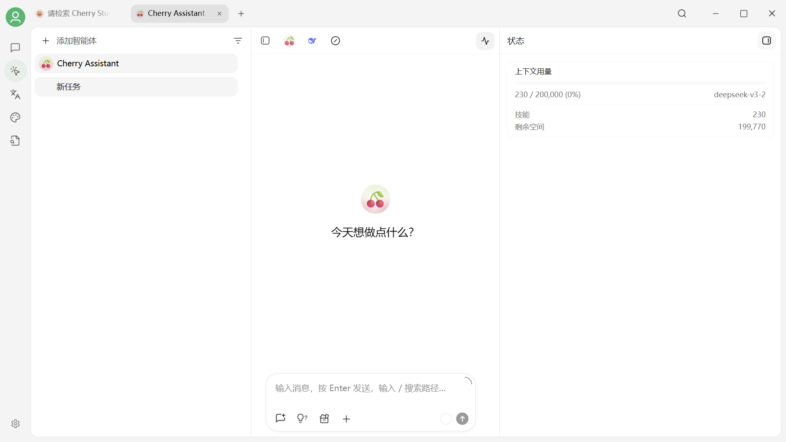

# 记忆能力

Cherry Studio 中与“记忆”有关的能力主要出现在 **工作** 和 **MCP** 两种场景。普通对话助手没有统一的“全局记忆”开关。

## 工作中的记忆

点击左侧工具栏的 **工作**，选择智能体并新建任务。

<figure><figcaption>
“工作”位于左侧工具栏
</figcaption></figure>

当前版本没有单独显示一个“启用 AgentMemory”的设置开关，也不需要在设置页寻找“记忆权限”。工作中的智能体会根据任务需要调用内置记忆能力；当某项操作需要确认时，客户端会按当前权限模式显示授权提示。

使用时可以直接告诉智能体：

* 哪些信息需要长期保留；
* 什么时候需要回忆这些信息；
* 哪些内容不应写入记忆。


不要让智能体保存密码、API Key、一次性验证码、身份证号等敏感信息。模型生成的记忆也可能不完整或有误，重要内容应由用户复核。


任务右上角的 **状态** 面板用于查看当前上下文用量。任务运行后，如果状态面板出现 **记忆文件**，它表示本次任务已经加载的持久上下文，不是启用记忆的开关。

<figure><figcaption>
状态面板用于查看当前任务上下文
</figcaption></figure>

## MCP 记忆服务器

如果希望普通助手或其他支持 MCP 的场景使用持久记忆，可以前往：

`设置 → MCP → 内置服务器 → memory`

内置 `memory` 服务器使用本地知识图谱保存信息，需要配置 `MEMORY_FILE_PATH` 环境变量。建议将它指向一个明确、可备份且访问权限受控的文件路径。

也可以使用 Nowledge Mem 等第三方记忆 MCP，但需要按照对应服务的说明安装应用或完成授权。

## 两种方式怎么选

| 需求 | 推荐方式 |
|---|---|
| 让 Agent 在多个任务间记住工作信息 | Agent 内置记忆 |
| 让普通助手通过工具读写持久记忆 | MCP `memory` |
| 使用第三方本地知识与记忆产品 | 对应的 MCP 服务器 |
| 仅希望保留当前对话上下文 | 继续使用同一话题，无需额外配置 |

## 隐私与维护

* 不要写入 API 密钥、密码、身份证号等高敏感信息；
* 定期检查记忆内容，删除过时或错误事实；
* 备份记忆文件前确认备份位置可信；
* 更换 `MEMORY_FILE_PATH` 后，旧文件不会自动迁移。

***

### 💡 获取帮助与提交反馈

如果您在配置或使用过程中遇到疑问，请参考 [反馈与建议](../question-contact/suggestions.md)。
