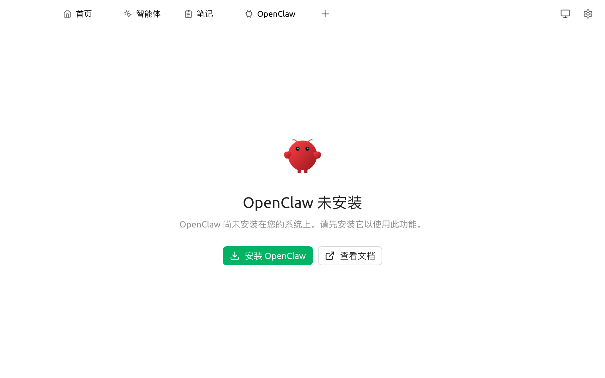

# OpenClaw

**OpenClaw 是另一个 AI 智能体工具**，长得像"在终端里跑的 Cherry Agent"，由独立团队开发。

如果你日常工作离不开命令行（程序员、运维、自动化爱好者），可能更喜欢 OpenClaw 那种"打字就出活儿"的纯文本交互方式。Cherry Studio 提供了**和 OpenClaw 互通的口子**：你不必再到 OpenClaw 里重新配一次 Provider/key，Cherry Studio 里已经配好的，OpenClaw 可以直接用。


**先确认你需不需要 OpenClaw**：

* 只想在 Cherry Studio 图形界面里用智能体 → **不需要**，直接看 [Cherry Agent](agent.md) 即可
* 想在终端里跑 Agent、想集成到自动化脚本/CI → 适合用 OpenClaw

如果不确定，先用 Cherry Agent；将来想升级了再来折腾 OpenClaw。


### 安装 OpenClaw

顶部 Tab `+` → **启动台** → 点击 **OpenClaw**。首次进入会看到：

<figure><figcaption>
OpenClaw 未安装态
</figcaption></figure>

* 点击 **安装 OpenClaw** → Cherry Studio 会从官方源下载并安装 OpenClaw 二进制
* 安装完成后页面会变为"运行中 / 已停止"状态，可在此**启动**或**停止**本地 OpenClaw gateway

### 配置 Provider 与模型

在 OpenClaw 页面中：

1. 选择要给 OpenClaw 使用的 **Provider**（必须是已在 `设置 → 模型服务` 中配置好的）
2. 选择具体的 **模型**
3. 点击 **启动**，OpenClaw 即开始在本地监听

### 在 OpenClaw CLI 中使用

启动后，在终端运行 `openclaw` 命令即可使用 Cherry Studio 中的模型。

* 详细 CLI 用法请见官方文档：[https://docs.openclaw.ai/](https://docs.openclaw.ai/)
* 点击 OpenClaw 页面右上角 **查看文档** 直达

### 与 [Cherry Agent](agent.md) 的区别

| 维度 | Cherry Agent | OpenClaw |
|---|---|---|
| 运行位置 | Cherry Studio 内 | 独立 CLI |
| UI | Cherry Studio 图形界面 | 终端 |
| 适合场景 | 日常对话型 Agent、IM 接入 | CLI 工作流、脚本自动化、CI 集成 |
| 是否依赖 [API 服务器](api-server.md) | 是 | 否（OpenClaw 走独立 gateway） |

### 提示与技巧

* OpenClaw 与 Cherry Agent 可同时使用，互不冲突
* 一台机器上 OpenClaw gateway 启动后会占用本地端口（默认见 OpenClaw 文档），与 [API 服务器](api-server.md) 默认 23333 不冲突
* 关闭 Cherry Studio 时 OpenClaw gateway 会自动停止；如需后台常驻请用 OpenClaw 自带的 daemon 模式

如遇问题，请在 [反馈与建议](../question-contact/suggestions.md) 中提交反馈，或前往 [OpenClaw 官方仓库](https://github.com/openclaw)。
