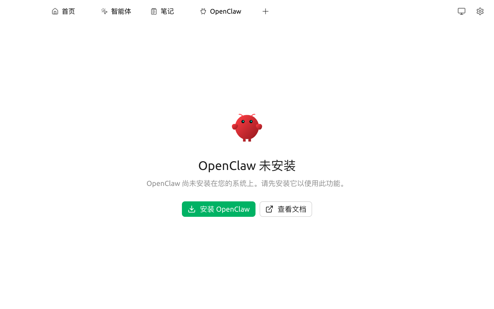

# OpenClaw

OpenClaw 是独立的开源 Agent 工具。Cherry Studio V2 已把原来的独立 OpenClaw 页面并入 **Code Switch**，不再从启动台提供单独入口。

## V2 入口

1. 打开顶部 `+` 进入 **启动台**；
2. 点击 **Code Switch**；
3. 在工具列表中选择 **OpenClaw**。

<figure><figcaption>
启动台 → Code Switch → OpenClaw
</figcaption></figure>

在同一页面可以完成安装或升级、选择 Provider 与模型、启动或停止 Gateway，以及打开 Dashboard。

完整步骤请阅读 [Code Switch 使用教程](code-tools.md)。


如果只想在 Cherry Studio 图形界面中执行文件、命令和多步任务，请直接使用 [Agent](agent.md)。OpenClaw 更适合需要其独立 Gateway、Dashboard 或生态工具的用户。


## 与 Agent 的区别

| 维度 | Agent | OpenClaw |
|---|---|---|
| 入口 | 顶部 `工作` | 启动台 → Code Switch |
| 运行形态 | Cherry Studio 内置工作区 | 独立 OpenClaw Gateway |
| 管理方式 | Agent 配置、工具和权限 | Code Switch 中安装、启停与打开 Dashboard |
| 适合场景 | 客户端内完成任务 | 使用 OpenClaw 自身工作流和生态 |

OpenClaw 的具体命令、端口和兼容性会随上游版本变化，以 Code Switch 页面和 OpenClaw 官方文档为准。

***

### 💡 获取帮助与提交反馈

如果您在配置或使用过程中遇到疑问，请参考 [反馈与建议](../question-contact/suggestions.md)。
