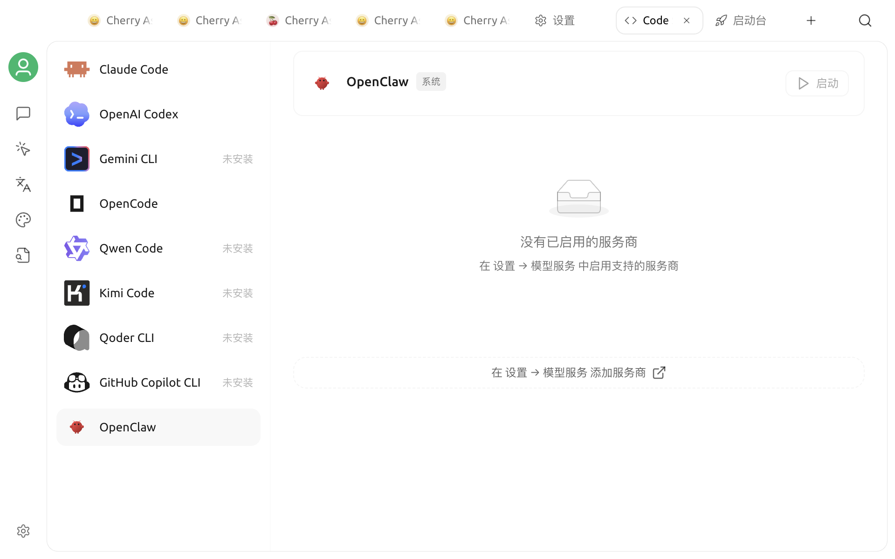

# OpenClaw

Cherry Studio 可以安装并管理 OpenClaw，在本机启动 OpenClaw Gateway，并把 Cherry Studio 中已有的模型服务同步给 OpenClaw。启动成功后，Cherry Studio 会自动打开内嵌的 OpenClaw 控制面板；你可以继续在其中配置 WhatsApp、Telegram、Slack、Discord 等渠道。

OpenClaw 是独立运行的个人 AI 助手，不等同于 Cherry Studio 的[智能体](agent.md)。如果只需要在 Cherry Studio 内完成对话或工具任务，直接使用智能体即可；需要使用 OpenClaw 的控制面板、渠道和运行方式时，再启用本页功能。


OpenClaw 拥有较高的系统权限，智能体任务也可能消耗较多 Token。请只在可信设备和可信工作区中运行，并检查它获得的文件、命令和第三方渠道权限。


## 打开 OpenClaw

1. 点击顶部标签栏右侧的 **+**，打开**启动台**。
2. 点击 **OpenClaw**。
3. Cherry Studio 会先检查由自己管理的 OpenClaw 是否已经安装。

Cherry Studio 只使用位于自身管理目录中的 OpenClaw 二进制文件。即使系统 `PATH` 中已经存在通过其他方式安装的 OpenClaw，页面仍会提示安装或迁移到托管版本，避免误用旧版本。

## 安装托管版本

首次进入时，点击 **安装 OpenClaw**。Cherry Studio 会根据当前操作系统和处理器下载对应的独立二进制包，并显示安装日志。

支持的组合包括 macOS、Windows 和 Linux 的 x64 或 ARM64。下载时会自动选择可用源；中国大陆网络环境会优先尝试镜像源。

安装完成后，页面会显示 OpenClaw 的安装路径。macOS 和 Linux 上，Cherry Studio 还会尝试在 `/usr/local/bin/openclaw` 建立链接；Windows 上会尝试把托管目录加入当前用户的 `PATH`。这些步骤用于方便终端调用，不影响 Cherry Studio 通过托管路径启动 OpenClaw。

## 选择模型并启动

启动前，请先在 Cherry Studio 的模型服务设置中启用至少一个可用服务商，并确保对应模型可以正常调用。然后：

1. 在 OpenClaw 页面选择一个模型。
2. 点击 **启动**。
3. Cherry Studio 会把所选服务商及模型配置同步到 OpenClaw。
4. Cherry Studio 在本机启动 Gateway，并等待健康检查通过。
5. 启动成功后，OpenClaw 控制面板会自动在 Cherry Studio 中打开。

模型列表只显示已启用且可用的服务商。Ollama、LM Studio 等本地服务可以不填写 API Key；其他服务商通常需要先完成 API Key 和模型配置。

默认 Gateway 地址为 `127.0.0.1:18790`。运行期间，OpenClaw 页面会显示状态和端口。关闭控制面板不会停止 Gateway；需要再次进入时，点击 **打开控制面板**。


每次点击 **启动** 时，Cherry Studio 都会先同步当前选择的模型。因此，更换模型后请先停止 Gateway，再选择新模型并重新启动。


## 同步了哪些配置

Cherry Studio 会合并写入 `~/.openclaw/openclaw.json`，主要包括：

* 当前服务商的 API 地址、认证信息和模型列表；
* 当前选择的默认模型；
* 本地 Gateway 模式、端口和自动生成的认证令牌。

已有 OpenClaw 配置不会被整体替换；Cherry Studio 会保留同一模型下已经存在的扩展配置，再更新自己管理的服务商和默认模型。如果检测到旧的 `openclaw.cherry.json`，会迁移为 `openclaw.json`，并在需要时备份原文件。


OpenClaw 配置文件包含模型服务认证信息和 Gateway 令牌。不要分享该文件、安装日志中的敏感内容或带有令牌的控制面板地址。


## 停止、更新与卸载

### 停止 Gateway

返回 OpenClaw 页面，点击 **停止**。正常退出 Cherry Studio 时，应用也会尝试停止由它管理的 Gateway。

### 更新 OpenClaw

Cherry Studio 会在进入已安装页面时检查托管版本。发现新版本后，安装路径旁会显示版本号；点击它并确认即可更新。更新前，正在运行的 Gateway 会先停止，更新完成后需要重新点击 **启动**。

### 卸载 OpenClaw

在 Gateway 停止时，点击安装路径区域右侧的 **卸载**，确认后等待日志完成。Cherry Studio 会移除托管二进制文件及其命令链接或 `PATH` 项。

卸载不会删除 `~/.openclaw/openclaw.json`。如果不再需要其中的服务商认证信息，请在确认没有其他 OpenClaw 安装使用该文件后自行处理。

## 常见问题

### 安装下载失败

确认设备可以访问下载源，并在安装日志中查看具体错误。网络恢复后可直接重新点击安装。若当前平台或处理器没有对应二进制包，安装也会失败。

### 已在终端安装，页面仍提示未安装

这是预期行为。Cherry Studio 不会运行系统 `PATH` 中的外部 OpenClaw；请在页面中安装 Cherry Studio 托管版本。

### 没有可选模型

前往模型服务设置，启用服务商并完成 API Key、API 地址和模型配置。先在普通对话中确认模型可以正常回复，再返回 OpenClaw 页面。

### Gateway 无法启动

默认端口 `18790` 可能被其他程序占用。先停止已有 OpenClaw 进程或占用该端口的应用，再重新启动。页面会等待最多约 30 秒进行健康检查；如果仍失败，可复制错误信息用于排查。

### 终端找不到 `openclaw`

Cherry Studio 内的控制面板不依赖终端命令。若需要在终端调用，请检查托管安装路径是否已加入 `PATH`；在 macOS 或 Linux 上，创建 `/usr/local/bin/openclaw` 链接可能因权限不足而失败。

更多 OpenClaw 渠道和控制面板用法，请查看 [OpenClaw 官方文档](https://docs.openclaw.ai/)。
