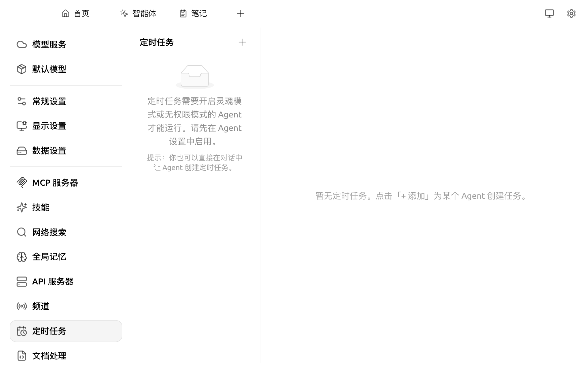
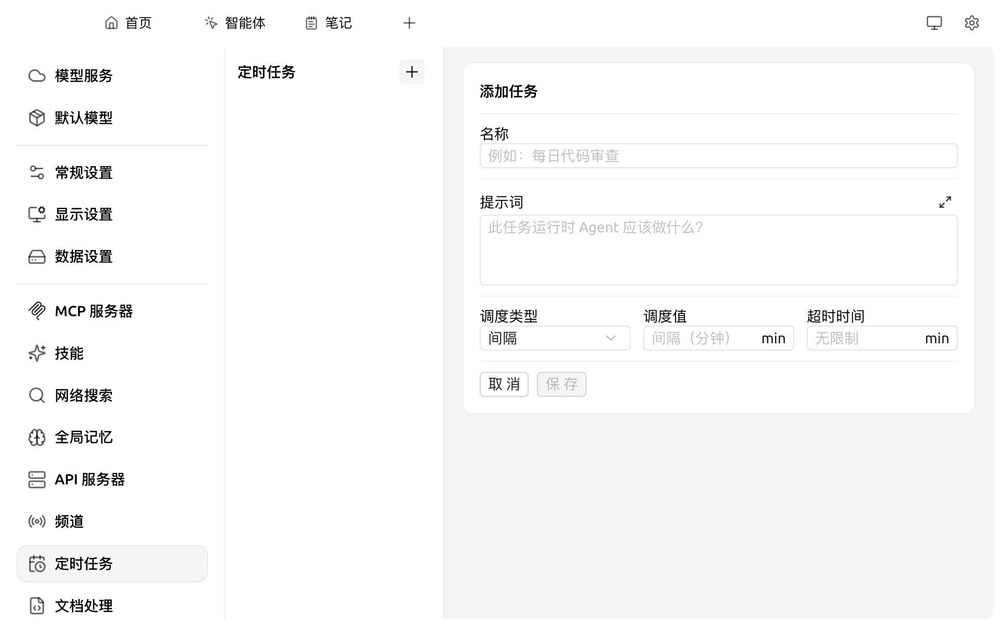

# 定时任务

定时任务允许你让一个 [Cherry Agent](agent.md) 在指定时间或周期自动执行任务（如每天早上汇总新闻、每小时同步数据、达到某个时间点抓取报告等）。它本质上是"由 Agent 来跑的 Cron"。

### 前置要求

定时任务依赖 Agent 运行，所以必须先满足：

1. **已启用 [API 服务器](api-server.md)**
2. **已配置至少一个 Agent**，且该 Agent 开启了下列 **任一权限**：
   * **灵魂模式**（Soul Mode）：允许 Agent 在无人值守时自主决策
   * **无权限模式**（Bypass Permissions）：允许 Agent 跳过敏感操作的人工确认

未启用上述权限的 Agent，**不会**出现在新建任务的下拉里，列表会显示提示：

> 定时任务需要开启灵魂模式或无权限模式的 Agent 才能运行。请先在 Agent 设置中启用。

<figure><figcaption>
未配置可用 Agent 时的空态
</figcaption></figure>

### 创建一个定时任务

打开 `设置 → 定时任务`，点击中间列顶部的 **+ 添加** 按钮，右侧出现 **添加任务** 表单：

<figure><figcaption>
添加任务表单
</figcaption></figure>

各字段含义：

| 字段 | 说明 |
|---|---|
| **名称** | 任务展示名，便于你日后识别（例如"每日代码审查"） |
| **提示词** | 任务运行时发给 Agent 的指令，描述"这次运行 Agent 应该做什么" |
| **调度类型** | `间隔` / `Cron` 两种 |
| **调度值** | 调度类型为 `间隔` 时填分钟数；为 `Cron` 时填 Cron 表达式 |
| **超时时间** | 单次运行的最大时长（分钟），留空为不限制 |

填完点击 **保存**，新任务会显示在中间列表中并立即按调度规则等待触发。

### 调度类型说明

#### 间隔（推荐入门）

按固定分钟数循环执行，例如 `60` 即每小时跑一次。

#### Cron

接受标准 Cron 表达式（5 字段）：`分 时 日 月 星期`。常用示例：

| 表达式 | 含义 |
|---|---|
| `0 9 * * *` | 每天上午 9:00 |
| `*/15 * * * *` | 每 15 分钟 |
| `0 0 * * 1` | 每周一 0:00 |

### 通过对话创建任务

任务表单不是唯一入口 —— 你也可以在对话中直接对 Agent 说：

> "每天早上 9 点用最近的新闻给我做一个 5 条要点的简报，结果发到我的飞书。"

Agent 会自动调用工具创建一条定时任务，效果与手动表单一致。

### 查看运行结果

每个任务都会保留 **运行日志**：

* 点击任务卡片可查看历次运行记录、耗时、输出 / 错误
* 失败时会显示完整堆栈，便于你修正提示词或权限设置

### 与频道的联动

定时任务的 Agent 输出可以通过 [频道（Cherry Claw）](agent-channels.md) 自动推送到：

* 飞书 / Lark
* Telegram / Discord / Slack
* QQ / 微信

例如"每天早上 9 点把任务结果推送到飞书群"。


长期运行的定时任务会持续消耗模型 token，请在 Provider 后台设置月度上限避免超支。


### 提示与技巧

* 建议先以 **间隔 = 5 分钟、最大运行 1 次** 进行试运行，确认输出符合预期后再调长间隔
* 不同任务可共用同一个 Agent，也可为不同场景准备专门 Agent
* 提示词中可引用 `{date}` 等占位符（具体支持以 Agent 模板为准）

如遇问题，请在 [反馈与建议](../question-contact/suggestions.md) 中提交反馈。
