# 调用链使用教程

## 功能介绍

调用链（Trace）是一个基于 [OpenTelemetry](https://opentelemetry.io/docs/languages/js/) 实现的可观测工具。它通过在端侧自动采集、存储和处理数据，将一次对话背后的完整执行过程实现可视化，用于查看每个处理环节（例如模型调用、知识库检索、MCP 工具调用或网络搜索）的耗时、输入输出和 token 使用情况，为定位问题、优化效果提供量化评估依据。

每次新对话请求会生成一条 trace 数据。一条 trace 由多个 span 组成，每个 span 对应 Cherry Studio 的一个处理环节，例如模型调用、知识库检索、MCP 工具调用或网络搜索。Trace 窗口会以树结构展示这些 span，你可以逐层展开查看详情。

<figure><figcaption>
调用链整体效果
</figcaption></figure>

## 开启 Trace

Trace 默认隐藏，需要先开启开发者模式：

1. 打开 `设置 → 常规设置`
2. 找到 **开发者模式**
3. 开启 **启用开发者模式**

<figure>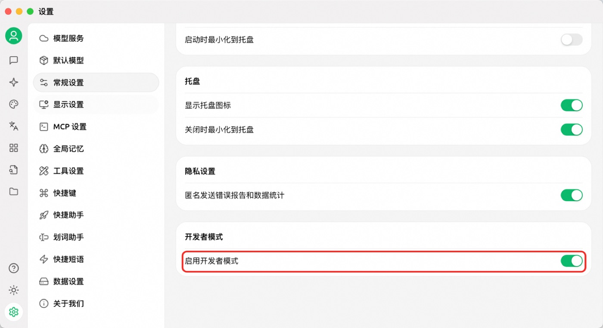<figcaption>
在常规设置中开启开发者模式
</figcaption></figure>


开启后，之前已经产生的会话不会补生成 Trace；只有后续新的问答才会记录调用链。


Trace 数据存储在本地应用数据目录中。通常不需要手动处理，如需彻底清理，可进入 `设置 → 数据设置 → 数据目录`，使用 **清除缓存**，或打开数据目录后删除 trace 相关缓存。

常见数据目录：

* **macOS**：`~/Library/Application Support/CherryStudio`
* **Windows**：`%APPDATA%\CherryStudio`
* **Linux**：`~/.config/CherryStudio`

<figure>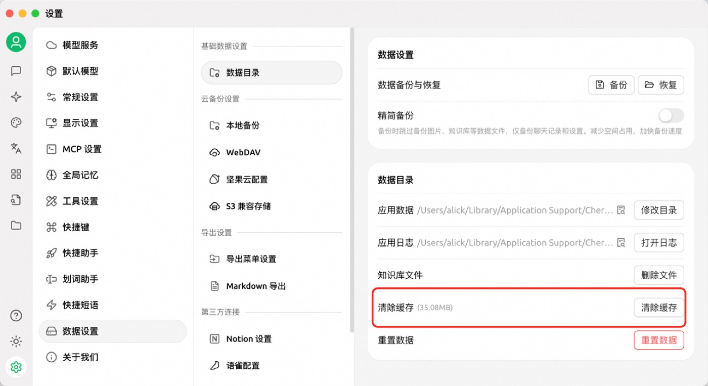<figcaption>
数据目录与缓存清理入口
</figcaption></figure>

## 场景介绍

### 全链路查看

在 Cherry Studio 对话框中点击调用链按钮，即可打开本次对话的完整链路。无论对话过程中调用了模型、网络搜索、知识库还是 MCP，都可以在调用链窗口中查看到对应节点。

<figure>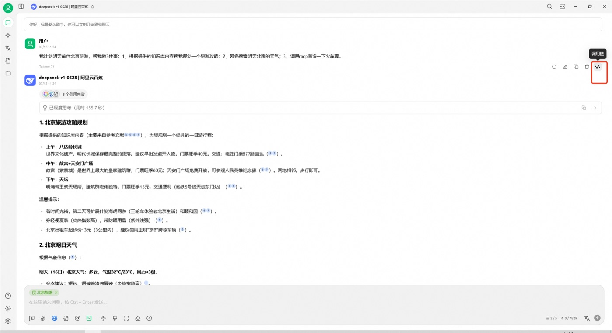<figcaption>
对话消息旁的调用链入口
</figcaption></figure>

<figure>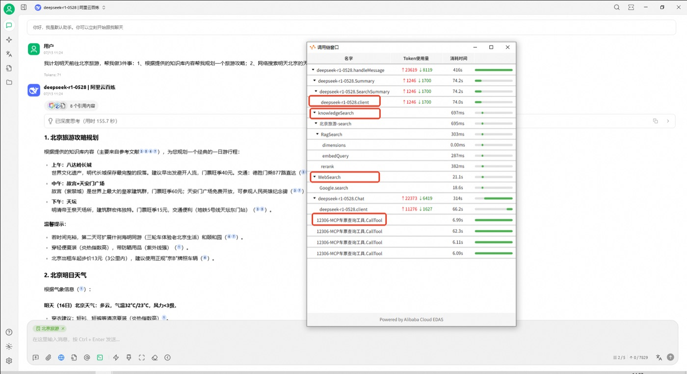<figcaption>
调用链树形视图
</figcaption></figure>

### 查看模型调用

点击模型调用节点，可以查看该次模型请求的耗时、token 使用量、输入和输出。

<figure>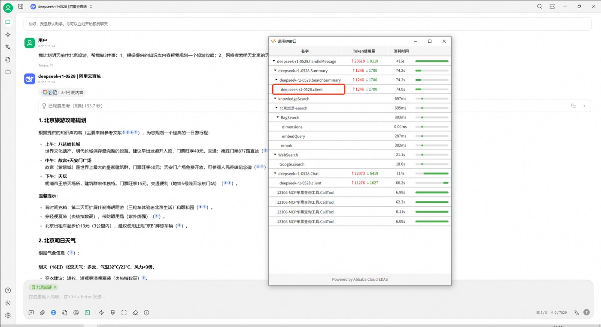<figcaption>
选择模型调用节点
</figcaption></figure>

<figure>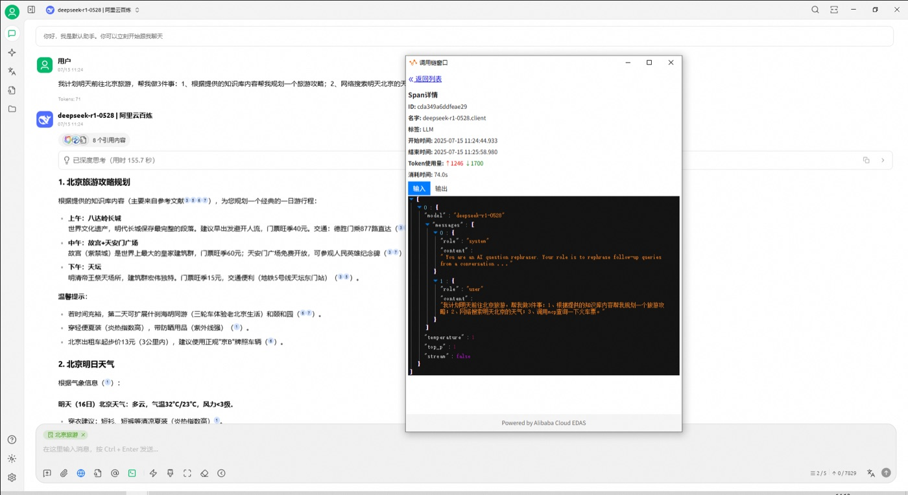<figcaption>
模型调用输入
</figcaption></figure>

<figure>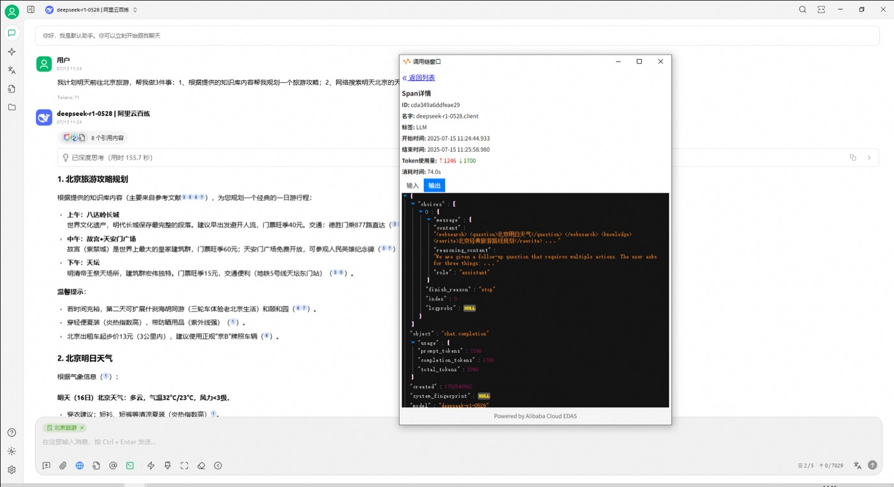<figcaption>
模型调用输出
</figcaption></figure>

### 查看网络搜索

点击网络搜索节点，可以查看搜索请求的问题、返回结果，以及后续传给模型的上下文。

<figure>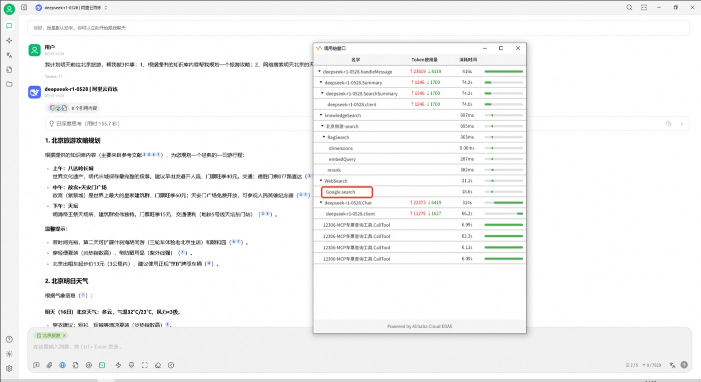<figcaption>
选择网络搜索节点
</figcaption></figure>

<figure>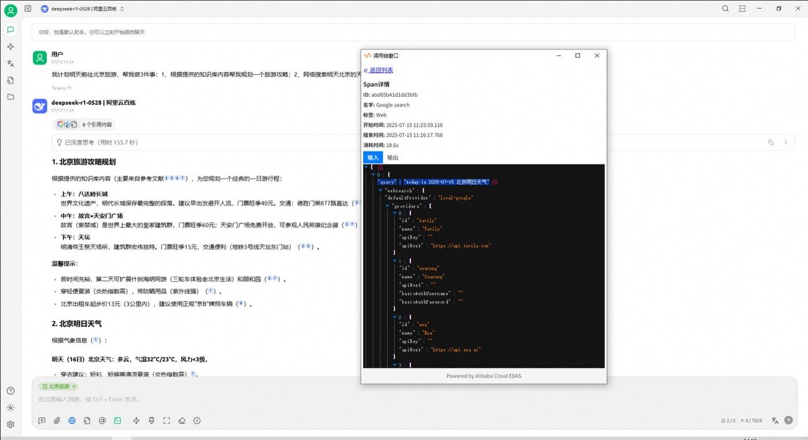<figcaption>
网络搜索输入
</figcaption></figure>

<figure>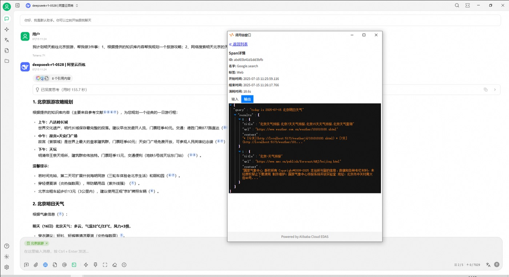<figcaption>
网络搜索返回结果
</figcaption></figure>

### 查看知识库检索

点击知识库节点，可以查看检索问题、命中的内容，以及知识库返回给模型的上下文。

<figure>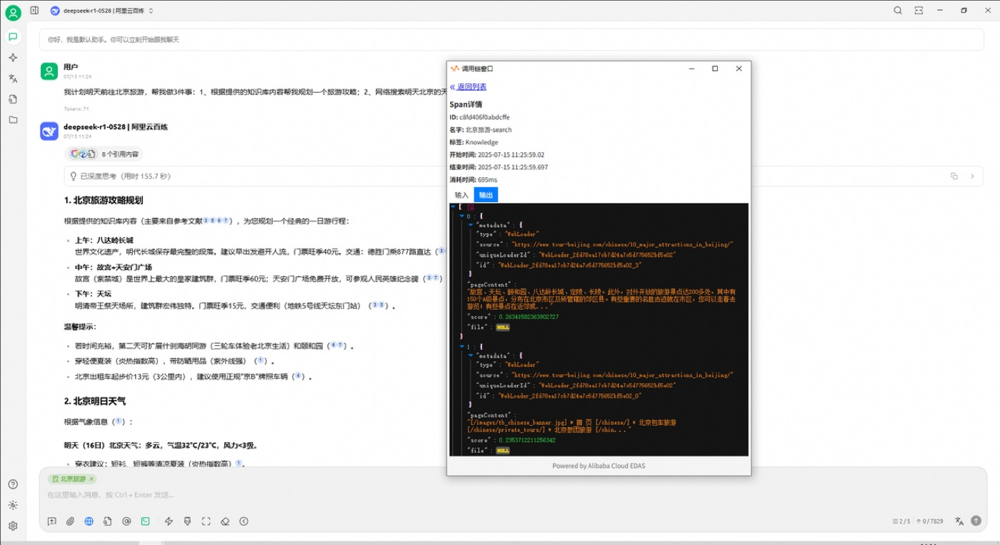<figcaption>
知识库节点详情
</figcaption></figure>

### 查看 MCP 调用

点击 MCP 节点，可以查看 MCP Server tool 的入参、返回值和耗时，便于排查工具调用是否符合预期。

<figure>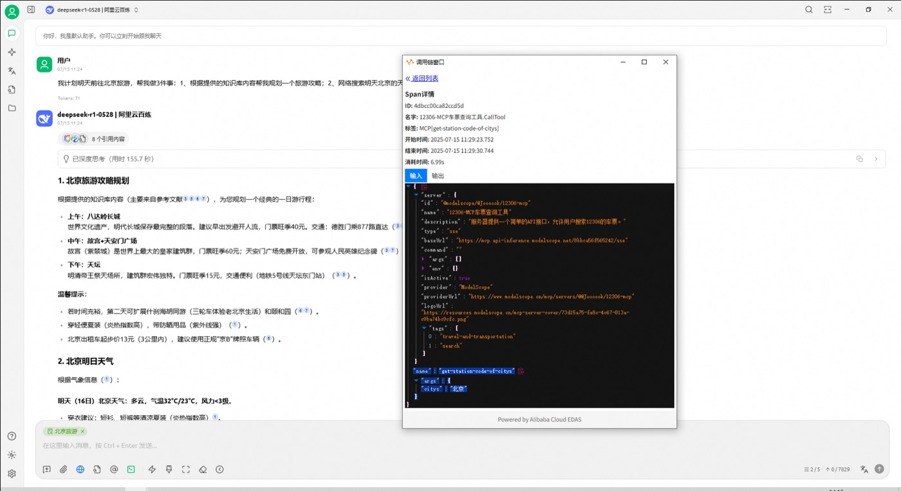<figcaption>
MCP 调用详情
</figcaption></figure>

<figure>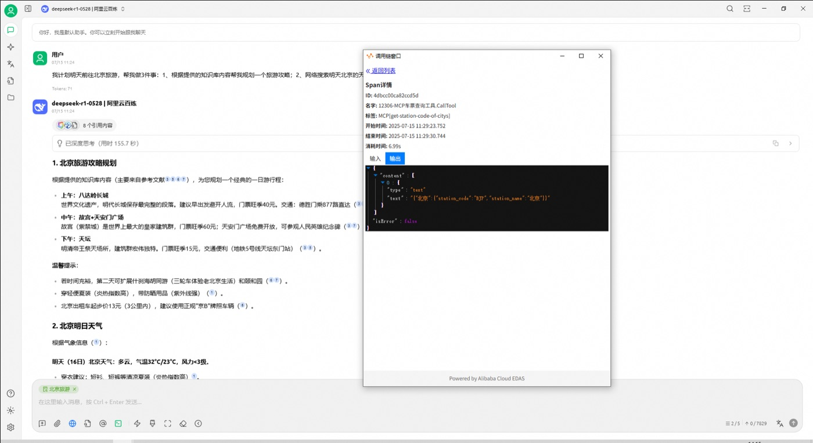<figcaption>
MCP 返回结果
</figcaption></figure>

## 问题和建议

如果调用链数据显示异常，或你希望补充更多可观测能力，参考 [反馈与建议](../question-contact/suggestions.md) 中提供的官方渠道。反馈时建议附上 Trace 截图、所用模型、是否启用了知识库 / MCP / 网络搜索，以及能够复现的提问内容。

***

### 💡 获取帮助与提交反馈

如果您在配置或使用过程中遇到任何疑问、Bug 或有功能改进建议，请参考 [反馈与建议](../question-contact/suggestions.md) 中提供的官方渠道。
