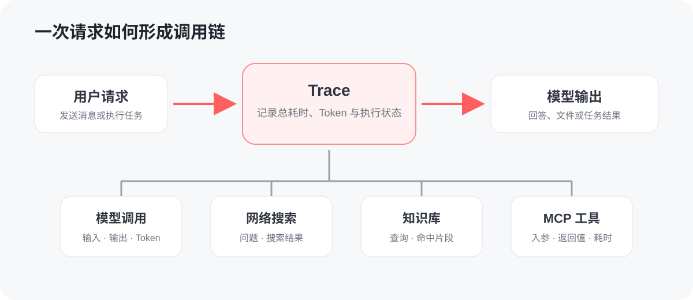

# 调用链使用教程

## 功能介绍

调用链（Trace）是一个基于 [OpenTelemetry](https://opentelemetry.io/docs/languages/js/) 实现的可观测工具。它通过在端侧自动采集、存储和处理数据，将一次对话背后的完整执行过程实现可视化，用于查看每个处理环节（例如模型调用、知识库检索、MCP 工具调用或网络搜索）的耗时、输入输出和 token 使用情况，为定位问题、优化效果提供量化评估依据。

每次新对话请求会生成一条 trace 数据。一条 trace 由多个 span 组成，每个 span 对应 Cherry Studio 的一个处理环节，例如模型调用、知识库检索、MCP 工具调用或网络搜索。Trace 窗口会以树结构展示这些 span，你可以逐层展开查看详情。

<figure><figcaption>
一次请求形成一条 Trace，模型、网络搜索、知识库和 MCP 等步骤分别记录为可展开的 Span
</figcaption></figure>

## 开启 Trace

Trace 默认隐藏，需要先开启开发者模式：

1. 打开 `设置 → 系统`
2. 找到 **开发者模式**
3. 开启 **启用开发者模式**


开启后，之前已经产生的会话不会补生成 Trace；只有后续新的问答才会记录调用链。


Trace 数据存储在当前应用数据目录中。通常不需要手动处理；如需清理，可进入 `设置 → 数据设置 → 数据目录` 使用 **清除缓存**。不要根据固定系统路径直接删除文件。

## 场景介绍

### 全链路查看

在 Cherry Studio 对话框中点击调用链按钮，即可打开本次对话的完整链路。无论对话过程中调用了模型、网络搜索、知识库还是 MCP，都可以在调用链窗口中查看到对应节点。

### 查看模型调用

点击模型调用节点，可以查看该次模型请求的耗时、token 使用量、输入和输出。

### 查看网络搜索

点击网络搜索节点，可以查看搜索请求的问题、返回结果，以及后续传给模型的上下文。

### 查看知识库检索

点击知识库节点，可以查看检索问题、命中的内容，以及知识库返回给模型的上下文。

### 查看 MCP 调用

点击 MCP 节点，可以查看 MCP Server tool 的入参、返回值和耗时，便于排查工具调用是否符合预期。

| 节点 | 重点检查 |
|---|---|
| 模型调用 | 输入、输出、耗时与 token 用量 |
| 网络搜索 | 搜索问题、返回结果与传入模型的上下文 |
| 知识库 | 检索问题、命中文段与相似度 |
| MCP | 工具名称、调用参数、返回结果与耗时 |


Trace 可能包含提示词、检索内容、工具参数和模型输出。向他人反馈问题前，请先移除 API Key、个人资料和企业敏感信息。


## 问题和建议

如果调用链数据显示异常，或你希望补充更多可观测能力，参考 [反馈与建议](../question-contact/suggestions.md) 中提供的官方渠道。反馈时建议附上 Trace 截图、所用模型、是否启用了知识库 / MCP / 网络搜索，以及能够复现的提问内容。

***

### 💡 获取帮助与提交反馈

如果您在配置或使用过程中遇到任何疑问、Bug 或有功能改进建议，请参考 [反馈与建议](../question-contact/suggestions.md) 中提供的官方渠道。
