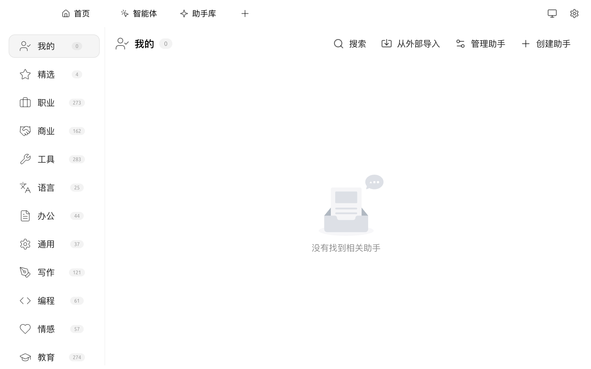

# 助手库


**命名说明**：Cherry Studio 中有两个相关但不同的概念，请注意区分：

* **本页（助手库）**：一个**助手预设市场**，提供大量"角色 + 提示词 + 参数"模板，添加后会出现在对话页的助手列表中。本质上是 [对话助手](chat.md#zhu-shou-he-hua-ti) 的来源。入口：顶部 Tab `+` → 启动台 → `助手库`。
* **Cherry Agent（智能体）**：一个能自主调用工具、访问文件、执行多步任务的智能体系统，依赖本地 [API 服务器](../../advanced-basic/api-server.md)。入口：顶部 Tab `智能体`。详见 [Cherry Agent](../../advanced-basic/agent.md)。

两者在 UI 中都涉及"Agent"字样，但**是不同模块**。本页讲的是助手库（也就是助手预设市场）。


### 进入助手库

顶部 Tab `+` → **启动台** → 点击 `助手库` 图标，或在对话页助手列表中点击 `+ 添加`。

<figure><figcaption>
助手库页面 —— 左侧按用途分类，右上 4 个动作
</figcaption></figure>

### 在助手库中查找助手

* **分类筛选**：左侧栏按 `我的` / `精选` 与 30+ 个用途分类（职业、商业、工具、语言、办公、写作、编程、翻译、教育、医疗 等）筛选，分类名右侧数字为该类的助手数量
* **搜索**：右上角点击 `搜索` 在所有分类内按关键词查找
* **预览**：点击助手卡片可看到该助手的系统提示词、推荐模型、参数预设

### 添加到我的助手

* 点击助手卡片 → 选择 `添加到助手`
* 之后在对话页助手列表中即可看到该助手
* 已添加的助手会进入左侧栏顶部的 `我的` 分类

### 创建自己的助手

1. 右上角点击 `创建助手`
2. 填写：
   * **名称 / 头像**
   * **系统提示词**（决定该助手的角色与行为）
   * **默认模型** 与 **模型参数**（temperature、topP 等）
   * 可选：**关联知识库**、**工具开关**


提示词输入框右上角按钮为 **AI 优化提示词**，点击后会用 [全局默认助手模型](../../pre-basic/settings/default-models.md) 改写当前内容。


### 导入 / 管理

右上角顶部栏从左到右四个动作：

* **搜索**：在助手库内按关键词查找
* **从外部导入**：从 JSON 文件或 URL 导入他人分享的助手
* **管理助手**：进入 `我的` 分类的批量管理界面（批量删除、批量导出）
* **创建助手**：开始新建一个助手

### 何时使用助手库，何时使用 Cherry Agent？

| 场景 | 推荐 |
|---|---|
| 个性化"角色"快速对话（写作、翻译、技术问答等）| **助手库** |
| 让 AI 自主调用工具、读写文件、跨步骤完成任务 | **[Cherry Agent](../../advanced-basic/agent.md)** |
| 定时执行、跨平台消息推送 | **Cherry Agent + [定时任务](../../advanced-basic/scheduled-tasks.md) + [频道](../../advanced-basic/agent-channels.md)** |

如遇问题，请在 [反馈与建议](../../question-contact/suggestions.md) 中提交反馈。
