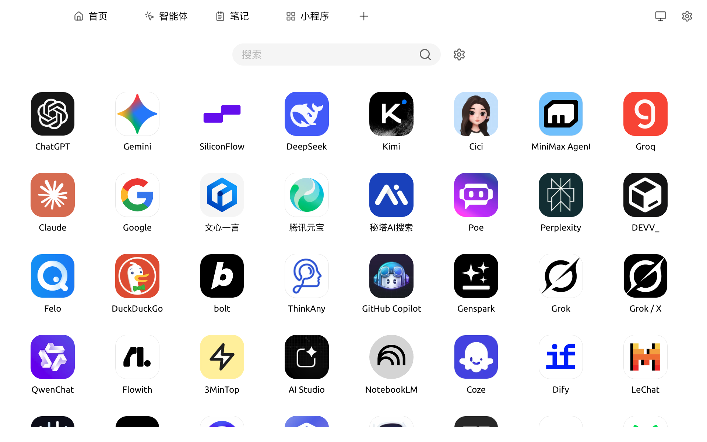

# 小程序

小程序页面（顶部 Tab `+` 进入 **启动台** → `小程序`）以客户端原生窗口的方式打开各家 AI 厂商的网页版（如 ChatGPT、Claude、文心一言、Kimi 等），让你不离开 Cherry Studio 就能切换不同模型的 Web 体验。

### 进入小程序

1. 顶部 Tab 栏点击 `+` 或直接打开 **启动台**
2. 点击 `小程序` 应用图标
3. 在小程序网格中选择需要打开的服务

<figure><figcaption>
小程序网格，内置 40+ 家服务；末尾的 `自定义` 可添加任意网页
</figcaption></figure>

页面顶部有 **搜索框** 与 **设置（⚙️）** 入口，列表末尾 `自定义` 用于添加任意网页。

### 设置

Cherry Studio 小程序的设置支持以下操作：

* **显示 / 隐藏小程序**：可以左右拖动小程序到两个区域，控制显隐
* **排序小程序**：上下拖动可以对小程序进行排序
* **小程序区域筛选**：根据你的选择，自动隐藏你无法访问的小程序
* **小程序缓存数量**：如果同时打开的小程序数量超出此数量，则有一部分小程序会进入不活跃状态

### 自定义与管理

Cherry Studio 的小程序支持以下操作：

* **添加到启动台**：把常用的小程序加入启动台，方便从 `+` 入口快速打开。可在 `设置 → 小程序` 中管理，或对小程序图标右键选择 **添加到启动台**
* **保活（Keep Alive）**：让小程序窗口在切走时不立即销毁，再次进入无需重新登录或重新加载
* **添加自定义网页**：点击列表末尾的 `自定义` 图标，填写名称、URL、图标即可加入网格
* **删除 / 编辑**：对每个小程序图标右键即可

### 提示与技巧

* 小程序使用各服务的**网页版**，登录态、Cookie、设置均保存在本地，与系统浏览器隔离
* 若某个小程序加载失败，可右键 → 重载，或检查代理设置（参考 [常规设置](../../pre-basic/settings/general.md)）
* 当前小程序与对话面板暂未互通，若需让 AI 读取小程序中的内容，需要手动复制或截图

如遇问题，请在 [反馈与建议](../../question-contact/suggestions.md) 中提交反馈。

***

### 💡 获取帮助与提交反馈

如果您在配置或使用过程中遇到任何疑问、Bug 或有功能改进建议，请参考 [反馈与建议](../../question-contact/suggestions.md) 中提供的官方渠道。
