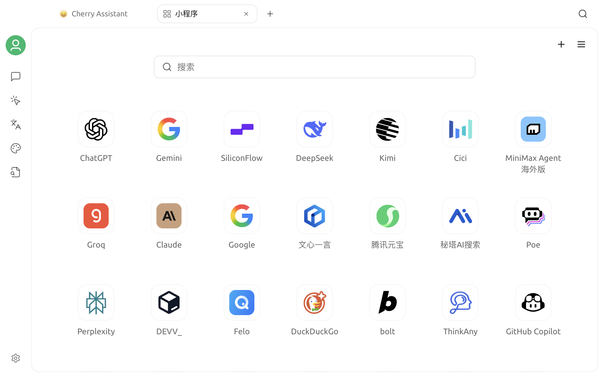

# 小程序

小程序可以在 Cherry Studio 内打开常用网站。内置目录包含多种 AI、搜索和开发服务，你也可以把自己的网页地址添加为小程序，并通过顶部标签在多个网页之间切换。


小程序加载的是第三方网站本身，不等同于 Cherry Studio 的模型 API。网站账号、功能、地区限制和收费方式均由对应服务提供方决定。


## 打开小程序

点击顶部标签栏右侧的 `+`，打开**启动台**，然后选择**小程序**。

小程序首页提供：

- **搜索框**：按名称或网址筛选小程序；
- **小程序网格**：打开当前可见的内置或自定义小程序；
- **添加按钮**：创建自定义小程序；
- **显示设置**：控制显示、顺序、地区和缓存等行为。

点击小程序后，网站会在一个新的顶部标签中打开。切换到其他标签时，在缓存范围内的小程序网页会保持加载状态。

## 使用小程序网页

打开网站后，页面顶部工具栏提供常用浏览操作：

| 操作 | 用途 |
| --- | --- |
| 后退 / 前进 | 在当前小程序的浏览记录中导航 |
| 刷新 | 重新加载当前网站 |
| 在浏览器中打开 | 使用系统默认浏览器打开当前网址 |
| 固定 | 将该小程序入口加入或移出启动台 / 侧边栏 |
| 新窗口链接方式 | 切换网站弹出的新窗口链接是在 Cherry Studio 内还是系统浏览器中打开 |

在小程序网页中还可以使用以下快捷键：

| 快捷键 | 作用 |
| --- | --- |
| `Ctrl / Command + F` | 搜索当前网页；`Enter` / `Shift + Enter` 切换匹配项 |
| `Ctrl / Command + P` | 将当前网页打印为 PDF |
| `Ctrl / Command + S` | 将当前网页保存为 HTML |

不同网站可能重新定义部分按键；以上操作以 Cherry Studio 实际显示的结果为准。

## 添加自定义小程序

点击小程序首页右上角的添加按钮，填写：

| 字段 | 要求 |
| --- | --- |
| ID | 必填且唯一，只能使用英文字母、数字、下划线和连字符 |
| 名称 | 显示在小程序网格和标签上的名称 |
| URL | 要打开的完整网页地址，通常使用 `https://` |
| 图标 | 可选；可以填写图片网址，也可以从本地上传图片 |

保存后，自定义小程序会加入可见列表并出现在网格中。


只添加你信任的网址。自定义小程序会在 Cherry Studio 内加载该网站，网站仍可接收你主动提交的登录信息、文件和表单内容。


当前版本不能直接修改已保存小程序的 ID、名称、URL 或图标。需要更改时，先移除原自定义小程序，再使用新信息重新创建。

## 固定、隐藏和移除

在小程序网格中右键点击一个图标，可以根据当前状态执行：

- **添加到启动台 / 侧边栏**或取消固定；
- **隐藏**内置或自定义小程序；
- **移除自定义小程序**。

内置小程序不能删除，但可以隐藏；只有自行创建的小程序可以彻底移除。固定入口的位置会随当前导航栏布局显示在启动台或侧边栏。

隐藏小程序时，如果它正在缓存列表中，相关网页也会从当前保持加载的列表中移除。

## 管理显示与排序

打开小程序首页右上角的显示设置。面板上方分为**显示的小程序**和**隐藏的小程序**两个列表：

- 点击条目可在显示与隐藏之间移动；
- 在同一列表中拖动可调整顺序；
- **交换**会互换当前可见和隐藏的条目；
- **重置**会把当前隐藏的条目恢复为显示。

固定的小程序始终保持可见，不会随普通显示条目一起隐藏。

## 地区筛选

地区设置有**自动检测**、**中国**和**全球**三个选项。它会根据内置目录声明的可用地区筛选网格，减少显示当前地区通常无法访问的服务。

地区筛选只影响当前展示范围，不会替你注册账号、绕过服务限制或保证网站可访问。自定义小程序默认可在中国和全球视图中显示。

## 控制链接打开方式

开启**在浏览器中打开新窗口链接**后，网站尝试打开的新窗口会交给系统默认浏览器；关闭时，新窗口由 Cherry Studio 的小程序环境处理。

这个开关可以在显示设置中统一修改，也可以在已打开小程序的顶部工具栏中快速切换。无论该选项如何设置，工具栏的**在浏览器中打开**按钮都会直接打开当前网址。

## 小程序缓存数量

缓存数量决定最多同时保持多少个小程序网页处于加载状态，可在 `1` 到 `10` 之间调整。默认值为 `3`。

- 数量较大：切回网页时更可能保留登录后的页面状态，但会占用更多内存；
- 数量较小：减少内存占用，但较早打开且未固定的网页可能被卸载，再次打开时需要重新加载。

降低数量后，会在当前打开列表随后变化到新限制时逐步生效。顶部标签中被固定的网页不会因为缓存上限而被自动移除。

## 登录状态与数据

小程序使用独立于系统浏览器的持久化网页会话。因此：

- 首次使用某个网站时，通常需要在小程序中单独登录；
- 关闭并再次打开 Cherry Studio 后，网站 Cookie 和登录状态通常仍可继续使用；
- 系统浏览器中的登录状态不会自动同步到小程序；
- 多个小程序使用同一个 Cherry Studio 网页会话分区。

网站仍可能因为账号安全策略、Cookie 过期、地区变化或自身更新而要求重新登录。

## 常见问题

### 网站一直加载或显示空白

先点击刷新；仍然失败时，使用工具栏在系统浏览器中打开，确认网址和账号服务本身是否可用。还应检查网络、代理和地区限制。部分网站会主动限制嵌入式浏览环境，此时只能改用系统浏览器。

代理配置可参考[常规设置](../../pre-basic/settings/general.md)。

### 登录后反复跳回登录页

尝试刷新并确认系统时间正确、网站允许 Cookie，且登录过程中没有被网络或代理拦截。如果服务不支持嵌入式网页登录，请改用系统浏览器。

### 小程序不见了

检查搜索词、地区筛选以及显示设置中的隐藏列表。如果它已被固定，还要查看启动台或侧边栏中的对应入口。

### 自定义小程序无法保存

检查 ID 是否只包含字母、数字、下划线或连字符，且没有与内置或现有小程序重复；同时确认名称和 URL 均已填写。

### 切回网页后重新加载

可能是打开的小程序超过缓存数量，较早的非固定网页已被卸载。可以提高缓存数量，或固定需要持续保留的顶部标签。

## 隐私与安全

你在小程序中输入的账号、消息、文件和其他内容会发送给对应网站，而不是发送给当前对话所选的模型。Cherry Studio 的对话也不会自动读取小程序网页内容；需要引用时，请在确认权限和敏感度后手动复制必要内容。

***

遇到问题或希望改进功能，请前往[反馈与建议](../../question-contact/suggestions.md)。
