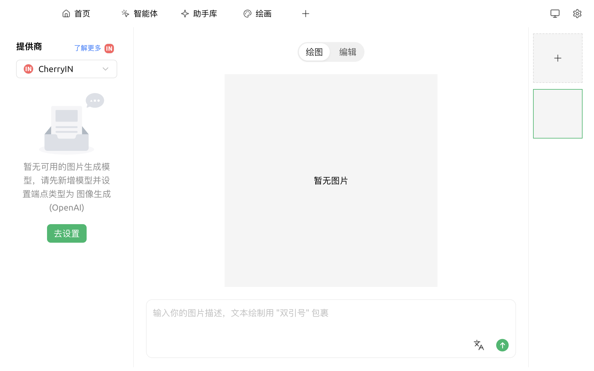
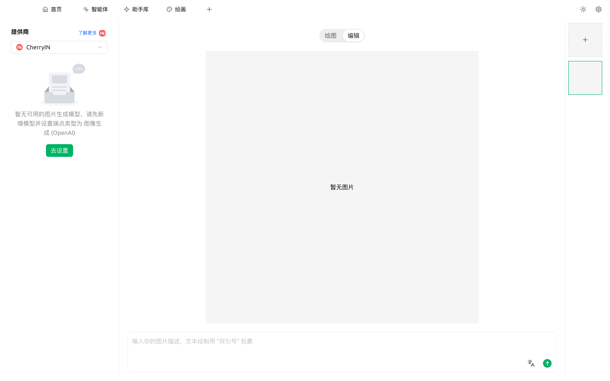
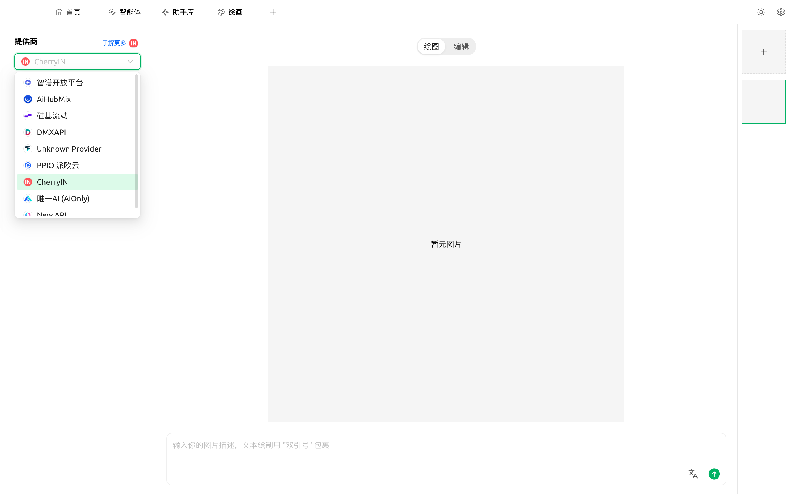

# 绘画

绘画页面是 Cherry Studio 内置的**文生图工具**：通过文字描述生成图像，效果与 Midjourney / DALL·E 等网页服务类似。**主要优势在于直接复用 Cherry Studio 中已配置的服务商账号**，无需另行注册各家平台。

## 进入绘画

顶部 Tab `+` → **启动台** → 点击 `绘画`。

<figure><figcaption><p>绘画页面：左侧选服务商，顶部切换 绘图 / 编辑，右侧为历史画板</p></figcaption></figure>

页面分为三栏：

* **左栏**：选择服务商，下方提示当前服务商有没有可用的图像生成模型；没有时会显示绿色 `去设置` 按钮直接跳到该服务商配置页
* **中栏顶部**：`绘图` / `编辑` 切换 —— 绘图是文生图，编辑是基于已有图像做图生图 / 修改
* **中栏底部**：提示词输入框，右下角为目标语言（如英文）翻译与发送
* **右栏**：当前会话已生成的图片列表，顶部 `+` 可新建画板

切到 `编辑` Tab 后画布说明会变为「上传图像 + 描述改动」的模式：

<figure><figcaption><p>切到「编辑」Tab —— 同样的输入框，但需要先上传一张参考图，再描述如何修改</p></figcaption></figure>

## 当前支持的服务商

Cherry Studio 的绘画功能依赖各家服务商提供的**文生图模型**。在左栏服务商下拉中可以看到当前实际可选的全部条目：

<figure><figcaption><p>服务商下拉 —— 选中项显示为绿色高亮，可滚动查看更多</p></figcaption></figure>

按类型大致分为三类：

| 类型 | 服务商 | 说明 |
|---|---|---|
| 国内云服务 | **[硅基流动](../../pre-basic/providers/siliconcloud.md)** | 国内访问最方便，价格便宜，模型选择多 |
| | **[PPIO 派欧云](../../pre-basic/providers/ppio.md)** | 国内云算力服务 |
| | **智谱开放平台** | 国产模型 CogView |
| 聚合网关 | **[AiHubMix](../../pre-basic/providers/)** | 聚合多家厂商的网关 |
| | **[DMXAPI](../../pre-basic/providers/)** | 聚合多家厂商的网关 |
| | **TokenFlux** | 海外网关 |
| | **CherryIN** | Cherry 官方网关，统一计费 |
| | **唯一 AI（AiOnly）** | 第三方网关 |
| 自建 / 本地 | **New API** | 自建网关方案，添加后会出现在此列表 |
| | **OVMS** | OpenVINO Model Server，本地推理（仅在 OVMS 已运行时显示） |


任何**端点类型设为 `图像生成 (OpenAI)`** 的自定义服务商，都会动态出现在这里。后续会陆续接入更多。


## 开始画

1. 在左栏选择已配置的**服务商**；若提示"暂无可用的图片生成模型"，点击 `去设置` 在该服务商下添加一个端点类型为 **图像生成 (OpenAI)** 的模型
2. 顶部确认在 `绘图` Tab，在中下方输入框输入**提示词**（中文/英文都可，越具体越好），例如：
   ```
   一只戴着圆眼镜的橘猫坐在书堆上，复古油画风格，温暖的黄昏光线
   ```
3. 调整右边的参数（尺寸、步数、随机种子等），不确定就用默认
4. 点击 **生成**，等几秒到几十秒（取决于模型）
5. 生成的图会出现在画布上，可下载、收藏，或一键再画一张

## 参数怎么填？

参数面板里部分字段右侧带 **ⓘ 信息图标**，鼠标悬停会显示说明（如硅基流动 / Aihubmix / PPIO 等服务商基本都带），但**不是所有服务商**都加了 Tooltip——比如智谱、NewAPI 的参数面板就没有提示。看不到说明时，按下面默认值直接试就行。

如果想深入了解：

* **尺寸**：影响细节量与生成时间。日常用 1024x1024 够了
* **步数（Steps）**：模型"打磨"次数。20-30 步通常够用，多了边际收益小
* **CFG / Guidance**：AI 对你提示词的"听话程度"。7-12 比较常用
* **种子（Seed）**：固定种子可让结果可复现；想看同一个提示词随机变化就留空

## 提示与技巧

* **用英文提示词通常效果更好**（绝大多数模型用英文素材训练为主）
* 越具体越好：风格、构图、光线、镜头都写进去
* 想要"参考某张图改"？看你选的服务商是否支持 **img2img**（图生图）
* 一次出 4 张省 4 倍时间：把"批次数"调到 4


绘画功能会随版本扩展。最新支持的服务商以应用内下拉为准。



