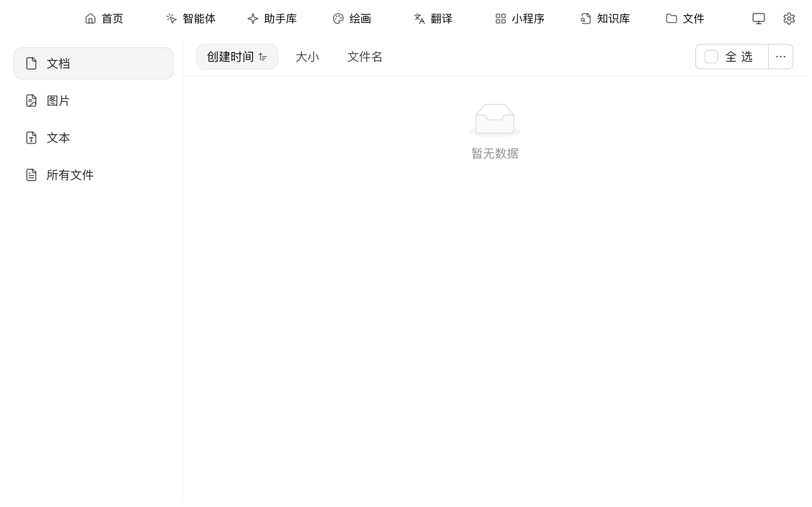

# 文件

文件页面是 Cherry Studio 的**附件总仓库** —— 你在对话中拖进来的图片、PDF、文档，在绘画中生成的图，在知识库中导入的资料，都能在这里集中查看与管理。

可以理解成 Cherry Studio 内部的"我的电脑"。

## 进入文件页面

顶部 Tab `+` → **启动台** → 点击 `文件`。

<figure><figcaption>
文件页面：左侧按类型分类，顶部排序与全选 / 多选
</figcaption></figure>

## 在这里可以做什么

* **按类型筛选**：左侧四个分类 —— `文档`、`图片`、`文本`、`所有文件`
* **排序**：顶部 `创建时间` / `大小` / `文件名` 三种排序方式
* **批量操作**：右上 `全选` 复选框配合 `⋯` 菜单做批量删除 / 下载
* **预览**：单击文件直接预览（图片、PDF 等支持的格式）
* **下载到本地**：右键 → 下载，可选择保存位置
* **删除**：右键 → 删除（删除后无法恢复，请确认）
* **打开所在位置**：右键 → 在文件管理器中显示（macOS = 访达，Windows = 资源管理器）

## 文件存在哪？

Cherry Studio 把所有附件存在本地的应用数据目录中。具体路径：

* **macOS**：`~/Library/Application Support/CherryStudio`
* **Windows**：`%APPDATA%\CherryStudio`
* **Linux**：`~/.config/CherryStudio`

想换到别的盘？看 [修改存储位置](../../pre-basic/personalization-settings/storage.md)。

## 提示与技巧

* 长期不用的对话 / 知识库会越攒越多文件，定期到这里清一下能省不少磁盘
* 重要文件建议同时备份到云盘（WebDAV / S3 等），见 [数据设置](../../pre-basic/data-settings/)
* 文件名乱码？通常是从外部拖入时编码问题，建议先重命名再用

如遇问题，请在 [反馈与建议](../../question-contact/suggestions.md) 中提交反馈。
