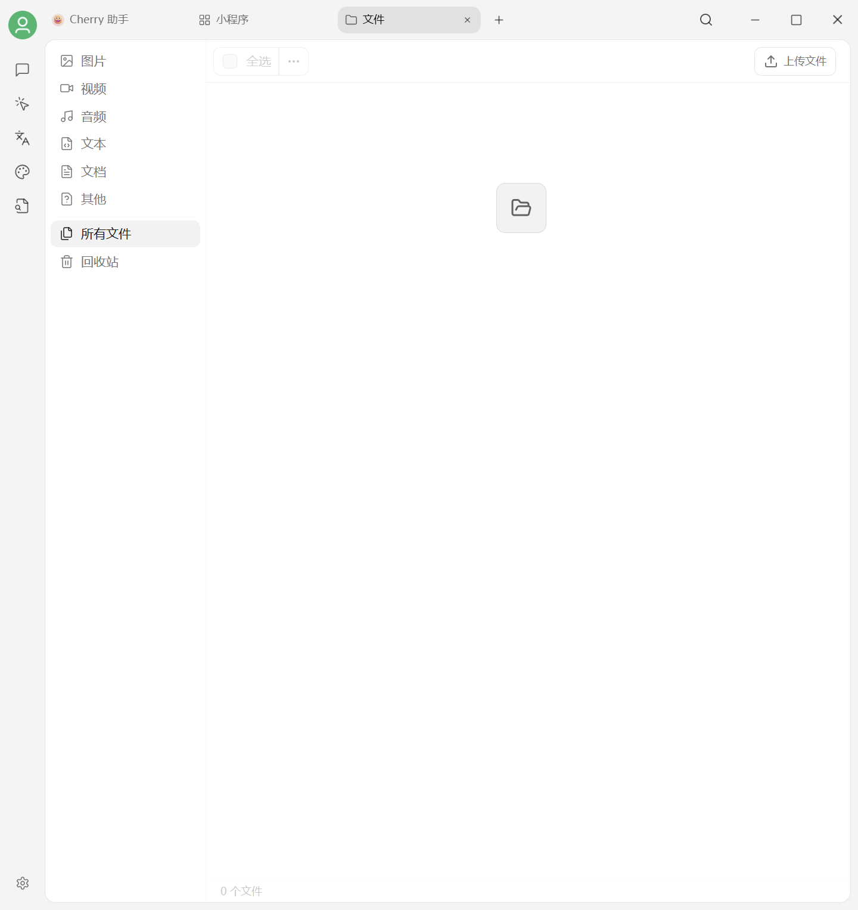

# 文件

文件页是 Cherry Studio 的本地文件管理入口，可上传并按类型整理应用内文件。

可以理解成 Cherry Studio 内部的"我的电脑"。

## 进入文件页面

顶部 Tab `+` → **启动台** → 点击 `文件`。

<figure><figcaption>
文件页提供类型筛选、批量操作、上传入口和回收站
</figcaption></figure>

## 在这里可以做什么

* **上传文件**：点击右上角 **上传文件**
* **按类型筛选**：图片、视频、音频、文本、文档、其他和所有文件
* **批量操作**：选择一个或多个文件后使用 **操作**
* **预览与打开**：支持的格式可直接预览
* **回收站**：删除的文件先进入回收站，可在清理前恢复或永久删除

## 文件存在哪？

Cherry Studio 把应用数据和文件索引保存在当前数据目录中。请在 `设置 → 数据设置 → 数据目录` 查看实际路径，不要仅根据固定系统路径猜测。

想更换目录？请先备份，再按 [数据存储位置](../../pre-basic/personalization-settings/storage.md) 的步骤迁移。

## 提示与技巧

* 定期检查回收站，确认无误后再永久清理
* 重要文件建议同时备份到云盘（WebDAV / S3 等），见 [数据设置](../../pre-basic/data-settings/)
* 重置数据会影响本地内容；执行前先在 `设置 → 数据` 创建备份

***

### 💡 获取帮助与提交反馈

如果您在配置或使用过程中遇到任何疑问、Bug 或有功能改进建议，请参考 [反馈与建议](../../question-contact/suggestions.md) 中提供的官方渠道。
