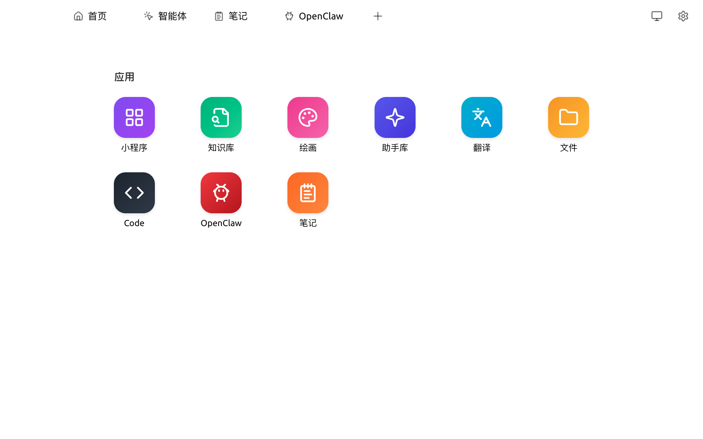

# 启动台

启动台（Launchpad）是 Cherry Studio v1.9.x 引入的**应用抽屉**，集中展示所有功能入口。顶部 Tab 栏的 `+` 按钮即指向启动台。

<figure><figcaption>
启动台中的 9 个应用
</figcaption></figure>

### 默认应用

| 图标 | 应用 | 说明 |
|---|---|---|
| 🟪 | [小程序](app.md) | 客户端内运行 AI 厂商网页版 |
| 🟩 | [知识库](knowledge-base.md) | 文档/网址/笔记向量化检索 |
| 🩷 | [绘画](drawing.md) | 文生图模型 |
| 🟦 | [助手库](agents.md) | 浏览/创建对话助手 |
| 🟦 | [翻译](translation.md) | 双栏快速翻译 |
| 🟧 | [文件](files.md) | 集中管理对话/绘画/知识库附件 |
| ⬛ | Code | Code Tools / CLI（详见 [Code Tools 使用教程](../../advanced-basic/code-tools-shi-yong-jiao-cheng.md)） |
| 🟥 | [OpenClaw](../../advanced-basic/openclaw.md) | 外部 Agent CLI 集成 |
| 🟧 | [笔记](notes.md) | 内置 Markdown 编辑器 |

### 把常用应用置顶到 Tab 栏

* 在启动台中右键某个应用 → **固定**（Pin），它会出现在顶部 Tab 栏中，便于一键访问
* 取消固定：在 Tab 栏对应项右键 → **取消固定**

### 切换默认导航布局

如果你更习惯传统的左侧栏：

* `设置 → 常规设置 → 导航位置` 切到 `左侧`
* 切换后启动台依然存在，但顶部 Tab 栏被左侧栏替代

### 提示与技巧

* 启动台不是必经的"主页"，所有应用都可通过 Tab 栏 + 快捷键直接进入
* 应用列表会随 Cherry Studio 更新而扩充（如新增的 [Cherry Agent](../../advanced-basic/agent.md) 顶部 Tab 与 [全局记忆](../../advanced-basic/memory.md) 设置项不在启动台中，而在专属 Tab / 设置菜单内）
* 如需"全屏沉浸"工作模式，可用 <kbd>⌘</kbd> + <kbd>[</kbd> 和 <kbd>⌘</kbd> + <kbd>]</kbd> 收起两侧栏

如遇问题，请在 [反馈与建议](../../question-contact/suggestions.md) 中提交反馈。
