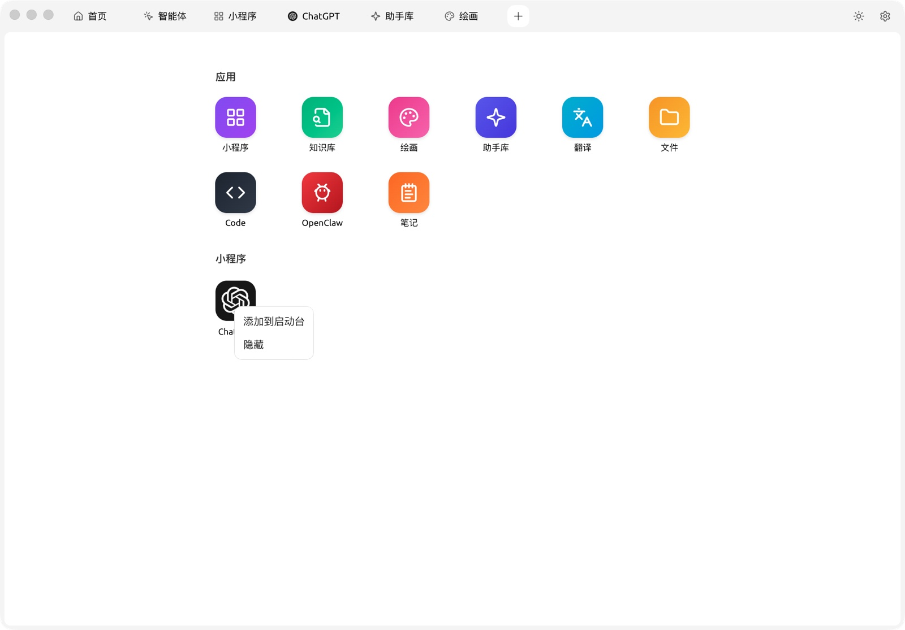
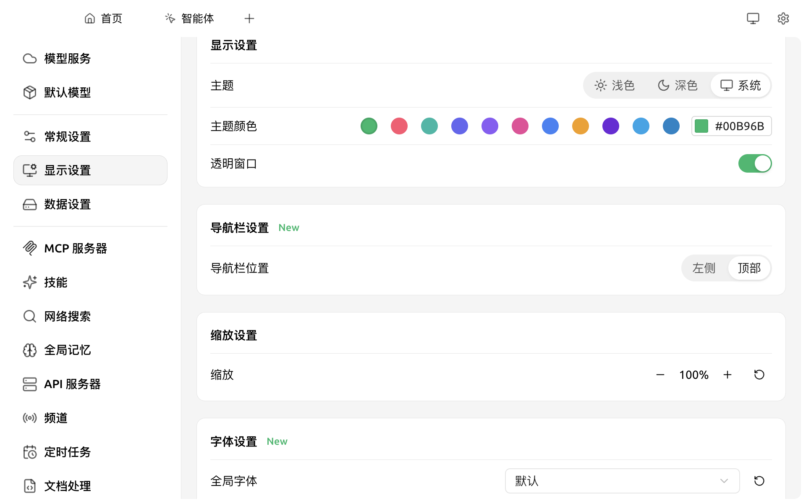
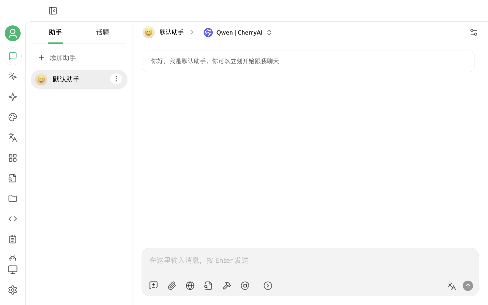

# 启动台

启动台（Launchpad）是 Cherry Studio 的**应用抽屉**，集中展示所有功能入口。顶部 Tab 栏的 `+` 按钮即指向启动台。

<figure><figcaption>
启动台中的 9 个应用
</figcaption></figure>

### 默认应用

| 应用 | 说明 |
|---|---|
| [小程序](app.md) | 客户端内运行 AI 厂商网页版 |
| [知识库](knowledge-base.md) | 文档/网址/笔记向量化检索 |
| [绘画](drawing.md) | 文生图模型 |
| [助手库](assistants.md) | 浏览/创建对话助手 |
| [翻译](translation.md) | 双栏快速翻译 |
| [文件](files.md) | 集中管理对话/绘画/知识库附件 |
| Code | Code Tools / CLI（详见 [Code Tools 使用教程](../../advanced-basic/code-tools.md)） |
| [OpenClaw](../../advanced-basic/openclaw.md) | 外部 Agent CLI 集成 |
| [笔记](notes.md) | 内置 Markdown 编辑器 |

### 小程序添加到启动台

启动台底部可以看到你已经使用过的[小程序](app.md)（如 ChatGPT 网页、Claude 网页等）。常用小程序可以**添加到启动台**：

* 对小程序图标右键，选择 **添加到启动台**
* 当导航布局切到 **左侧栏** 时（见下方"切换默认导航布局"），已添加的小程序会显示在左侧栏底部，便于一键访问

<figure><figcaption>
右键小程序，可添加到启动台或隐藏
</figcaption></figure>

> 启动台中的 9 个核心应用（笔记、绘画、翻译等）是**固定**的，不支持自定义增删。

### 切换默认导航布局

如果你更习惯传统的左侧栏：打开 `设置 → 显示设置`，在 **导航栏设置** 节中把 **导航栏位置** 由 `顶部` 切到 `左侧`。

<figure><figcaption>
设置 → 显示设置 → 导航栏设置 → 导航栏位置
</figcaption></figure>

切换后，顶部 Tab 栏会被替换为左侧的纵向图标栏，可以直接点击对应图标进入相应界面：

<figure><figcaption>
切换到左侧栏后的首页效果
</figcaption></figure>

两种布局功能完全相同，按个人习惯选择即可，**随时可以再切回**。

***

### 💡 获取帮助与提交反馈

如果您在配置或使用过程中遇到任何疑问、Bug 或有功能改进建议，请参考 [反馈与建议](../../question-contact/suggestions.md) 中提供的官方渠道。
