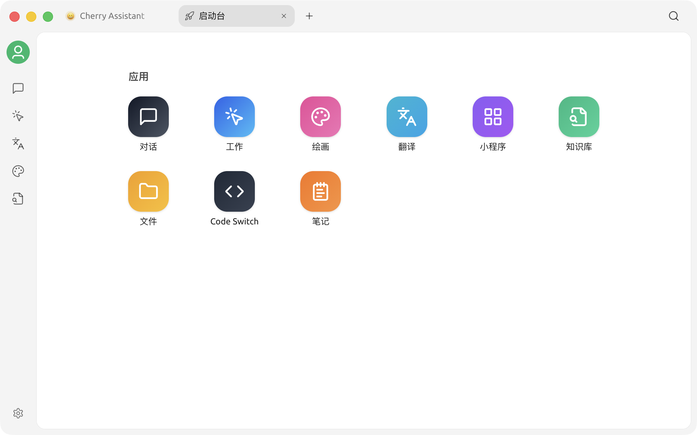

# 启动台

启动台集中展示 Cherry Studio 的应用入口。点击顶部标签栏右侧的 `+` 即可打开；关闭所有标签页时，也会自动回到启动台。

<figure><figcaption>
简体中文界面的启动台
</figcaption></figure>

## 打开应用

| 应用 | 说明 |
| :--- | :--- |
| [对话](chat.md) | 开始一次新的 AI 对话 |
| [工作](../../advanced-basic/agent.md) | 创建并运行 Agent 任务 |
| [绘画](drawing.md) | 使用图像模型生成图片 |
| [翻译](translation.md) | 快速翻译文本 |
| [小程序](app.md) | 在 Cherry Studio 中使用网页应用 |
| [知识库](knowledge-base.md) | 导入资料并用于检索和问答 |
| [文件](files.md) | 集中查看和管理文件 |
| [Code Switch](../../advanced-basic/code-tools.md) | 管理和使用 AI 编程工具 |
| [笔记](notes.md) | 编写和管理 Markdown 笔记 |

点击应用卡片后，当前启动台标签页会切换到对应应用。打开“对话”或“工作”时，会新建一个会话或任务。

## 调整应用

* 拖动应用卡片可以调整它们在启动台中的顺序。启动台顺序与侧边栏顺序互不影响。
* 右键点击应用卡片，可以选择 **添加到侧边栏** 或 **从侧边栏移除**。“对话”是必需入口，不能从侧边栏移除。

## 管理小程序

添加到启动台的小程序会显示在页面下方的独立区域。你可以拖动小程序调整顺序，也可以右键选择 **从启动台移除**，或将它添加到侧边栏。更多操作请参阅[小程序](app.md)。

***

## 💡 获取帮助与提交反馈

如果您在配置或使用过程中遇到任何疑问、Bug 或有功能改进建议，请参考 [反馈与建议](../../question-contact/suggestions.md) 中提供的官方渠道。
