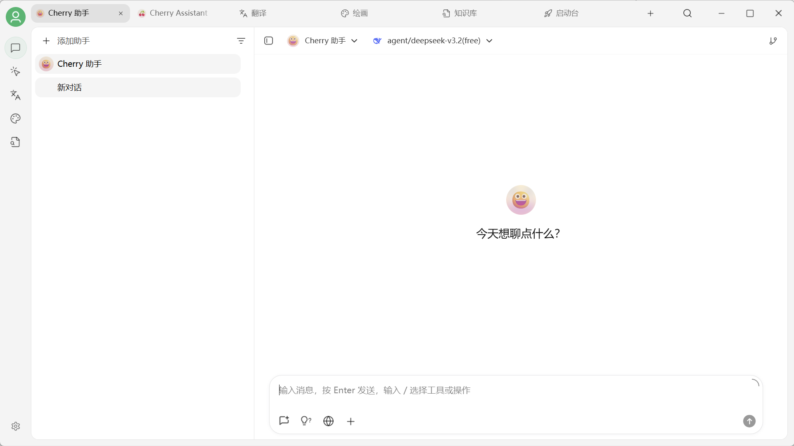

# 启动台

启动台（Launchpad）是 Cherry Studio 的**应用抽屉**，集中展示所有功能入口。顶部 Tab 栏的 `+` 按钮即指向启动台。

<figure><figcaption>
启动台应用区
</figcaption></figure>

### 默认应用

| 应用 | 说明 |
|---|---|
| [对话（助手）](chat.md) | 使用和管理对话助手、话题与助手库 |
| [工作（智能体）](../../advanced-basic/agent.md) | 让 AI 调用工具并完成多步骤任务 |
| [绘画](drawing.md) | 文生图模型 |
| [翻译](translation.md) | 双栏快速翻译 |
| [小程序](app.md) | 客户端内运行 AI 厂商网页版 |
| [知识库](knowledge-base.md) | 文档/网址/笔记向量化检索 |
| [文件](files.md) | 集中管理对话/绘画/知识库附件 |
| Code Switch | Code CLI 与 OpenClaw（详见 [Code Switch 使用教程](../../advanced-basic/code-tools.md)） |
| [笔记](notes.md) | 内置 Markdown 编辑器 |


V2 不再提供独立的「助手库」或「OpenClaw」启动台入口：助手库已并入助手对话页，OpenClaw 已并入 Code Switch 页面。


### 排序应用和添加到侧边栏

* 长按并拖动启动台中的内置应用，可以调整它们在启动台中的顺序
* 右键内置应用，可选择 **添加到侧边栏** 或 **从侧边栏移除**
* 「助手」是必需入口，不能从侧边栏移除

启动台顺序与侧边栏顺序彼此独立，调整其中一处不会自动重排另一处。

### 小程序添加到启动台

启动台的「小程序」区域只显示已经固定到启动台的[小程序](app.md)（如 ChatGPT 网页、Claude 网页等）。仅打开过、但没有固定的小程序不会出现在这里。

* 在小程序页面打开目标小程序的菜单，选择 **添加到启动台**
* 已固定的小程序会显示在启动台的「小程序」区域，也可以拖动排序
* 在启动台中打开已固定小程序的菜单，可以取消固定或继续添加到侧边栏

> 启动台中的 9 个内置应用不能删除，但可以拖动排序；小程序可按需固定或取消固定。

***

### 💡 获取帮助与提交反馈

如果您在配置或使用过程中遇到任何疑问、Bug 或有功能改进建议，请参考 [反馈与建议](../../question-contact/suggestions.md) 中提供的官方渠道。
