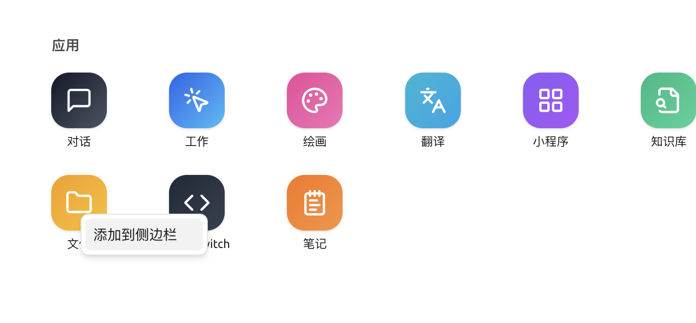
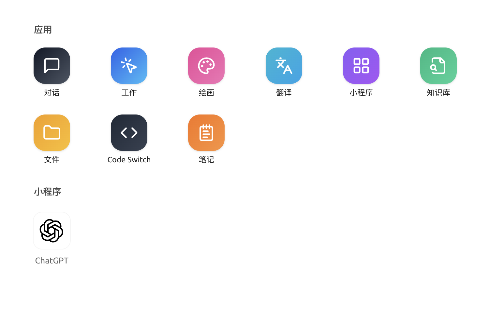

# 启动台

启动台是 Cherry Studio 的应用导航页，集中展示对话、Agent、绘画、翻译、知识库等常用入口。你可以从这里快速开始一项新工作，也可以按自己的使用习惯调整应用顺序和侧边栏入口。

## 打开启动台

点击窗口顶部标签栏右侧的 `+`，即可打开一个新的启动台标签页。每次点击都会新建独立标签页，适合在多个应用之间并行工作。

<figure><figcaption>
点击顶部的“+”打开启动台
</figcaption></figure>

如果关闭了所有标签页，Cherry Studio 也会自动回到启动台。首次安装后默认进入“对话”页，不会自动打开启动台。

## 认识默认应用

<figure><figcaption>
启动台中的默认应用
</figcaption></figure>

| 应用 | 适合完成的工作 | 打开后的行为 |
| :--- | :--- | :--- |
| [对话](chat.md) | 与模型聊天、分析资料或调用工具 | 新建一个对话 |
| [工作](../../advanced-basic/agent.md) | 让 Agent 分步骤执行复杂任务 | 新建一个 Agent 任务 |
| [绘画](drawing.md) | 使用图像模型生成和管理图片 | 打开绘画工作区 |
| [翻译](translation.md) | 快速翻译文本并对照原文 | 打开翻译工作区 |
| [小程序](app.md) | 使用网页应用或管理自定义小程序 | 打开小程序列表 |
| [知识库](knowledge-base.md) | 导入文档、网页等资料并检索问答 | 打开知识库列表 |
| [文件](files.md) | 集中查看对话和任务中使用的文件 | 打开文件管理页 |
| [Code Switch](../../advanced-basic/code-tools.md) | 管理并切换 AI 编程工具 | 打开 Code Switch |
| [笔记](notes.md) | 创建和整理 Markdown 笔记 | 打开笔记列表 |

点击应用卡片后，当前启动台标签页会切换到对应应用。其中“对话”和“工作”会分别创建新会话和新任务；如需继续之前的内容，请从侧边栏打开最近使用的项目。

## 调整应用顺序

按住应用卡片并拖到目标位置，即可调整启动台中的排列顺序。排序结果会自动保存，下次打开启动台时仍会保留。


启动台和侧边栏分别保存自己的顺序。在启动台中拖动卡片，不会改变侧边栏的排列。


## 将应用固定到侧边栏

如果经常使用某个应用，可以将它固定到左侧边栏：

1. 在启动台中右键点击应用卡片。
2. 选择 **添加到侧边栏**。
3. 如需取消固定，再次右键点击并选择 **从侧边栏移除**。

<figure><figcaption>
右键点击应用卡片，将常用应用添加到侧边栏
</figcaption></figure>

“对话”是 Cherry Studio 的必需入口，因此不能从侧边栏移除。其他默认应用即使不固定在侧边栏，仍可随时从启动台打开。

## 管理小程序

在[小程序](app.md)页面中将网页应用添加到启动台后，它会显示在默认应用下方的“小程序”区域。

* 拖动小程序卡片，可以调整它们在启动台中的顺序。
* 右键点击小程序，可以选择 **从启动台移除**，或将它添加到侧边栏。
* 对于自己创建的小程序，右键菜单还会提供删除操作。

<figure><figcaption>
添加到启动台的小程序显示在独立区域
</figcaption></figure>

从启动台移除小程序只会取消快捷入口，不会删除小程序本身；你仍可在“小程序”页面中找到它。

## 常见问题

### 为什么启动台和侧边栏的顺序不一样？

两处顺序相互独立。启动台用于组织所有应用入口，侧边栏用于固定最常用的入口，因此可以分别调整。

### 为什么点击“对话”或“工作”后没有打开上次的内容？

启动台用于开始新工作，因此会新建对话或任务。如需继续之前的内容，请从侧边栏或历史列表中打开。

### 可以从启动台删除默认应用吗？

目前默认应用不能从启动台移除，但可以拖动排序。添加到启动台的小程序可以通过右键菜单移除。

***

## 💡 获取帮助与提交反馈

如果您在配置或使用过程中遇到任何疑问、Bug 或有功能改进建议，请参考 [反馈与建议](../../question-contact/suggestions.md) 中提供的官方渠道。
