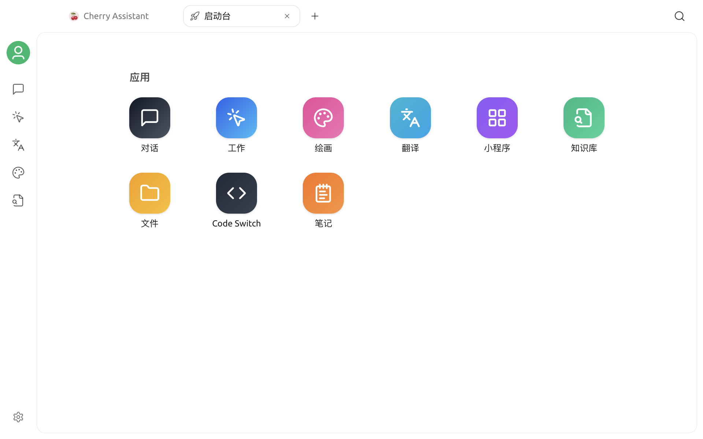

# 启动台

启动台是 Cherry Studio 的首页，用于集中打开内置功能和已固定的小程序。它适合开始一项新工作，也可以作为多个标签页之间的统一入口。

## 打开启动台

启动 Cherry Studio 后，应用会默认进入启动台。使用过程中还可以通过以下方式返回或新建启动台：

* 点击窗口顶部标签栏左侧的首页按钮，返回已有的启动台标签页。
* 点击标签栏中的 `+`，新建一个标签页。新标签页会从启动台开始。

从启动台点击应用后，当前标签页会进入相应工作区。需要同时处理多项工作时，可以使用 `+` 新建多个标签页。

## 应用入口

启动台的“应用”区域提供以下入口：

| 应用 | 用途 |
| :--- | :--- |
| 对话 | 新建对话并使用助手 |
| 工作 | 创建和运行智能体任务 |
| 绘画 | 使用图像模型生成和管理图片 |
| 翻译 | 翻译文本并对照原文与译文 |
| 小程序 | 打开和管理网页小程序 |
| 知识库 | 管理知识库、数据源和检索设置 |
| 文件 | 查看 Cherry Studio 中使用过的文件 |
| Code Switch | 管理和运行支持的 AI 编程工具 |
| 笔记 | 创建和整理 Markdown 笔记 |

拖动图标可以调整内置应用在启动台中的顺序。右键点击图标，还可以将对应应用固定到左侧边栏，或从边栏取消固定；对话等必要入口不能取消固定。

## 小程序区域

固定到启动台的小程序会显示在“应用”区域下方。小程序和内置应用分别排序，拖动小程序图标即可调整它们在该区域中的顺序。

如需添加或移除入口，请在“小程序”页面打开对应小程序的操作菜单，然后选择“添加到启动台”或“从启动台移除”。


从启动台移除小程序只会取消快捷入口，不会删除小程序本身。


## 使用建议

* 从启动台开始一项新工作；需要继续已有对话或任务时，使用左侧边栏或相应页面的历史列表。
* 使用多个标签页并行打开不同功能，避免频繁退出当前工作区。
* 将常用网页小程序添加到启动台，并把高频内置应用固定到侧边栏。
