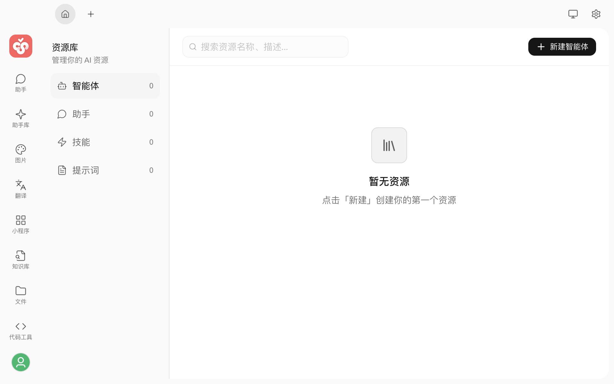

# 资源库

资源库用于集中管理你在 Cherry Studio 中创建或安装的助手、智能体、技能和提示词。你可以按资源类型切换列表，搜索已有资源，并在同一页面完成新建、导入、编辑或删除。


资源库与[助手库](assistants.md)用途不同。助手库用于浏览和导入社区助手；资源库用于管理已经属于你的资源。


## 打开资源库

在启动台中点击 **资源库**。进入后，左侧会显示四种资源类型及其数量，右侧显示当前类型的资源卡片。

| 类型 | 可以完成的工作 |
| :--- | :--- |
| 助手 | 新建或导入助手，配置模型、提示词、知识库和工具 |
| 智能体 | 新建智能体，配置模型、工作目录、权限和可用工具 |
| 技能 | 从 ZIP 文件或本地目录安装技能，查看技能内容并卸载 |
| 提示词 | 创建和维护可重复使用的提示词 |

## 查找和整理资源

1. 从左侧选择资源类型。
2. 在顶部搜索框中输入名称或关键词。
3. 在“助手”列表中，还可以使用标签进一步筛选。

助手卡片的操作菜单支持管理标签。新建标签后，可以继续把它分配给其他助手。

## 新建或导入资源

点击页面右上方的新建按钮，然后选择当前资源类型对应的操作：

* 助手、智能体和提示词会打开各自的配置页面，填写必填项并保存后才会创建。
* 助手支持从 JSON 文件导入。
* 技能支持从 ZIP 文件或本地目录安装；如需搜索技能市场，请前往“设置 → 技能”。

创建完成后，资源会回到对应类型的列表中。

## 编辑和管理资源

点击资源卡片可以打开编辑或详情页面。也可以使用卡片的操作菜单：

* 编辑资源配置。
* 复制或导出助手。
* 删除助手、智能体或提示词。
* 查看技能详情，或卸载不再需要的技能。

删除或卸载前，Cherry Studio 会显示确认提示。此操作可能影响正在引用该资源的工作流，请先确认资源不再使用。

## 下一步

* 了解如何创建和运行[智能体](../../advanced-basic/agent.md)。
* 了解如何安装和管理[技能](../../pre-basic/settings/skills.md)。
