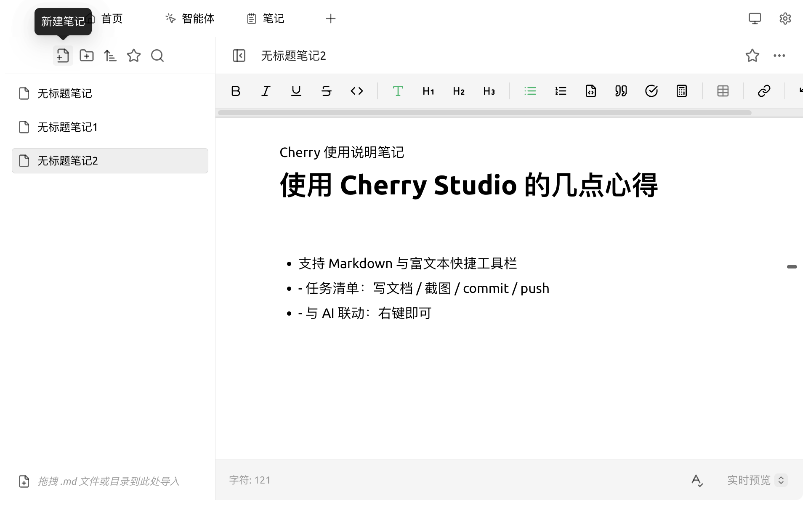
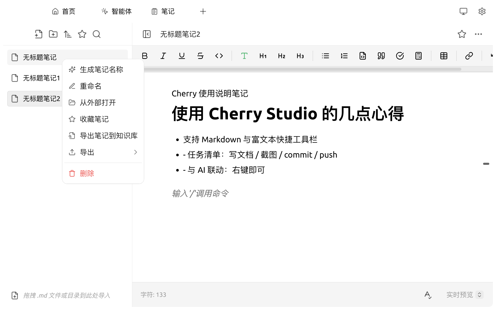
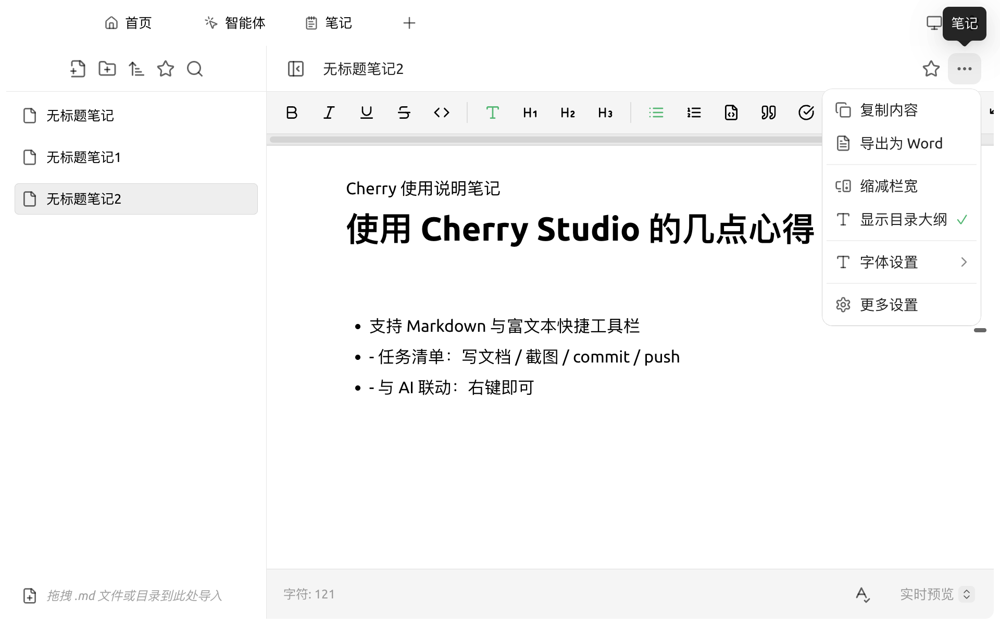

# 笔记

笔记是 Cherry Studio 内置的 Markdown 编辑器，方便您在与 AI 对话之外整理灵感、保存阶段性产出，并与对话/智能体能力联动。

### 打开笔记

顶部 Tab 栏点击 `笔记`，或在启动台中点击 `笔记` 应用图标。

<figure><figcaption>
初次打开笔记，左侧为目录树，右侧为编辑器
</figcaption></figure>

### 创建第一篇笔记

1. 点击左上角第一个 **新建笔记** 图标（📄+）
2. 输入笔记标题，按 <kbd>Enter</kbd> 确认
3. 在右侧编辑器中输入正文，支持 Markdown 语法与富文本快捷工具栏

<figure><figcaption>
已包含若干笔记的工作区
</figcaption></figure>

### 导入已有 Markdown 文件

* 直接将 `.md` 文件或包含 `.md` 文件的目录**拖拽**到笔记区域，即可导入为新笔记或新文件夹
* 也可点击左上角第二个 **新建文件夹** 图标先建好目录，再向其中拖拽

### 编辑器功能

笔记编辑器顶部工具栏提供常用富文本能力：

* **格式化**：粗体（<kbd>B</kbd>）、斜体（<kbd>I</kbd>）、下划线（<kbd>U</kbd>）、删除线
* **结构**：行内代码 / H1–H3 标题 / 无序列表 / 有序列表 / 代码块 / 引用 / 任务清单 / 公式
* **嵌入**：表格、超链接

<figure><figcaption>
新建笔记并写入正文后的编辑器
</figcaption></figure>

底部状态栏显示当前 **字符数**，左下角的 **A✓** 图标可开关拼写检查，右下角下拉切换 **实时预览**、**仅编辑** 或 **仅预览** 模式。

### 目录管理

左侧侧栏顶部依次是：**新建笔记** / **新建文件夹** / **排序** / **收藏** / **搜索**。

* **排序**：6 个选项——名称 `A→Z` / `Z→A`、更新时间倒序 / 正序、创建时间倒序 / 正序
* **收藏**：星标按钮切到"已收藏"视图
* **搜索**：放大镜按钮，搜索框中输入即可。**搜索同时匹配标题与正文**，命中正文的条目会在标题旁加 "内容" 或 "两者" 标签提示来源

### 右键菜单（AI 联动 + 导出）

在左侧目录树**右键**任一笔记会弹出操作菜单——这是 AI 联动与多格式导出的入口：

<figure><figcaption>
右键单条笔记弹出的菜单
</figcaption></figure>

* **生成笔记名称** ✨：让 AI 根据正文自动生成一个标题（仅文件可用）
* **重命名** / **从外部打开**（在 Finder / 资源管理器中显示）
* **收藏笔记** / **取消收藏**
* **导出笔记到知识库**：发送到指定 [知识库](../../knowledge-base/knowledge-base.md)
* **导出 ›** 二级菜单：Markdown / Word（.docx）/ Notion / 语雀 / Obsidian / Joplin / 思源，以及"复制为图片 / 导出为图片"——可在 `设置 → 显示设置` 中开关单项
* **删除**

> 文件夹的右键菜单更精简，只有：新建笔记 / 新建文件夹 / 重命名 / 从外部打开 / 删除。

### 顶部「⋯」菜单（视图设置）

笔记标题右上角的 **「⋯」** 是**当前笔记的视图/导出快捷入口**，不要和右键菜单混淆：

<figure><figcaption>
右上角「⋯」菜单
</figcaption></figure>

* **复制内容**：纯文本复制
* **导出为 Word**：快速 `.docx`（需要完整格式列表请走右键菜单的"导出 ›"）
* **缩减栏宽**：限制每行最大字数
* **显示目录大纲**：右侧显示当前笔记的标题树
* **字体设置 ›**：默认 / 衬线字体，三档字号
* **更多设置**：跳到 `设置 → 笔记` 完整面板

### 工作目录与备份

笔记内容存储为本地文件。**工作目录** 在 `笔记 → 设置 → 数据设置` 中查看与修改。

* 默认存放于 Cherry Studio 应用数据目录下
* 可通过 **应用** 按钮换到自定义路径（更改不会自动迁移已有文件，需手动复制）
* 备份建议结合 [WebDAV](../../pre-basic/data-settings/webdav.md) / [S3 兼容存储](../../pre-basic/data-settings/s3-compatible.md)

### 显示设置

`笔记 → 设置 → 显示设置` 中可调整：

* **默认字体** 与 **字体大小**（10–30px 之间）
* **缩减栏宽**（限制每行最大字数，让长行不至于横铺整屏）

### 提示与技巧

* 笔记支持任务清单 `- [ ]` 写法，可用于日常待办
* 拖拽 `.md` 文件（或包含 `.md` 的目录）到目录树即可批量导入
* 跨设备恢复配置后若发现笔记目录为空，按提示路径手动复制文件即可


若要让 AI **直接**基于笔记内容回答问题，最方便的做法是把目标笔记 **导出到知识库**，然后在对话中开启该知识库。


如遇问题，请在 [反馈与建议](../../question-contact/suggestions.md) 中提交反馈。
