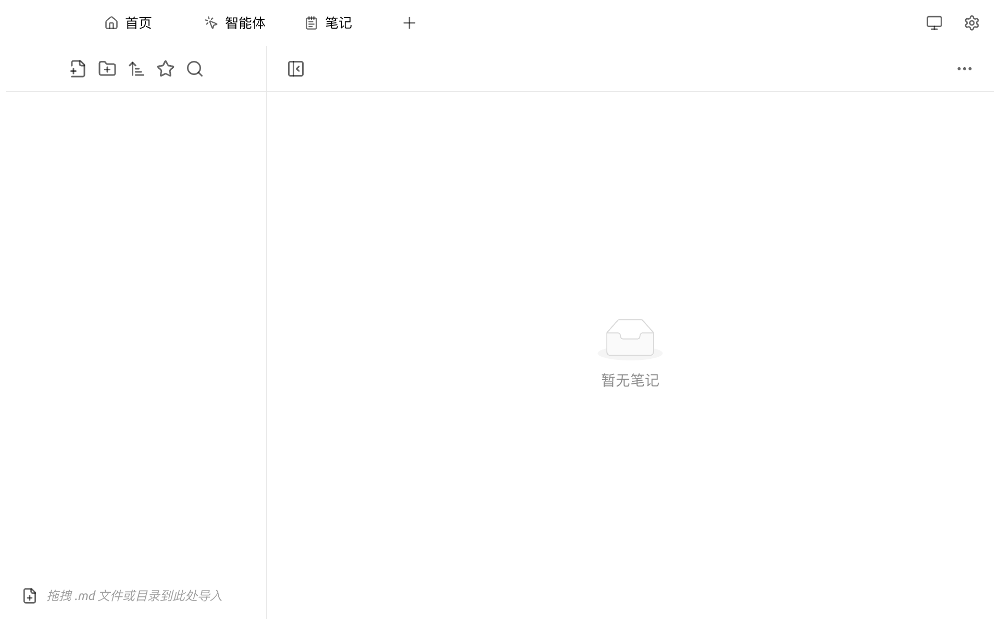
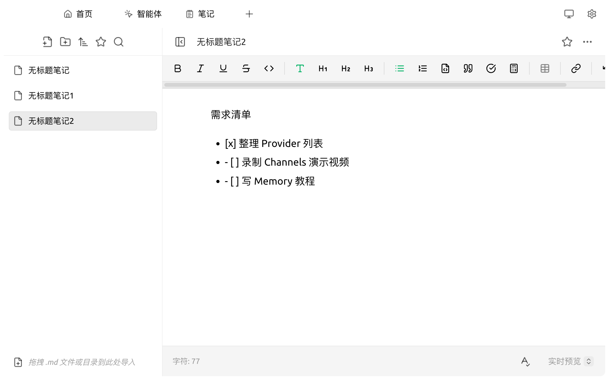

# 笔记

笔记是 Cherry Studio 内置的 Markdown 编辑器，方便您在与 AI 对话之外整理灵感、保存阶段性产出，并与对话/智能体能力联动。

### 打开笔记

顶部 Tab 栏点击 `笔记`，或在启动台中点击 `笔记` 应用图标。

<figure><figcaption>
初次打开笔记，左侧为目录树，右侧为编辑器
</figcaption></figure>

### 创建第一篇笔记

1. 点击左上角第一个 **新建笔记** 图标（📄+）
2. 输入笔记标题，按 <kbd>Enter</kbd> 确认
3. 在右侧编辑器中输入正文，支持 Markdown 语法与富文本快捷工具栏

<figure><figcaption>
已包含若干笔记的工作区
</figcaption></figure>

### 导入已有 Markdown 文件

* 直接将 `.md` 文件或包含 `.md` 文件的目录**拖拽**到笔记区域，即可导入为新笔记或新文件夹
* 也可点击左上角第二个 **新建文件夹** 图标先建好目录，再向其中拖拽

### 编辑器功能

笔记编辑器顶部工具栏提供常用富文本能力：

* **格式化**：粗体（<kbd>B</kbd>）、斜体（<kbd>I</kbd>）、下划线（<kbd>U</kbd>）、删除线
* **结构**：行内代码 / H1–H3 标题 / 无序列表 / 有序列表 / 代码块 / 引用 / 任务清单 / 公式
* **嵌入**：表格、超链接

底部状态栏显示当前 **字符数**，并可点击右下角切换 **实时预览**。

### 目录管理

左侧侧栏支持：

* **排序**：点击工具栏第三个图标，按修改时间或名称排序
* **收藏**：点击星标图标查看已收藏的笔记
* **搜索**：点击放大镜图标全文搜索

### 提示与技巧

* 笔记内容默认存储在本地，建议在 `设置 → 数据设置` 中配置 WebDAV 或 S3 备份
* 笔记支持任务清单 `- [ ]` 写法，可用于日常待办


笔记目前不提供与 AI 模型的内联交互。若需要让 AI 基于某篇笔记回答问题，建议将笔记内容复制到对话窗口，或上传到 [知识库](knowledge-base.md) 后再检索。


如遇问题，请在 [反馈与建议](../../question-contact/suggestions.md) 中提交反馈。
