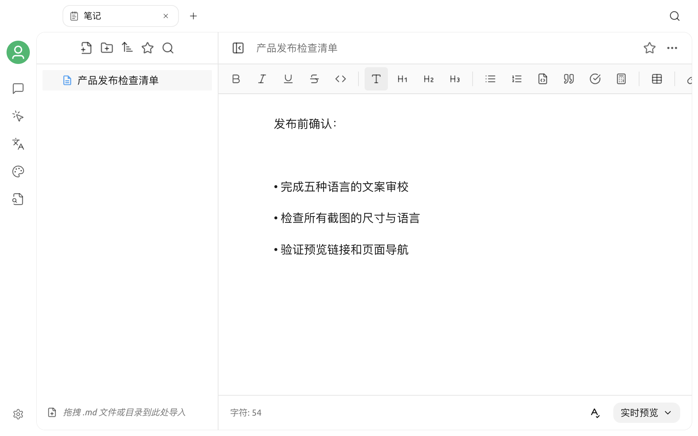

# 笔记

笔记是 Cherry Studio 内置的 Markdown 工作区。每篇笔记都保存为本地 `.md` 文件，适合整理对话结果、写作草稿和维护可被其他 Markdown 工具读取的资料。


笔记不会自动成为聊天上下文。需要让模型检索笔记内容时，可以把目标笔记导出到[知识库](knowledge-base.md)。


## 打开笔记

1. 点击窗口顶部标签栏右侧的 **+**，打开新的启动台标签页。
2. 在启动台点击**笔记**。

页面左侧是笔记和文件夹，右侧是当前笔记的编辑区。

## 创建第一篇笔记

1. 点击左侧顶部的**新建笔记**按钮。
2. 在页面顶部输入笔记名称。
3. 在编辑区输入内容。

内容修改后会自动保存到当前 Markdown 文件。切换笔记或离开页面时，Cherry Studio 也会尝试保存尚未写入的修改。


如果笔记文件读取失败，编辑器会阻止写入，避免用空内容覆盖原文件。看到读取或保存错误时，先检查工作目录和文件权限。


## 使用文件夹整理笔记

点击左侧顶部的**新建文件夹**，可以在根目录或当前选中的文件夹中创建目录。

还可以：

* 展开或折叠文件夹
* 将笔记或文件夹拖入另一个文件夹
* 在文件夹上右键，新建子笔记或子文件夹
* 直接编辑页面顶部的标题来重命名当前笔记
* 在目录树中右键笔记或文件夹进行重命名

笔记工作区只读取 Markdown 文件，隐藏文件不会显示。

## 导入现有 Markdown

可以用以下方式导入：

* 把 `.md` 文件拖到左侧目录树
* 把包含 Markdown 文件的文件夹拖到左侧目录树
* 在左侧空白处右键，选择上传文件或上传文件夹
* 在空笔记工作区点击导入提示，选择一个文件夹

导入文件夹时会尽量保留原目录结构。其他格式会被跳过，并在导入完成后显示成功、跳过或失败的数量。

## 编辑和阅读

编辑器底部可以切换三种模式：

| 模式 | 适合场景 |
| --- | --- |
| 实时预览 | 使用工具栏编辑，同时查看 Markdown 的排版效果 |
| 源码模式 | 直接编辑 Markdown 源码 |
| 阅读模式 | 只阅读渲染后的内容 |

实时预览模式的工具栏提供常用格式，例如标题、粗体、斜体、列表、引用、代码和表格。笔记编辑器当前不会提供图片和行内公式插入命令。

底部还会显示字符数。实时预览模式下，可以点击拼写检查按钮开启或关闭检查。

### 页面显示

点击右上角的更多菜单，可以：

* 复制当前笔记内容
* 快速导出为 Word
* 限制正文宽度
* 显示或隐藏目录大纲
* 切换默认字体或衬线字体
* 选择小、中、大三档字号
* 打开完整笔记设置

在完整设置中，还可以设置默认视图、默认编辑模式、10–30 px 字号和目录大纲。

## 查找和收藏

### 搜索

点击左侧顶部的搜索按钮并输入关键词。搜索会同时匹配：

* 笔记名称
* 笔记正文

命中正文时，结果会显示匹配类型和相关行。点击匹配内容可以打开笔记并跳到对应位置。

### 收藏

打开笔记后，可以点击顶部的星标按钮收藏。左侧顶部的收藏入口只显示已收藏的笔记。

### 排序

目录支持六种排序方式：

* 名称从 A 到 Z
* 名称从 Z 到 A
* 更新时间从新到旧
* 更新时间从旧到新
* 创建时间从新到旧
* 创建时间从旧到新

文件夹始终排在同级笔记之前。

## 右键菜单

### 笔记

右键一篇笔记，可以：

* 使用模型根据正文生成笔记名称
* 重命名
* 从外部打开
* 收藏或取消收藏
* 导出到知识库
* 导出为已启用的格式
* 删除

自动生成名称需要可用的模型配置。导出到知识库前，需要先创建至少一个知识库。

### 文件夹

右键文件夹，可以新建子笔记或子文件夹、重命名、从外部打开或删除。


删除文件夹会同时删除其中的笔记。删除前请确认目标目录已经备份。


## 导出笔记

笔记右键菜单中的导出选项可能包括：

* 复制为图片或导出为图片
* Markdown
* Word
* Notion
* 语雀
* Obsidian
* Joplin
* 思源

实际显示的项目由**设置 → 数据设置 → 导出菜单**控制。顶部更多菜单中的“导出为 Word”是当前笔记的快捷入口。

## 与对话和知识库配合

### 从对话保存到笔记

对话消息和话题的导出菜单可以把内容保存到笔记工作目录。是否显示该选项取决于导出菜单设置。

### 把笔记加入知识库

1. 先创建一个知识库。
2. 在笔记目录树中右键目标笔记。
3. 选择**导出笔记到知识库**。
4. 选择目标知识库并确认。
5. 等待知识库完成索引后，再在聊天中选择该知识库。

原笔记和知识库中的副本是两个独立数据源。笔记后续修改后，需要再次导出或在知识库中更新资料。

## 工作目录与备份

打开右上角更多菜单，进入**更多设置 → 数据设置**，可以查看当前笔记工作目录、选择其他目录或恢复默认目录。


切换工作目录只会改变 Cherry Studio 当前读取的位置，不会自动迁移旧目录中的 Markdown 文件。切换前请手动复制或备份原目录。


笔记是普通 Markdown 文件，可以使用文件同步、版本控制或备份软件保护。使用自定义工作目录时，应单独备份该目录，不要只依赖 Cherry Studio 的应用配置备份。

跨系统恢复后，如果原路径不存在，Cherry Studio 会回到默认笔记目录。此时需要把旧笔记手动复制到新目录，或在设置中重新选择有效目录。

## 常见问题

### 新建笔记后没有保存

检查工作目录是否存在且可写。如果当前文件读取失败，Cherry Studio 会暂停保存以保护原内容。

### 导入后少了一些文件

笔记工作区只导入 `.md` 文件。检查被跳过的文件是否使用 `.md` 扩展名。

### 搜索不到刚修改的内容

等待自动保存完成后再搜索。如果文件位于同步盘，也要确认外部同步没有占用或覆盖文件。

### 切换电脑后笔记为空

笔记正文保存在工作目录，而不是只保存在设置中。将原目录中的 Markdown 文件复制到新电脑，并在笔记设置中选择该目录。

***

### 获取帮助与提交反馈

如果使用过程中遇到问题，请通过[反馈与建议](../../question-contact/suggestions.md)提供的信息联系社区。
