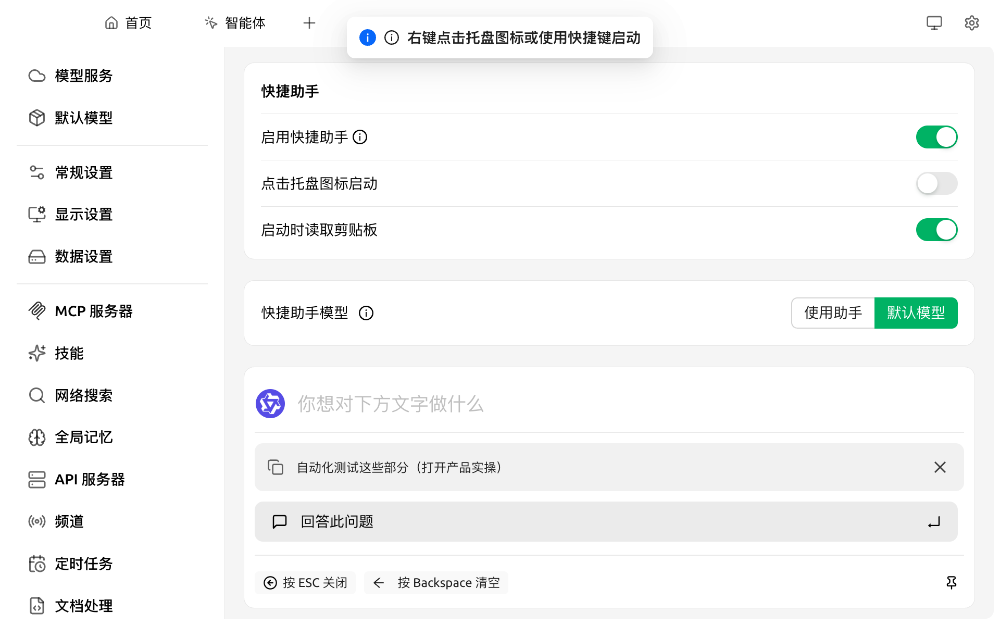
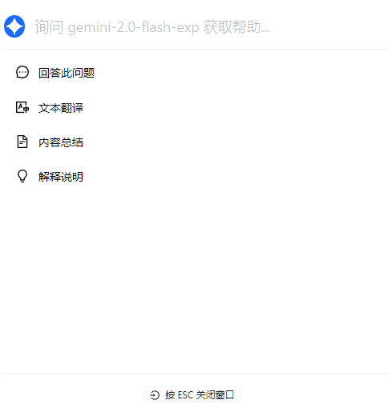

# 快捷助手

快捷助手是 Cherry Studio 提供的一个便捷工具，它允许您在任何应用程序中快速访问 AI 功能，从而实现即时提问、翻译、总结和解释等操作。

### 启用快捷助手

1. **打开设置：** 导航至 `设置` → `快捷助手`（在左侧菜单中）。
2. **启用开关：** 打开 `启用快捷助手`。开启后页面会展开更多选项。


**快捷助手 vs 划词助手**：两者是不同的功能。
* **快捷助手**：通过快捷键唤起一个迷你窗口主动提问，不依赖你当前选中的内容。
* **划词助手**：在任意应用内选中文字后，通过工具栏对所选文字做翻译/解释/改写。
* 配置入口分别在 `设置 → 快捷助手` 与 `设置 → 划词助手`。


<figure><figcaption>
启用后的快捷助手设置（实拍）
</figcaption></figure>

启用后可见的开关：

* **启用快捷助手**：主开关
* **点击托盘图标启动**：左键点击系统托盘 Cherry Studio 图标时直接唤起快捷助手（默认开启）
* **启动时读取剪贴板**：每次唤起快捷助手时自动把剪贴板内容作为输入
* **快捷助手模型**：`使用助手` 跟随当前对话助手所选模型；`默认模型` 使用 [全局默认快速模型](../../pre-basic/settings/default-models.md)

3. **设置快捷键（在另一个页面）：**
   * 快捷键不在本页配置，需到 `设置 → 快捷键` 中调整。
   * Windows 默认 <kbd>Ctrl</kbd> + <kbd>E</kbd>，macOS 默认 <kbd>⌘</kbd> + <kbd>E</kbd>。
   * 可自定义快捷键以避免冲突或更符合个人习惯。

### 使用快捷助手

1. **唤起：** 在任何应用程序中，按下您设置的快捷键（或默认快捷键）即可打开快捷助手。
2. **交互：** 在快捷助手窗口中，您可以直接进行以下操作：
   * **快速提问：** 向 AI 提问任何问题。
   * **文本翻译：** 输入需要翻译的文本。
   * **内容总结：** 输入长文本进行摘要。
   *   **解释说明：** 输入需要解释的概念或术语。

       <figure><figcaption>
快捷助手界面示意图
</figcaption></figure>
3. **关闭：** 按下 <kbd>ESC</kbd> 键或点击快捷助手窗口外部的任意位置即可关闭。


当 `快捷助手模型` 选 **默认模型** 时使用 [全局默认快速模型](../../pre-basic/settings/default-models.md)；选 **使用助手** 后可以选择一个已有助手作为响应的模型。


### 提示与技巧

* **快捷键冲突：** 如果默认快捷键与其他应用程序冲突，请修改快捷键。
* **探索更多功能：** 除了文档中提到的功能，快捷助手可能还支持其他操作，例如代码生成、风格转换等。建议您在使用过程中不断探索。
* **反馈与改进：** 如果您在使用过程中遇到任何问题或有任何改进建议，请及时向 Cherry Studio 团队 [反馈](../../question-contact/suggestions.md)。

***

### 💡 获取帮助与提交反馈

如果您在配置或使用过程中遇到任何疑问、Bug 或有功能改进建议，请参考 [反馈与建议](../../question-contact/suggestions.md) 中提供的官方渠道。
