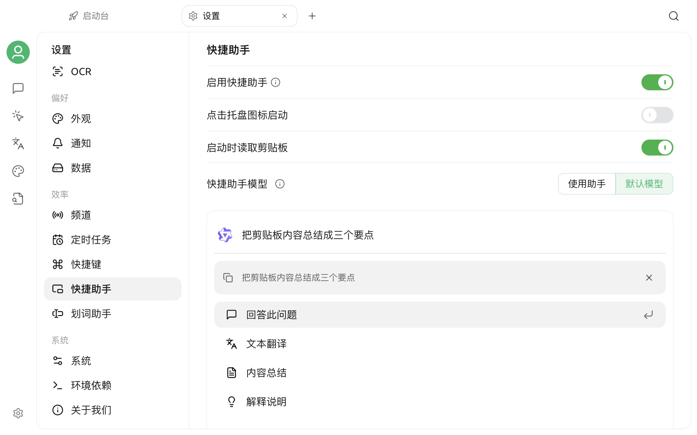

# 快捷助手

快捷助手是一个可从其他应用上方唤起的轻量窗口。它适合临时提问、翻译、总结或解释一段文字，不必先切回 Cherry Studio 主窗口。


快捷助手和[划词助手](selection-assistant.md)是两个独立功能。快捷助手由全局快捷键或托盘唤起；划词助手在选中文字后显示操作工具栏。


## 使用前准备

快捷助手会调用已经配置的模型。启用前，请先确认至少有一个可用的聊天模型；需要使用“文本翻译”时，还应配置翻译模型。

相关设置请查看[默认模型](../../pre-basic/settings/default-models.md)。

## 启用快捷助手

1. 打开**设置 → 快捷助手**。
2. 开启**启用快捷助手**。
3. 选择是否开启**点击托盘图标启动**。
4. 选择是否开启**启动时读取剪贴板**。
5. 在**快捷助手模型**中选择“使用助手”或“默认模型”。

设置页下方会显示快捷助手预览，可以先用它确认模型和界面是否正常。

### 选择模型方式

| 方式 | 实际效果 |
| --- | --- |
| 使用助手 | 选择一个现有助手，并使用它的系统提示词、模型和模型参数 |
| 默认模型 | 不套用特定助手，使用当前默认模型 |

“文本翻译”使用单独配置的翻译模型，不使用这里选择的助手。


快捷助手中的回答、总结和解释会禁用网页搜索、MCP 和知识库。需要这些能力时，请使用主窗口中的[对话](chat.md)。


## 设置唤起方式

### 全局快捷键

1. 打开**设置 → 快捷键**。
2. 找到**快捷助手**。
3. 启用该快捷键。
4. 如有需要，修改按键组合。

系统预填的组合是：

* macOS：Command + E
* Windows / Linux：Ctrl + E

该快捷键初始为关闭状态。只开启快捷助手主开关，并不会自动启用全局快捷键。

更多说明请查看[快捷键设置](../../pre-basic/settings/key-shortcut.md)。

### 系统托盘

开启**点击托盘图标启动**后，单击 Cherry Studio 托盘图标会打开快捷助手，同时系统托盘功能也会被启用。

即使没有开启单击启动，也可以在已启用快捷助手时右键托盘图标，从菜单中选择快捷助手。

## 打开并执行操作

1. 在任意应用中按已启用的全局快捷键，或使用托盘入口。
2. 输入要处理的内容。
3. 选择一个操作。

| 操作 | 用途 |
| --- | --- |
| 回答此问题 | 把输入作为普通问题发送给模型 |
| 文本翻译 | 选择目标语言并翻译输入 |
| 内容总结 | 使用内置总结指令处理输入 |
| 解释说明 | 使用内置解释指令处理输入 |

可以用方向键上、下切换操作，按 Enter 执行当前操作。

### 使用剪贴板内容

开启**启动时读取剪贴板**后，每次显示窗口时，快捷助手会尝试读取新的纯文本剪贴板内容，并把它显示为参考文字。

此时可以：

* 直接选择翻译、总结或解释
* 继续输入要求，把剪贴板文字和要求一起发送
* 在首页按 Backspace 清除剪贴板参考文字

剪贴板为空、不是纯文本，或系统拒绝读取权限时，窗口不会得到可用的参考文字。

## 查看结果和继续提问

回答、总结和解释会以流式方式显示。使用“回答此问题”后，可以在结果页继续输入，形成一段临时对话。

文本翻译页可以更换目标语言，结果会随设置重新生成。

快捷助手的内容是临时会话。返回首页或关闭窗口后，不应把它当作主窗口中的长期对话记录。

## 窗口操作

| 操作 | 结果 |
| --- | --- |
| Esc（正在生成） | 暂停当前生成 |
| Esc（结果页） | 返回快捷助手首页 |
| Esc（首页） | 隐藏窗口 |
| C（结果页） | 复制最近一条模型输出 |
| 点击图钉 | 保持窗口置顶，失去焦点时不自动隐藏 |
| 点击窗口外部 | 未置顶时隐藏快捷助手 |

窗口再次打开时，会继续使用当前的模型方式、剪贴板开关和翻译目标语言。

## 使用建议

* 需要处理当前复制的一小段文字时，开启剪贴板读取最省步骤。
* 经常使用固定语气或格式时，选择一个专用助手。
* 只想快速提问时，使用默认模型可以减少额外配置。
* 处理长文档、附件、网页搜索或知识库资料时，改用主窗口对话。

## 常见问题

### 按 Command + E 或 Ctrl + E 没有反应

确认快捷助手主开关和快捷键本身都已启用。若快捷键被其他应用占用，请在快捷键设置中换一个组合。

### 单击托盘图标没有打开

确认**点击托盘图标启动**已开启，并检查系统托盘区域是否隐藏了 Cherry Studio 图标。也可以右键图标后从菜单打开。

### 窗口一点击别处就消失

这是未置顶时的正常行为。需要对照其他应用内容时，点击右下角的图钉。

### 没有读取到剪贴板

确认开关已开启，剪贴板中是纯文本，并检查系统剪贴板权限。复制新内容后重新唤起窗口。

### 翻译没有结果

“文本翻译”使用翻译模型。检查默认模型设置中的翻译模型、服务商状态和 API 配置。

### 助手中的知识库或 MCP 没有生效

快捷助手会主动关闭网页搜索、MCP 和知识库。请在主窗口中使用该助手。

## 隐私提示

开启剪贴板读取后，快捷助手会在窗口显示时读取纯文本剪贴板。只有执行回答、翻译、总结或解释后，相应文本才会随请求发送给所选模型服务。

处理密码、密钥或其他敏感内容前，请先清空剪贴板参考文字，或关闭**启动时读取剪贴板**。

***

### 获取帮助与提交反馈

如果使用过程中遇到问题，请通过[反馈与建议](../../question-contact/suggestions.md)提供的信息联系社区。
