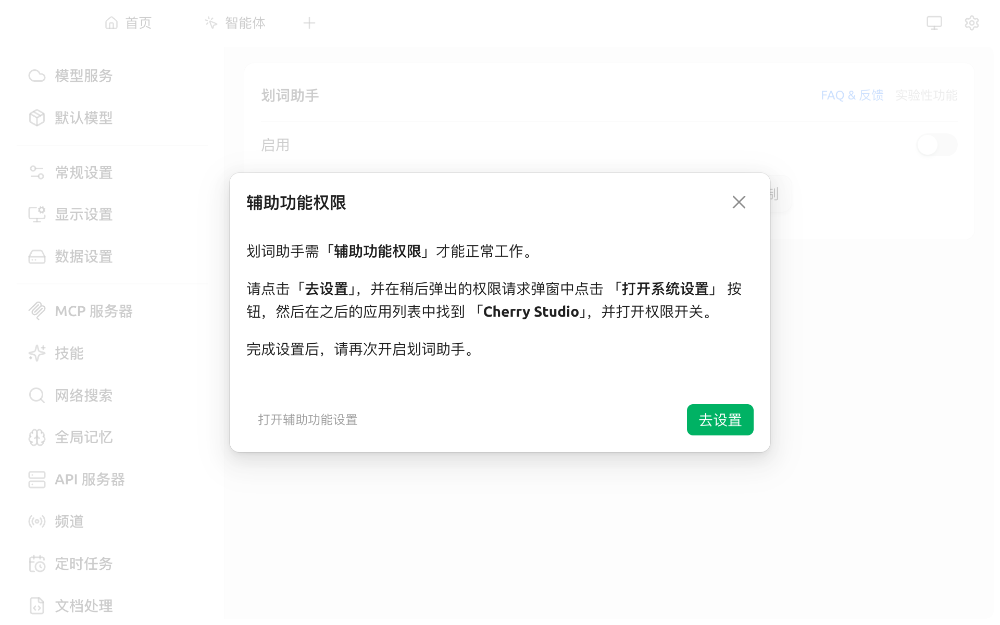
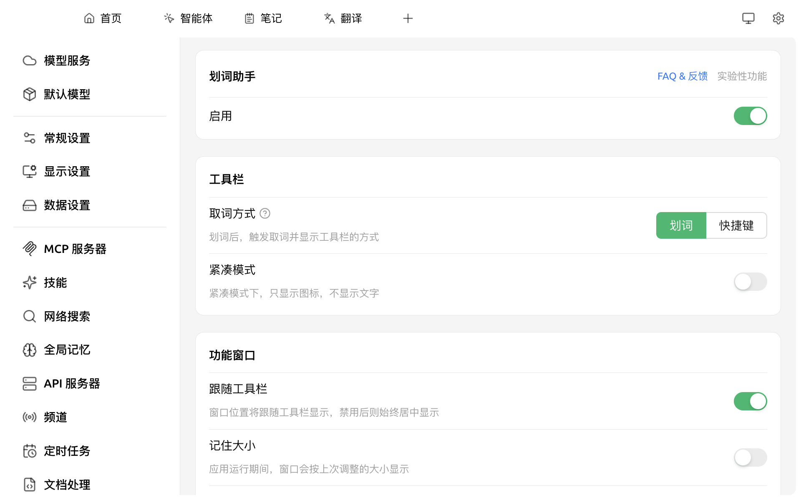
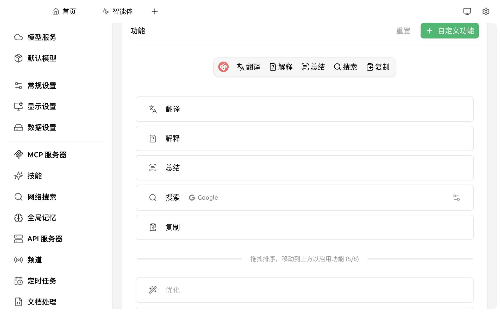

# 划词助手

划词助手（Selection Assistant）让你在**任意应用中选中文字**后，通过浮动工具栏调用 AI 做翻译、解释、优化、总结等操作，无需把内容粘贴回 Cherry Studio。


**与 [快捷助手](kuai-jie-zhu-shou.md) 的区别**：

* **快捷助手**：用全局快捷键唤起一个**主动输入**窗口，你打字提问
* **划词助手**：选中文字后**针对所选内容**弹出工具栏，一键执行预设操作


### 平台支持

* ✅ **macOS**：完整支持，但首次启用需授予 **辅助功能（Accessibility）权限**
* ✅ **Windows**：完整支持，无需特殊权限
* ⚠️ **Linux**：仅在 **X11** 模式下完整支持；Wayland 模式下工具栏可能无法跟随选中文本定位。同时需要将当前用户加入 `input` 组（`sudo usermod -aG input $USER`）以获取按键监听权限

### 启用划词助手

打开 `设置 → 划词助手`：

<figure><figcaption>
划词助手设置面板
</figcaption></figure>

1. 打开 **启用** 开关
2. **macOS** 用户首次启用会弹窗请求 **辅助功能权限**：

   <figure><figcaption>
首次启用时的辅助功能权限提示
</figcaption></figure>

   点击 **去设置** → 在弹出的系统设置「隐私与安全性 → 辅助功能」中找到 Cherry Studio 并打开开关 → 回到 Cherry Studio 再次启用。
3. （可选）在 **工具栏 → 取词方式** 选择触发方式（不同平台可选项不同）：
   * **划词**：选中文字后立即弹出工具栏（默认）
   * **Ctrl 键**（仅 Windows）：选中文字后**再长按 Ctrl 键**才弹（避免误触）
   * **快捷键**：选中文字后按快捷键再弹，快捷键在 `设置 → 快捷键` 中改

<figure><figcaption>
启用后的设置面板：取词方式 / 紧凑模式 / 跟随工具栏…
</figcaption></figure>

### 内置操作

划词助手提供 7 个内置操作，**默认启用 5 个**：翻译 / 解释 / 总结 / 搜索 / 复制。工具栏左侧的 **Cherry 图标不是操作按钮**——它只是工具栏的拖拽手柄，按住可移动整条工具栏。

| 操作 | 默认启用 | 用途 |
|---|---|---|
| **翻译** | ✅ | 智能翻译：优先翻译为目标语言；若已是目标语言则翻译为备选语言 |
| **解释** | ✅ | 让 AI 解释这段内容 |
| **总结** | ✅ | 让 AI 用一段话总结所选内容 |
| **搜索** | ✅ | 用所选文字调用搜索引擎查询（默认 Google，可在每项右侧 ⋯ 改） |
| **复制** | ✅ | 复制选中文字 |
| **优化** | 待启用 | 让 AI 改写得更通顺 / 更专业，需在设置中拖入启用区 |
| **引用** | 待启用 | 把选中文字以引用形式发送到当前对话，需在设置中拖入启用区 |

<figure><figcaption>
设置面板的「功能」区：上方为已启用，下方暂存区拖到上方即启用
</figcaption></figure>

### 自定义操作

在 `设置 → 划词助手 → 功能` 中可：

* **编辑**内置操作的提示词
* **添加**自定义操作（命名 + 提示词 + 默认模型）
* **拖拽**调整工具栏中操作的顺序
* 把不常用的操作拖到下方暂存区即可"停用"

### 工具栏 / 结果窗口外观

工具栏：
* **紧凑模式**：只显示图标，不显示文字，节省屏幕空间

结果窗口（`功能窗口` 节）：
* **跟随工具栏**：窗口贴着工具栏弹（默认开），关闭则始终居中
* **记住大小**：本次手动调过的窗口尺寸，下次保留
* **自动关闭**：点窗口外即关
* **自动置顶**：始终悬浮在其他应用之上
* **透明度**：20%–100% 可调

### 搜索引擎

划词助手内置的「搜索」操作可选预设引擎（Google、Bing、DuckDuckGo 等），也可在 `设置 → 划词助手 → 高级 → 搜索引擎` 中加自定义引擎，URL 中用 `{{queryString}}` 表示搜索词位置。

### 应用筛选（高级）

可在 `设置 → 划词助手 → 高级 → 应用筛选` 中设置 **黑名单 / 白名单**，让划词助手只在指定应用中生效（白名单）或不在指定应用中弹出（黑名单）。

* **macOS**：填入应用的 Bundle ID（如 `com.google.Chrome`、`com.apple.mail`）
* **Windows**：填入应用的可执行文件名（如 `chrome.exe`、`Cherry Studio.exe`）

### 使用的模型

划词助手默认使用 [全局默认对话模型](../../pre-basic/settings/default-models.md)，也可针对每个操作单独指定模型。

### 提示与技巧

* macOS 上若工具栏不出现，检查 `系统设置 → 隐私与安全性 → 辅助功能` 中 Cherry Studio 是否打勾
* 频繁因误触选中文字而弹工具栏？切到 **Ctrl 键** 触发模式
* 工具栏图标过多挤屏？开启 **紧凑模式**
* 想做"翻译完直接朗读"等链式操作？把"翻译"结果复制后调用 [快捷助手](kuai-jie-zhu-shou.md) 继续处理

如遇问题，请在 [反馈与建议](../../question-contact/suggestions.md) 中提交反馈。
