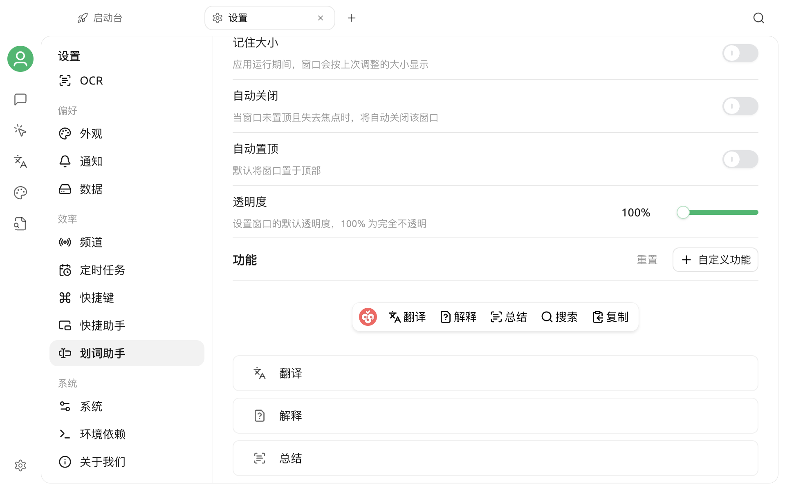

# 划词助手



划词助手会在其他应用中选中文字后显示浮动工具栏。可以直接翻译、解释、总结、搜索或复制所选内容，也可以添加自己的 AI 操作。


划词助手和[快捷助手](quick-assistant.md)是两个独立功能。划词助手处理刚刚选中的文字；快捷助手通过快捷键或托盘打开主动输入窗口。


## 平台支持

| 平台 | 当前说明 |
| --- | --- |
| macOS | 支持；首次启用需要授予辅助功能权限 |
| Windows | 支持直接划词、Ctrl 键触发和快捷键触发 |
| Linux X11 | 支持主要功能；按键监听可能需要 `input` 组权限 |
| Linux Wayland | 受桌面环境限制；工具栏可能只能居中，应用筛选可能不生效 |

Wayland 环境下，设置页会检查 XWayland、`input` 组权限和桌面合成器兼容性。当前环境不兼容时，建议改用 X11。

## 启用划词助手

1. 打开**设置 → 划词助手**。
2. 开启**启用划词助手**。
3. 选择取词方式。

未启用时，设置页会显示演示工具栏，可以先确认紧凑模式和操作布局。

### macOS 辅助功能权限

macOS 首次启用时：

1. 在权限提示中点击前往系统设置。
2. 打开**隐私与安全性 → 辅助功能**。
3. 为 Cherry Studio 开启权限。
4. 返回 Cherry Studio，再次启用划词助手。

如果权限被关闭，Cherry Studio 会自动关闭划词助手。

### Linux 权限提示

设置页显示未取得 `input` 组权限时，可以执行：

```bash
sudo usermod -aG input $USER
```

完成后需要退出当前系统会话并重新登录。Wayland 下还可能需要以 XWayland 模式启动；请以设置页的环境检查结果为准。

## 选择取词方式

| 方式 | 平台 | 行为 |
| --- | --- | --- |
| 划词 | macOS、Windows、Linux | 选中文字后立即显示工具栏 |
| Ctrl 键 | Windows | 选中文字后长按 Ctrl 才显示工具栏 |
| 快捷键 | macOS、Windows | 选中文字后按已配置的取词快捷键 |

快捷键方式需要前往**设置 → 快捷键**，为“划词助手取词”设置并启用组合键。当前没有预设按键。

如果直接划词频繁误触，可以改用 Ctrl 键或快捷键方式。

## 使用工具栏

1. 在支持的应用中选中文字。
2. 等待工具栏出现，或按所选触发键。
3. 点击需要的操作。

工具栏左侧的 Cherry Studio 图标是拖动区域，可以移动整条工具栏。开启**紧凑模式**后，工具栏只显示图标；把鼠标移到图标上仍可查看名称。

## 内置操作

划词助手包含七个内置操作。

| 操作 | 默认状态 | 行为 |
| --- | --- | --- |
| 翻译 | 已启用 | 检测原文语言，并在首选语言和备选语言之间选择目标 |
| 解释 | 已启用 | 用模型解释所选内容 |
| 总结 | 已启用 | 用模型总结所选内容 |
| 搜索 | 已启用 | 使用配置的搜索引擎打开查询 |
| 复制 | 已启用 | 把所选内容写入剪贴板 |
| 优化 | 未启用 | 用模型润色所选内容 |
| 引用 | 未启用 | 把所选内容引用到 Cherry Studio 主窗口输入框 |

翻译使用已配置的翻译模型。解释、总结、优化和未指定助手的自定义 AI 操作使用默认模型。


划词助手的 AI 结果窗口会禁用网页搜索、MCP 和知识库。需要这些工具时，请把内容引用到主窗口后继续处理。


## 调整操作和顺序

在**设置 → 划词助手 → 功能**中，上方列表是已启用操作，下方列表是未启用操作。

可以：

* 拖动操作调整工具栏顺序
* 把操作拖到上方以启用
* 把操作拖到下方以停用
* 重置内置操作的默认顺序和状态

工具栏最多同时启用 8 个操作，并且至少保留 1 个已启用操作。重置不会删除自定义操作，但会把自定义操作移到未启用区域。

内置操作的提示词不能在此处修改；“搜索”可以单独更换搜索引擎。

## 添加自定义操作

最多可以创建 10 个自定义操作。

1. 在功能设置中点击添加自定义功能。
2. 输入操作名称。
3. 选择或随机生成一个 Lucide 图标。
4. 选择使用默认模型，或选择一个助手。
5. 输入提示词。
6. 保存后，把新操作拖到已启用区域。

提示词可以使用 `{{text}}` 表示选中的文字。如果没有填写占位符，所选文字会自动附加到提示词末尾。

选择“使用助手”时，会同时使用该助手的系统提示词、模型和模型参数。

## 配置搜索引擎

1. 在功能列表中找到**搜索**。
2. 点击右侧设置按钮。
3. 选择 Google、百度或 Bing，或者添加自定义搜索引擎。

自定义 URL 必须：

* 以 `http://` 或 `https://` 开头
* 包含 `{{queryString}}` 占位符

执行搜索时，Cherry Studio 会对所选文字进行 URL 编码后替换占位符。若选中的内容本身是 URL 或本地绝对路径，则会直接尝试打开。

## 使用结果窗口

翻译、解释、总结、优化和自定义 AI 操作会打开独立结果窗口。

窗口中可以：

* 查看或隐藏原文
* 复制原文或模型结果
* 暂停生成
* 重新生成
* 最小化或关闭
* 置顶
* 临时调整透明度

翻译窗口还可以直接切换目标语言，并设置首选语言和备选语言。

## 调整窗口行为

在**功能窗口**设置中可以调整：

| 设置 | 作用 |
| --- | --- |
| 跟随工具栏 | 在工具栏附近打开结果窗口；关闭后居中显示 |
| 记住大小 | 在本次应用运行期间沿用上次调整的窗口大小 |
| 自动关闭 | 未置顶的结果窗口失去焦点时关闭 |
| 自动置顶 | 每次打开结果窗口时默认置顶 |
| 透明度 | 设置结果窗口的默认不透明度，范围 20%–100% |

结果窗口中手动调整的透明度只影响当前窗口；设置页中的透明度用于后续窗口。

## 设置应用筛选

应用筛选可以让划词助手只在指定应用中生效，或排除指定应用。

1. 打开**设置 → 划词助手 → 高级**。
2. 选择白名单或黑名单。
3. 点击编辑，并按每行一个应用标识填写。

| 平台 | 填写内容 | 示例 |
| --- | --- | --- |
| macOS | Bundle ID，可模糊匹配 | `com.google.Chrome` |
| Windows | 可执行文件名，可模糊匹配 | `chrome.exe` |

输入会统一转换为小写并去重。Wayland 模式下应用筛选可能不生效。

## 常见问题

### 选中文字后没有工具栏

确认功能已启用、取词方式正确，并检查当前应用是否被筛选规则排除。macOS 还需检查辅助功能权限。

### Windows 的 Ctrl 键方式没有反应

部分应用或键盘映射工具会拦截 Ctrl。改用直接划词或快捷键方式，并检查 AHK 等工具是否重映射了按键。

### Linux 工具栏位置不正确

这通常与 Wayland 和 XWayland 坐标差异有关。查看设置页的环境检查；无法满足条件时，切换到 X11。

### AI 操作没有结果

检查默认模型或目标助手是否可用。翻译操作还需要单独配置翻译模型。

### 引用后没有看到文字

“引用”会把所选内容发送到 Cherry Studio 主窗口输入框。检查主窗口是否已打开，并切换到对话页面查看。

## 隐私提示

复制操作只写入系统剪贴板；搜索操作会把查询发送给所选搜索引擎；引用操作会把文字传给 Cherry Studio 主窗口。

只有执行翻译、解释、总结、优化或自定义 AI 操作时，所选文字才会发送给相应模型服务。处理敏感文本前，请确认操作类型和服务商的数据政策。

***

### 获取帮助与提交反馈

如果使用过程中遇到问题，请通过[反馈与建议](../../question-contact/suggestions.md)提供的信息联系社区。
